# Python NumPy max 示例

> 原文：<https://pythonguides.com/python-numpy-max-with-examples/>

[](https://sharepointsky.teachable.com/p/python-and-machine-learning-training-course)

在本 [Python NumPy 教程](https://pythonguides.com/numpy/)中，我们将通过如下几个例子来讨论 **Python NumPy max** :

*   Python numpy 最大值
*   Python numpy 最大索引
*   Python numpy max 函数
*   列中的 Python numpy 最大值
*   Python numpy 最大最小值
*   Python numpy max 忽略 nan
*   Python numpy 最大值和索引
*   Python numpy 最大浮点
*   Python numpy max 2d 数组
*   两个数组的 Python numpy 最大值

目录

[](#)

*   [Python numpy max](#Python_numpy_max "Python numpy max")
*   [另一个寻找一维最大值的例子](#Another_example_to_find_maximum_value_in_one_dimensional "Another example to find maximum value in one dimensional")
*   [Python numpy 最大值](#Python_numpy_max_value "Python numpy max value")
*   [Python numpy 最大索引](#Python_numpy_max_index "Python numpy max index")
*   [Python numpy max 函数](#Python_numpy_max_function "Python numpy max function")
*   [列中的 Python numpy 最大值](#Python_numpy_max_value_in_column "Python numpy max value in column")
*   [Python numpy 最大最小值](#Python_numpy_max_min "Python numpy max min")
*   [Python numpy max 忽略 nan](#Python_numpy_max_ignore_nan "Python numpy max ignore nan")
*   [Python numpy 最大值和索引](#Python_numpy_max_value_and_index "Python numpy max value and index")
*   [Python numpy max float](#Python_numpy_max_float "Python numpy max float")
*   [Python numpy max 2d 数组](#Python_numpy_max_2d_array "Python numpy max 2d array")
*   [两个数组的 Python numpy max](#Python_numpy_max_of_two_arrays "Python numpy max of two arrays")

## Python numpy max

*   在本节中，我们将讨论 **Python numpy max** 。这里我们将使用函数 **numpy.max()** 。
*   此函数生成存储在 NumPy 数组中的数值的最大值。它还可以计算行和列的最大值。
*   numpy 模块提供了一个 max()函数来从 Numpy 数组中获取最大值。
*   它比较两个 numpy 数组，并返回一个包含元素最大值的新数组。如果被比较的元素之一不是数字，则返回该元素。

**语法:**

下面是 **numpy.max()** 的语法

```py
numpy.maximum
             (
              x1,
              x2,
              out=None,
              where=True,
              casting='same_kind',
              dtype=None
             )
```

*   它由几个参数组成
    *   **X1，X2:** 输入数组(数组将保持元素相等)。
    *   **Out:** 包含结果的位置。如果提供，它必须具有输入提供的形状。如果未提供或无，则返回分配的数组。out 参数允许您指定一个输出数组，我们可以在其中存储 np 的输出。最大值
    *   **轴:**可选参数。axis 参数用于指定计算最大值的轴。轴就像阵列的方向。在二维数组中，轴 0 是表示行的轴，轴 1 是指向列的轴。

**举例:**

下面举个例子来检查一下**如何实现 numpy.max()函数**。

```py
import numpy as np

arr = np.array([2,4,5,6,7])
arr2 = np.array([4,5,6,7,8])
res = np.maximum(arr,arr2)
print(res)
```

在上面的代码中，我们将首先导入一个 NumPy 库，然后使用**函数 np.array()** 创建一个 NumPy 数组。创建一个变量并分配一个 NumPy 函数。最大值并打印结果。

它将对元素进行比较，并返回 arr1 和 arr2 的最大值。如果是标量值，那么 arr1 和 arr2 都是标量。

下面是以下代码的截图

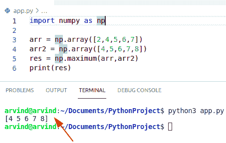

Python numpy max

阅读 [Python 数字形状](https://pythonguides.com/python-numpy-shape/)

## 另一个寻找一维最大值的例子

*   本例中，我们将讨论**如何在一维**中求最大值。
*   在这个方法中我们可以很容易地使用**函数 numpy.max()** 。
*   该函数用于获取指定轴上的最大值。

**语法:**

```py
np.max(arr,axis=None)
```

*   它由几个参数组成。
    *   **arr:** 参数指的是要应用 np.max()函数的 numpy 数组。
    *   **轴:**轴参数是可选的，帮助用户指定我们想要找到最大值的轴。

**举例:**

让我们举个例子来检查如何在一维数组中找到一个最大值。

```py
import numpy as np

arr = np.array([2,4,5,6,7])
res = np.max(arr)
print("Maximum Value",res)
```

下面是以下代码的截图

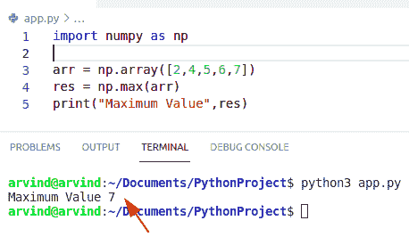

Python numpy maximum

## Python numpy 最大值

*   在本节中，我们将讨论 **Python numpy 最大值**。
*   在这个方法中我们可以很容易地使用**函数 numpy.amax()** 。
*   numpy.amax()是一个函数，它返回数组的最大值或沿轴的最大值(如果提到的话)。这个函数有几个参数，分别是 array、axis、out 和 keep dimension，并返回数组的最大值。
*   它将返回一个数组的最大值。

**语法:**

下面是 **numpy.amax()函数**的语法

```py
numpy.amax
          (
           arr,
           axis=None,
           out=None
          )
```

*   它由几个参数组成
    *   **数组:**输入数组
    *   **轴:**操作所沿的轴。默认情况下，使用 axis=0 输入。
    *   **Out:** 可选参数。

**举例:**

```py
import numpy as np

arr = np.array([6,2,8,9,1])
res = np.amax(arr) #amax function
print("Maximum Value",res)
```

在上面的代码中，我们将导入一个 NumPy 库，然后使用 numpy.array()函数创建一个 NumPy 数组。现在创建一个变量，并指定 NumPy 函数为 np.amax()。它为用户提供了沿指定轴的最大值。

下面是以下代码的截图

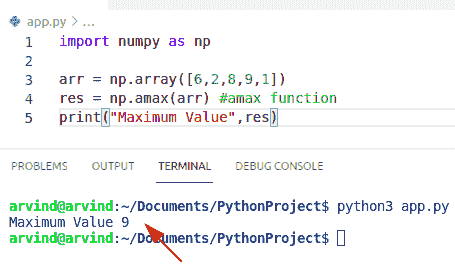

Python numpy max value

读取 [Python 反向 NumPy 数组](https://pythonguides.com/python-reverse-numpy-array/)

## Python numpy 最大索引

*   在本节中，我们将讨论 **Python numpy 最大值**。
*   在这个方法中，我们可以很容易地使用函数 numpy.argmax()。
*   numpy 模块提供了一个名为 numpy 的函数。argmax()。这个函数将返回最大值的索引，并将它们与指定的轴一起返回。
*   它将返回一个轴上最大值的索引。

**语法:**

下面是 numpy.argmax()的语法

```py
numpy.argmax
            (
             arr,
             axis,
             out
            )
```

*   它由几个参数组成
    *   **数组:**输入数组
    *   **轴:**可选参数。默认情况下，索引在数组中，否则沿着指定的轴。
    *   **Out:** 如果提供，输出将存储在这个数组中。它应该是适当的形状和类型。

**举例:**

让我们举一个例子来检查如何找到 numpy 最大指数

```py
import numpy as np

arr = np.random.randint(16, size=(4,4))
print("Maximum element",np.max(arr))
print("Indices of Max element",np.argmax(arr,axis=0))
print("Indices of Max element",np.argmax(arr,axis=1))
```

在上面的代码中

*   我们已经导入了别名为 np 的 numpy。
*   我们使用 np.random()函数创建了一个具有行和列形状的数组 arr。
*   我们还在数组的每个元素中添加了 16。
*   我们已经声明了变量，并为 np 的返回值赋值。argmax()函数。

下面是以下代码的截图

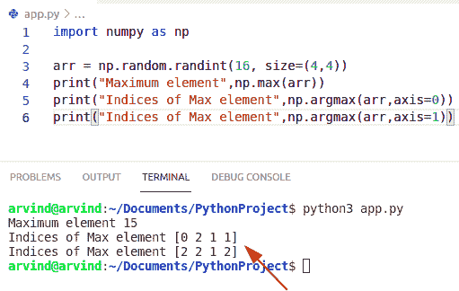

Python numpy max index

读取[Python NumPy empt](https://pythonguides.com/python-numpy-empty-array/)[y](https://pythonguides.com/python-numpy-empty-array/)[数组](https://pythonguides.com/python-numpy-empty-array/)

## Python numpy max 函数

*   在本节中，我们将讨论 **Python numpy max 函数**。
*   NumPy max 生成 NumPy 数组中的最大值。此函数计算存储在 NumPy 数组中的数值的最大值。
*   它还可以提供行、列的最大值。我们应该知道。max 函数和 np 是一回事。amax 函数。

**语法:**

在这里，我们将讨论函数的结构，我还将讨论重要的参数。

```py
np.max(arr, axis, keepdims=)
```

*   它由几个参数组成
    *   **arr:**arr 参数让你指定 numpy 的数据。最大函数。必要时，它指定函数的输入数组。
    *   **轴:**轴参数为用户提供指定轴，在该轴上你将很容易计算最大值。

**举例:**

下面举个例子来检查一下如何使用 **NumPy max 函数**。

*   这里，我们将提供一维 NumPy 数组的最大值。
*   为此，我们将首先创建一个存储随机整数的一维数组
*   为了创建这个数组，我们将使用 numpy。数组函数。

**代码:**

```py
import numpy as np

arr = np.array([16,19,4,5,20])
print("Maximum element",np.max(arr))
```

下面是以下代码的截图

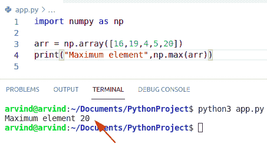

Python NumPy max function

阅读 [Python NumPy nan](https://pythonguides.com/python-numpy-nan/)

## 列中的 Python numpy 最大值

*   在本节中，我们将在列中讨论 **Python numpy 最大值**
*   在这个方法中，我们可以很容易地使用函数 **np.amax 来获得列中的最大值**。
*   在这个方法中，我们使用 axis=0 和 axis=1 来查找列中的最大值。
*   轴总是沿着 NumPy 数组。在二维数组中，轴 0 是代表行的轴，轴 1 是代表列的轴。
*   当我们在 np.max 函数中使用 axis 参数时，我们将指定计算最大值的轴。
*   当我们调整 axis =0 时，我们将指定我们想要计算列的最大值。

**语法:**

```py
numpy.amax
          (
           arr,
           axis=None,
           out=None
          )
```

**举例:**

我们举个例子，求列中的最大值。

```py
import numpy as np

a = np.array([[10, 20], [4, 40], [5, 6]])
max = np.amax(a,axis=1)
print(max)
```

下面是以下代码的截图

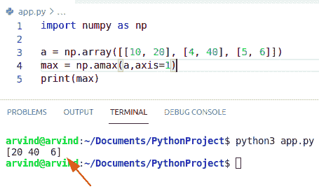

Python NumPy max value in column

阅读 [Python NumPy 平均值及示例](https://pythonguides.com/python-numpy-average/)

## Python numpy 最大最小值

*   在本节中，我们将讨论 **Python numpy max-min** 。我们将使用函数 np.max()和 np.min()函数。
*   Np.min()函数用于按元素查找最小值
*   numpy.ndarray 的 min()和 max()函数返回 ndarray 对象的最小值和最大值。
*   np.min()和 np.max()函数的返回值取决于指定的轴。
*   如果没有轴被验证，则返回值基于给定数组的所有元素。

**举例:**

*   现在，让我们创建一个二维 NumPy 数组。
*   现在使用 **numpy.max()** 和 **numpy.min()** 函数我们可以找到最大和最小元素。

**代码:**

```py
import numpy as np

arr = np.array([[2,4,5,6],[7,8,9,2]])
max = print("Maximum value",np.max(arr))
min = print("Minimum value",np.min(arr))
```

下面是以下代码的截图

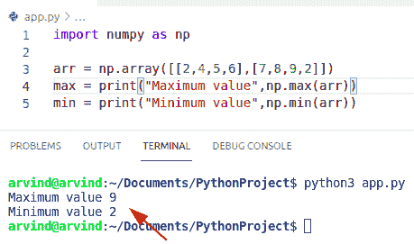

Python numpy max min

读取[检查 Python 中的 NumPy 数组是否为空](https://pythonguides.com/check-if-numpy-array-is-empty/)

## Python numpy max 忽略 nan

*   在本节中，我们将讨论 **Python numpy max ignore nan** 。
*   在这个例子中，我们可以很容易地使用函数 numpy。nanmax()。此函数返回数组的最大值或沿轴的最大值，忽略任何 nan。

语法:

下面是 **numpy.nanmax()函数**的语法。

```py
numpy.nanmax
            (
             arr,
             axis=None,
             out=None
            )
```

*   它由几个参数组成
    *   数组存储需要最大值的数字。如果数组中未给定，则尝试转换。
    *   **轴:**提供最大值的轴。默认值是计算输入数组的最大值。
    *   **Out:** 可选参数。
    *   **返回:**删除一个与 arr 形状相同，有指定轴的数组。

**举例:**

下面举个例子来检查一下**如何使用 NumPy max ignore nan**

```py
import numpy as np

arr = np.array([[2,4,np.nan,6],[3,4,np.nan,8]])
res = np.nanmax(arr)
print(res)
```

下面是以下代码的截图

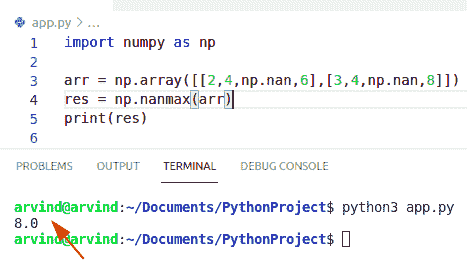

Python numpy max ignore nan

阅读 [Python NumPy 绝对值示例](https://pythonguides.com/python-numpy-absolute-value/)

## Python numpy 最大值和索引

*   在本节中，我们将讨论 **Python numpy 最大值和索引**。
*   在这个例子中，我们可以很容易地使用函数 np。argmax()获取最大值和索引。
*   Numpy。argmax()函数返回轴上最大值的索引。默认情况下，索引在输入数组中，否则沿着验证的轴。
*   Numpy。argmax 是一个函数，它给出给定行或列中最大数字的索引，并且可以使用 np 的 ax is 属性来提供该行或列。argmax。

**语法:**

下面是 numpy.argmax()的语法

```py
numpy.argmax
            (
             arr,
             axis,
             out
            )
```

**举例:**

下面举个例子来检查一下如何实现 numpy.argmax()函数求最大值和索引。

```py
import numpy as np

arr = np.array([[2,4,5,16],[4,5,6,7]])
print("Maximum element",np.max(arr))
print("Indices of Max element",np.argmax(arr))
```

在上面的代码中，我们将导入一个 NumPy 库，并使用 np.array()函数创建一个 NumPy 数组。

下面是以下代码的截图

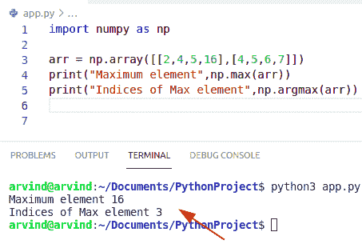

Python NumPy max value and index

阅读 [Python NumPy square](https://pythonguides.com/python-numpy-square/)

## Python numpy max float

*   在本节中，我们将讨论 **Python numpy max float** 。
*   在这个例子中，我们可以很容易地使用函数 numpy.max()并在参数中指定数据类型。float()方法将字符串或整数中包含的数字转换为浮点数。

**举例:**

让我们举一个例子来检查如何实现 **NumPy max float**

```py
import numpy as np

b = np.array([5,6,7.2,8.5], dtype=float)
c= np.max(b)
print(c)
```

下面是以下代码的截图

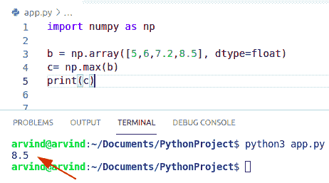

Python numpy max float

## Python numpy max 2d 数组

*   在本节中，我们将讨论 **Python numpy max 2d 数组。**
*   在这个方法中我们可以很容易地使用函数 **np.max()** 。
*   让我们创建一个二维数组。现在让我们使用 numpy.amax()从这个 numpy 数组中找到最大值，只需将 array 作为参数传递。
*   它从传递的 numpy 数组中返回最大值。

**举例:**

让我们举一个例子来检查 numpy max 2d 数组

```py
import numpy as np

b = np.array([[5,6,7,2,8],
             [2,6,1,3,9]])
print("Maximum value 2d array",np.max(b))
```

下面是以下代码的截图

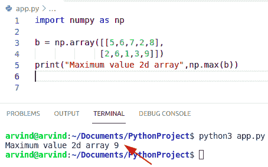

Python NumPy max 2d array

阅读 [Python NumPy 以列出示例](https://pythonguides.com/python-numpy-to-list/)

## 两个数组的 Python numpy max

*   在本节中，我们将讨论两个数组的最大值。
*   在这个方法中我们可以很容易地使用**函数 numpy.maximum()** 。
*   maximum()函数用于查找数组元素的最大值。它相当于 2 个数组，并返回一个包含元素最大值的新数组。
*   如果比较的值之一不是数字，则返回该值。如果两个元素都不是数字，则返回第一个元素。

语法:

下面是 numpy.maximum()函数的语法

```py
numpy.maximum
             (
              x1,
              x2,
              out=None,
              where=True,
              casting='same_kind',
              dtype=None
             )
```

**举例:**

我们举个例子来检查一下如何求两个数组的最大值。

```py
import numpy as np

arr1 = [4, 5, 234]
arr2 = [1, 2, 215]

print ("Input array1 : ", arr1) 
print ("Input array2 : ", arr2)

res_arr = np.maximum(arr1, arr2) 
print ("Output array after selecting maximum: ", res_arr)
```

下面是以下代码的截图

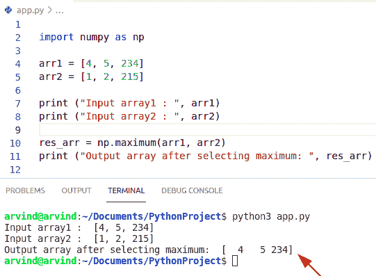

Python numpy max of two arrays

您可能会喜欢以下 Python 教程:

*   [从字符串 Python 中删除字符](https://pythonguides.com/remove-character-from-string-python/)
*   [创建 Python 变量](https://pythonguides.com/create-python-variable/)
*   [Python NumPy 读取 CSV](https://pythonguides.com/python-numpy-read-csv/)
*   [使用 Tkinter 中 pyqrcode 的 Python QR 码生成器](https://pythonguides.com/python-qr-code-generator/)
*   [如何在 Python Tkinter 中创建贪吃蛇游戏](https://pythonguides.com/create-a-snake-game-in-python/)

在本 Python 教程中，我们将通过如下几个例子来讨论 **Python NumPy max** :

*   Python numpy 最大值
*   Python numpy 最大索引
*   Python numpy max 函数
*   列中的 Python numpy 最大值
*   Python numpy 最大最小值
*   Python numpy max 忽略 nan
*   Python numpy 最大值和索引
*   Python numpy 最大浮点
*   Python numpy max 2d 数组
*   两个数组的 Python numpy 最大值

[Bijay Kumar](https://pythonguides.com/author/fewlines4biju/)

Python 是美国最流行的语言之一。我从事 Python 工作已经有很长时间了，我在与 Tkinter、Pandas、NumPy、Turtle、Django、Matplotlib、Tensorflow、Scipy、Scikit-Learn 等各种库合作方面拥有专业知识。我有与美国、加拿大、英国、澳大利亚、新西兰等国家的各种客户合作的经验。查看我的个人资料。

[enjoysharepoint.com/](https://enjoysharepoint.com/)[](https://www.facebook.com/fewlines4biju "Facebook")[](https://www.linkedin.com/in/fewlines4biju/ "Linkedin")[](https://twitter.com/fewlines4biju "Twitter")