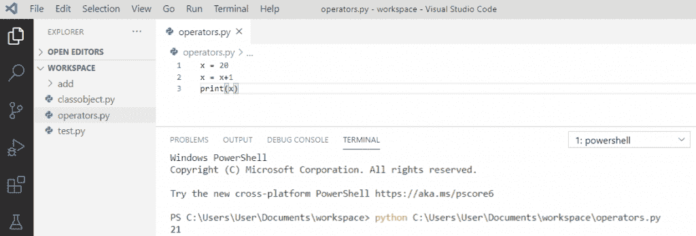
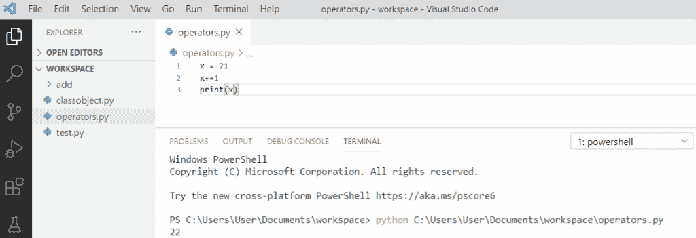
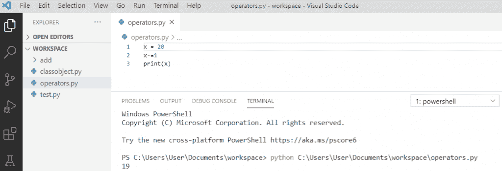
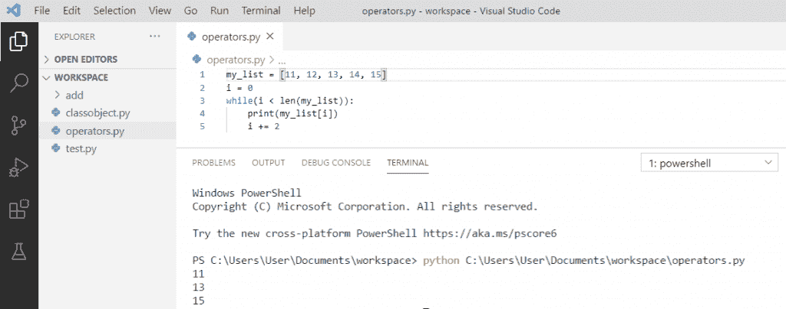
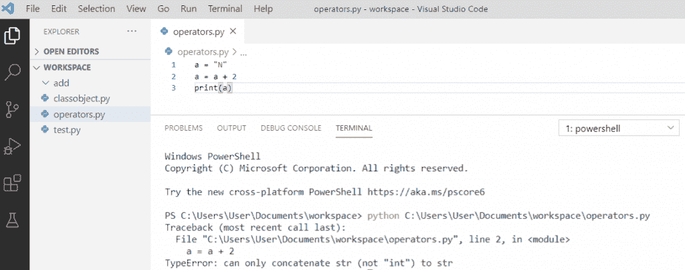
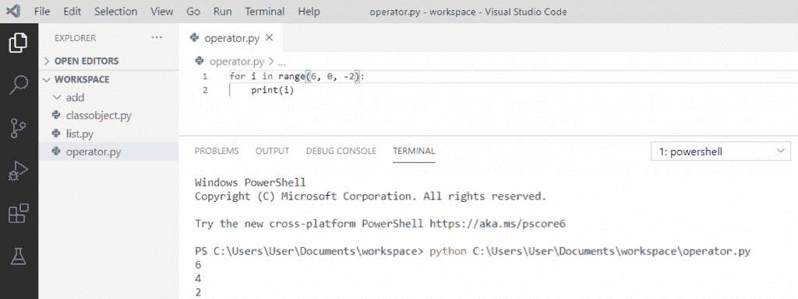

# Python 中的递增和递减运算符

> 原文：<https://pythonguides.com/increment-and-decrement-operators-in-python/>

[](https://sharepointsky.teachable.com/p/python-and-machine-learning-training-course)

在这个 [python 教程中，](https://pythonguides.com/python-hello-world-program/)你将通过例子学习 python 中的**递增和递减操作符。这里我们将检查 **:****

*   Python 中的递增和递减运算符
*   Python 增量运算符
*   Python 减量运算符
*   循环 python 中的增量变量
*   如何在 python 中增加一个字符
*   python for 循环中的减量运算符
*   python for 循环中的增量运算符

目录

[](#)

*   [Python 中的递增和递减运算符](#Increment_and_Decrement_operators_in_Python "Increment and Decrement operators in Python")
*   [Python 增量运算符](#Python_increment_operator "Python increment operator")
*   [Python 减量运算符](#Python_decrement_operator "Python decrement operator")
*   [循环 python 中的增量变量](#Increment_variable_in_loop_python "Increment variable in loop python")
*   [如何在 python 中增加一个字符](#How_to_increment_a_character_in_python "How to increment a character in python")
*   [python for 循环中的减量运算符](#Decrement_operators_in_python_for_loop "Decrement operators in python for loop")
*   [python for 循环中的增量运算符](#Increment_operators_in_python_for_loop "Increment operators in python for loop")

## Python 中的递增和递减运算符

让我们了解一下 Python 中的**递增和递减运算符。**

Python 不允许使用 **"(++和-)"**操作符。在 python 中，要增加或减少一个变量，我们可以简单地重新分配它。所以，**“++”**和**“–”**符号在 Python 中是不存在的。

## Python 增量运算符

现在，让我们用一个例子来了解一下 **Python 增量运算符**。

在 python 中，如果你想用**增加**一个变量，我们可以使用 **"+="** 或者我们可以简单地重新分配它 **"x=x+1"** 来增加一个变量值 **1** 。

**举例:**

```py
x = 20
x = x+1
print(x)
```

写完上面的代码(python 增量操作符)，你将打印出 **"x"** ，然后输出将显示为 **" 21 "** 。这里，**“x”**的值增加了**“1”**。

你可以参考下面 python 中增量运算符的截图。



Python increment operator

在下面的代码中，我们将看到另一个使用**"+= "****增加**变量的例子，它做同样的事情。

**举例:**

```py
x = 21
x+=1
print(x)
```

写完上面的代码后，你将打印出 **"x"** ，然后输出将显示为 **" 22 "** 。这里，**“x”**的值增加了**“1”**。

你可以参考下面的截图。



Increment operator in python

读取 [Python while 循环多个条件](https://pythonguides.com/python-while-loop-multiple-conditions/)

## Python 减量运算符

现在让我们来了解一下， **Python 减量运算符**的一个例子。

为了**减少**python 中的一个变量，我们可以使用 **"-="** 或 **"x=x-1"** 运算符来减少一个变量的值 **1** 。

**举例:**

```py
x = 21
x = x-1
print(x)
```

写完上面的代码(python 减量操作符)，你将打印出 **"x"** ，然后输出将显示为 **" 20 "** 。这里，**“x”**的值减少了**“1”**。

关于 python 中的减量运算符，可以参考下面的截图。


Python decrement operator

在下面的代码中，我们将看到另一个使用**"-= "****减少**变量的例子，这也是一样的。

**举例:**

```py
x = 20
x-=1
print(x)
```

写完上面的代码后，你将打印出 **"x"** ，然后输出将显示为 **" 19 "** 。这里，**“x”**的值减少了**“1”**。

你可以参考下面的截图。



Decrement operator in python

## 循环 python 中的增量变量

让我们看看如何在 Python 的循环中**递增变量。**

在 python 中，**在循环中增加**一个变量值，我们可以使用 **while 循环**直接增加或减少迭代值。

**举例:**

```py
my_list = [11, 12, 13, 14, 15]
i = 0
while(i < len(my_list)):
print(my_list[i])
i += 2
```

写完上面的代码(循环 python 中的增量变量)，你将打印出 **"my_list[i]"** ，然后输出将显示为 **" 11 13 15 "** 。这里，该值在每次迭代中递增 2。

循环 python 中的**增量变量可以参考下面的截图。**



Increment variable in loop python

在下面的代码中，我们将通过使用**范围函数**来查看循环 python 中**增量变量的另一个示例，因为该函数的第三个参数将指定递增其索引值的步骤。**

**举例:**

```py
my_list = [11, 12, 13, 14, 15]
for i in range(0, len(my_list), 2)
print(my_list[i])
```

*   写完上面的代码(循环 python 中的增量变量)，你将打印出 **"my_list[i]"** ，然后输出将显示为 **" 11 13 15 "** 。
*   这里，**范围函数**用于返回数字序列，从“0”开始，指定停止位置，也指定增量 2。

关于循环 python 中的增量变量，可以参考下面的截图。


Increment variable in loop python

阅读 [Python 字典初始化-完整教程](https://pythonguides.com/python-dictionary-initialize/)

## 如何在 python 中增加一个字符

python 中如何递增一个字符？如果你试图在 Python 中用整数值增加一个字符，它会给出一个错误。

**举例:**

```py
a = "N"
a = a + 2
print(a)
```

写完上面的代码(如何在 python 中增加一个字符)，你将打印出 **"a"** ，然后**错误**将显示为**"类型错误:只能将 str(不是" int ")连接到 str "** 。

你可以参考下面的截图。



How to increment a character in python

为了解决上面的**类型错误**，我们将使用 **ord()** 和 **chr()** 来避免错误。 **ord()** 返回字符对应的 ASCII 值，在加上整数后， **chr()** 再次将其转换为字符。

**举例:**

```py
char = ord("N")
val = char + 2
increment = chr(val)
print(increment)
```

写完上面的代码(如何在 python 中增加一个字符)，你将打印出**“increment”**，然后输出将显示为**“P”。**这里，**“chr”**返回增加的字符。

你可以参考下面的截图如何在 python 中增加一个字符。


How to increment a character in python

阅读[如何在 Python 中创建字符串](https://pythonguides.com/create-a-string-in-python/)

## python for 循环中的减量运算符

为了**递减 Python 中循环**的**内的索引值**，我们可以使用**范围函数**作为这个函数的第三个参数将**负**。通过使步长值为负，可以减少循环计数器。

**举例:**

```py
for i in range(6, 0, -2):
print(i)
```

*   写完上面的代码(python 中循环的减量操作符)，你将打印出 **"i"** ，然后输出将显示为 **" 6 4 2 "** 。
*   这里，**范围函数**用于返回数字序列，这里从“6”开始，并继续递减，直到 0 个位置，也指定了递减-2 的步长。

关于循环的 python 中的**减量运算符，可以参考下面的截图。**



Decrement operators in python for loop

## python for 循环中的增量运算符

为了**增加循环 python** 中的操作符，我们将使用**范围函数**，因为该函数的第三个参数将指定增加其索引值的步骤。

**举例:**

```py
for i in range(0, 6, 1)
print(i)
```

*   写完上面的代码(python 中 for 循环的增量操作符)，你将打印出 **"i"** ，然后输出将显示为 **" 0 1 2 3 4 5 "** 。
*   这里， **range 函数**用于返回数字序列，从“0”开始，指定的停止范围是 6，递增的步长也是 1。

python for 循环中的**增量运算符可以参考下面的截图。**


Increment operators in python for loop

您可能会喜欢以下 Python 教程:

*   [Python 匿名函数](https://pythonguides.com/python-anonymous-function/)
*   [Python 访问修饰符+示例](https://pythonguides.com/python-access-modifiers/)
*   [Python 读取 CSV 文件并写入 CSV 文件](https://pythonguides.com/python-read-csv-file/)
*   Python 中的[函数](https://pythonguides.com/function-in-python/)
*   [Python 数组与示例](https://pythonguides.com/python-array/)

在本 Python 教程中，我们学习了 **Python 增量和减量操作符**。此外，我们还讨论了以下主题:

*   Python 中的递增和递减运算符
*   Python 增量运算符
*   Python 减量运算符
*   循环 python 中的增量变量
*   如何在 python 中增加一个字符
*   python for 循环中的减量运算符
*   python for 循环中的增量运算符

[Bijay Kumar](https://pythonguides.com/author/fewlines4biju/)

Python 是美国最流行的语言之一。我从事 Python 工作已经有很长时间了，我在与 Tkinter、Pandas、NumPy、Turtle、Django、Matplotlib、Tensorflow、Scipy、Scikit-Learn 等各种库合作方面拥有专业知识。我有与美国、加拿大、英国、澳大利亚、新西兰等国家的各种客户合作的经验。查看我的个人资料。

[enjoysharepoint.com/](https://enjoysharepoint.com/)[](https://www.facebook.com/fewlines4biju "Facebook")[](https://www.linkedin.com/in/fewlines4biju/ "Linkedin")[](https://twitter.com/fewlines4biju "Twitter")