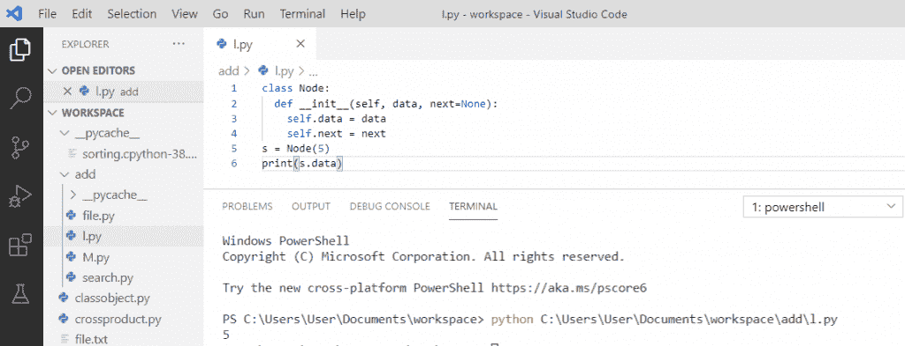
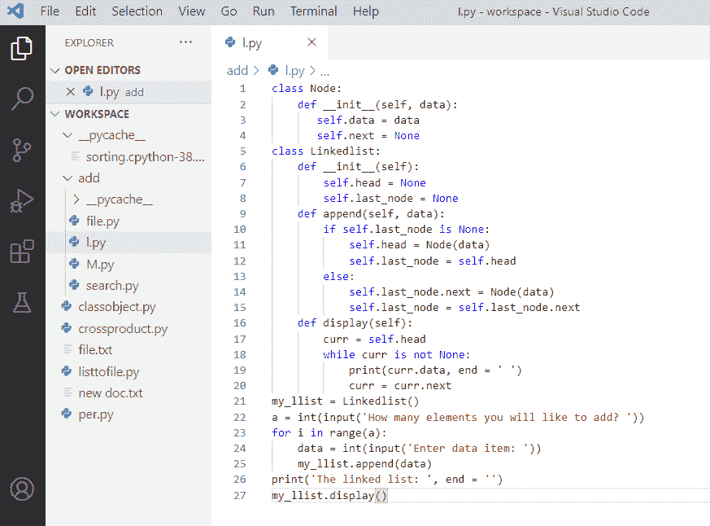
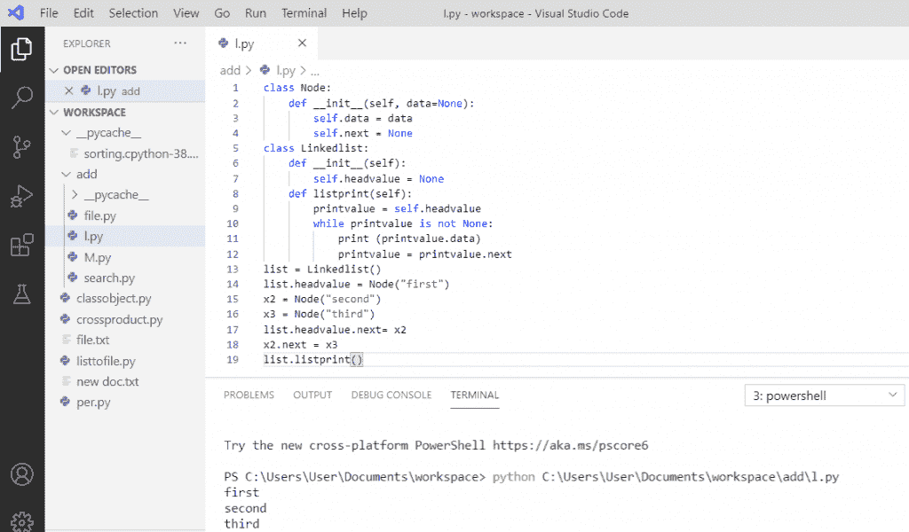
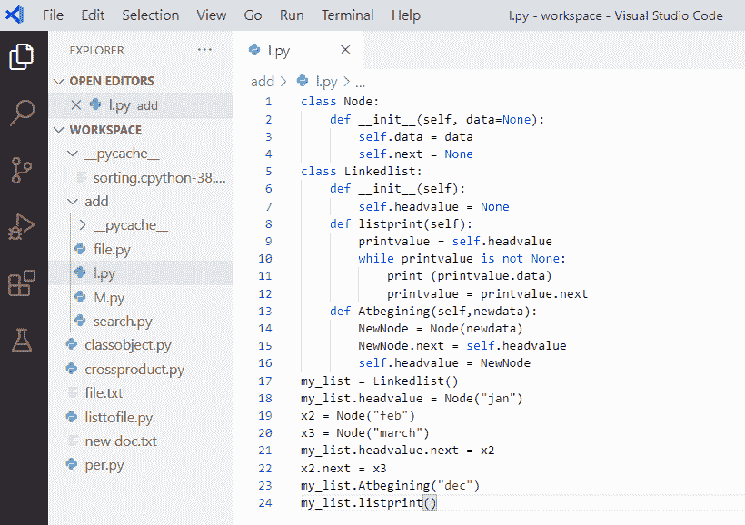
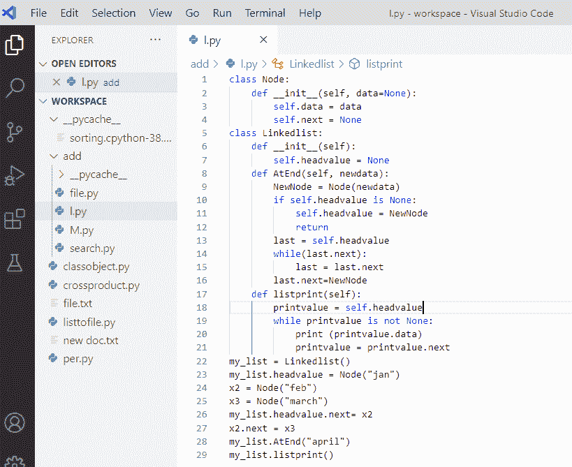

# Python 中的链表

> 原文：<https://pythonguides.com/linked-lists-in-python/>

[](https://sharepointsky.teachable.com/p/python-and-machine-learning-training-course)

在本 [Python 教程](https://pythonguides.com/python-gui-programming/)中，我们将讨论关于 Python 中的**链表。此外，我们将看到以下主题:**

*   python 中的链表是什么？
*   用 python 创建一个链表
*   python 中的链表程序
*   在 python 中遍历链表
*   在 python 中在链表的开头插入
*   在 python 中的链表末尾插入
*   python 中链表的删除

目录

[](#)

*   [python 中的链表是什么？](#What_are_linked_lists_in_python "What are linked lists in python?")
*   [用 python 创建一个链表](#Create_a_linked_list_in_python "Create a linked list in python")
*   [python 中的链表程序](#Linked_list_program_in_python "Linked list program in python")
*   [在 python 中遍历链表](#Traversing_a_linked_list_in_python "Traversing a linked list in python")
*   [在 Python 中的链表开头插入](#Inserting_at_the_beginning_of_the_linked_list_in_Python "Inserting at the beginning of the linked list in Python")
*   [在 python 中的链表末尾插入](#Inserting_at_the_end_of_the_linked_list_in_python "Inserting at the end of the linked list in python")
*   [python 中链表的删除](#Deletion_in_a_linked_list_in_python "Deletion in a linked list in python")

## python 中的链表是什么？

*   Python 中的**链表是一种线性数据结构，其中的元素不存储在连续的内存位置。**
*   每个数据元素以指针的形式连接到另一个数据元素。
*   链表由节点组成，其中每个节点都有一个数据字段和一个到下一个节点的链接。
*   第一个节点称为头部，它是遍历一个列表的起点。
*   最后一个节点的下一个引用指向 none，这意味着它是列表的末尾。
*   Python 的标准库中没有链表。


Linked Lists in Python

> 你可能喜欢 [Python 复制文件(示例)](https://pythonguides.com/python-copy-file/)

## 用 python 创建一个链表

现在，我们可以看到**如何在 python** 中创建链表。

让我们创建一个单独的节点，首先我们将创建一个保存一些**数据**和一个指针 **next** 的**节点**类，它将用于指向链表中的下一个节点。

**举例:**

```
class Node:
  def__init__(self, data, next=None):
    self.data = data
    self.next = next
s = Node(5)
print(s.data)
```

写完上面的代码(用 python 创建一个链表)，当你要打印 **"s.data"** 的时候那么输出会出现 **"5"** 。在这里，我创建了一个单独的节点**“s = Node(5)”**，打印后，它将返回该节点的数据。

你可以参考下面的截图，用 python 创建一个链表。



Create a linked list in python

## python 中的链表程序

*   首先，用实例变量 data 和 next 创建一个类节点。
*   现在，我将用实例变量 head 和 last_node 创建一个类 Linkedlist。
*   变量 head 指向链表中的第一个元素，last_node 指向最后一个元素。
*   此外，在 linkedlist 类中定义 append 和 display 方法，以追加数据并显示一个链接列表
*   为链表创建一个实例，向其追加数据，并显示它。

**举例:**

```
class Node:
    def__init__(self, data):
       self.data = data
       self.next = None
class Linkedlist:
    def__init__(self):
       self.head = None
       self.last_node = None
    def append(self, data):
        if self.last_node is None:
            self.head = Node(data)
            self.last_node = self.head
        else:
            self.last_node.next = Node(data)
            self.last_node = self.last_node.next
    def display(self):
        curr = self.head
        while curr is not None:
            print(curr.data, end = ' ')
            curr = curr.next
my_llist = Linkedlist()
a = int(input('How many elements you will like to add? '))
for i in range(a):
    data = int(input('Enter data item: '))
    my_llist.append(data)
print('The linked list: ', end = ' ')
my_llist.display()
```

写完上面的代码(python 中的链表程序)，当你要显示列表时，输出就会出现。这里，要求用户输入要添加的元素数量，并使用一个循环将数据追加到链表中。链接列表值将显示在输出中。



Linked list program in python

**你可以参考下面的输出:**


Python linked list example

读取: [Python NumPy 读取 CSV](https://pythonguides.com/python-numpy-read-csv/)

## 在 python 中遍历链表

遍历是指遍历每一个节点，单链表从链表头开始向前遍历，到下一个值为 None 的节点结束。

**举例:**

```
class Node:
    def__init__(self, data=None):
       self.data = data
       self.next = None
class Linkedlist:
    def__init__(self):
       self.headvalue = None
    def listprint(self):
        printvalue = self.headvalue
        while printvalue is not None:
            print (printvalue.data)
            printvalue = printvalue.next
list = Linkedlist()
list.headvalue = Node("first")
x2 = Node("second")
x3 = Node("third")
list.headvalue.next = x2
x2.next = x3
list.listprint()
```

写完上面的代码(在 python 中遍历一个链表)，当你打印时，输出将显示为 **"first second third"** 。这里，我们简单地打印当前数据项的值，并通过分配下一个节点的指针来打印下一个数据项。

你可以参考下面的截图，在 python 中遍历一个链表。



Traversing a linked list in python

读取 [Python NumPy 空数组](https://pythonguides.com/python-numpy-empty-array/)

## 在 Python 中的链表开头插入

现在，我们将看到如何将**插入到链表**的开头。

为了将**插入到链表**的开头，我们将在给定链表的头部之前添加一个新的节点。新添加的节点将成为链表的新头。

**举例:**

```
class Node:
    def__init__(self, data=None):
       self.data = data
       self.next = None
class Linkedlist:
    def__init__(self):
       self.headvalue = None
    def listprint(self):
        printvalue = self.headvalue
        while printvalue is not None:
            print (printvalue.data)
            printvalue = printvalue.next
     def Atbegining(self,newdata):
         NewNode = Node(newdata)
         NewNode.next = self.headvalue
         self.headvalue = NewNode
my_list = Linkedlist()
my_list.headvalue = Node("jan")
x2 = Node("feb")
x3 = Node("march")
my_list.headvalue.next = x2
x2.next = x3
my_list.Atbegining("dec")
my_list.listprint()
```

在编写完上面的代码(在 python 中插入链表的开头)后，当您打印时，输出将显示为 **"dec jan feb march"** 。现在，我们将调用在列表开头添加的函数，新节点将被插入到列表的开头

在链表的开头插入**，可以参考下面的截图。**



Inserting at the beginning of the linked list in python

**你可以参考下面的输出:**


## 在 python 中的链表末尾插入

节点被添加到链表的**端，这包括将最后一个节点的下一个指针指向链表的新数据节点。现在，当前最后一个节点将成为倒数第二个数据，而新节点将成为链表的最后一个节点。**

**举例:**

```
class Node:
    def__init__(self, data=None):
       self.data = data
       self.next = None
class Linkedlist:
    def__init__(self):
       self.headvalue = None
    def AtEnd(self,newdata):
         NewNode = Node(newdata)
         if self.headvalue is None:
             self.headvalue = NewNode
             return
         last = self.headvalue
         while(last.next):
             last = last.next
         last.next=NewNode
     def listprint(self):
         printvalue = self.headvalue
         while printvalue is not None:
             print (printvalue.data)
             printvalue = printvalue.next
my_list = Linkedlist()
my_list.headvalue = Node("jan")
x2 = Node("feb")
x3 = Node("march")
my_list.headvalue.next = x2
x2.next = x3
my_list.AtEnd("april")
my_list.listprint()
```

在编写完上面的代码(在 python 中插入链表的末尾)之后，当您打印时，输出将显示为 **" jan feb march april"** 。现在，我们将调用在列表末尾添加新节点的函数。

python 中在链表末尾插入**可以参考下面的截图。**



Inserting at the end of the linked list in python

**你可以参考下面的输出:**


Insert at the end of the linked list in python

阅读: [Python NumPy 日志+示例](https://pythonguides.com/python-numpy-log/)

## python 中链表的删除

让我们看看如何在链表中删除一个节点。

要**删除链表中的一个节点**，我们会找到要删除的节点的前一个节点。我们将改变前一个节点的下一个，并调用一个函数来删除一个节点。

**举例:**

```
class Node:
    def __init__(self, data=None):
        self.data = data
        self.next = None
class Linkedlist:
    def __init__(self):
        self.head = None
    def Atbegining(self, data_n):
        NewNode = Node(data_n)
        NewNode.next = self.head
        self.head = NewNode
    def RemoveNode(self, Removekey):
        Headvalue = self.head
        if (Headvalue is not None):
            if (Headvalue.data == Removekey):
                self.head = Headvalue.next
                Headvalue = None
                return
        while (Headvalue is not None):
            if Headvalue.data == Removekey:
                break
            previous = Headvalue
            Headvalue = Headvalue.next
        if (Headvalue == None):
            return
        previous.next = Headvalue.next
        Headvalue = None
    def list_print(self):
        printvalue = self.head
        while (printvalue):
            print(printvalue.data),
            printvalue = printvalue.next
my_list = Linkedlist()
my_list.Atbegining("jan")
my_list.Atbegining("feb")
my_list.Atbegining("march")
my_list.RemoveNode("jan")
my_list.list_print() 
```

在编写了上面的代码(在 python 中插入链表的末尾)之后，当您打印时，输出将显示为 **" march feb"** 。现在，我们将调用从列表中删除指定节点的函数。

**可以参考下面的输出:**


Deletion in a linked list in python

您可能会喜欢以下 Python 教程:

*   [如何用 Python 显示日历](https://pythonguides.com/display-calendar-in-python/)
*   [如何用 Python 制作计算器](https://pythonguides.com/make-a-calculator-in-python/)
*   [Python 中的正则表达式](https://pythonguides.com/regular-expressions-in-python/)
*   [Python 打印 2 位小数](https://pythonguides.com/python-print-2-decimal-places/)
*   [Python 递归](https://pythonguides.com/python-recursion/)
*   [Python 中的递增和递减运算符](https://pythonguides.com/increment-and-decrement-operators-in-python/)
*   [Python 中的构造函数](https://pythonguides.com/constructor-in-python/)
*   [Python 匿名函数(Lambda 函数)](https://pythonguides.com/python-anonymous-function/)
*   [集合的并集 Python +实例](https://pythonguides.com/union-of-sets-python/)

在本 Python 教程中，我们学习了 Python 中的**链表。此外，我们还讨论了以下主题:**

*   python 中的链表是什么？
*   用 python 创建一个链表
*   python 中的链表程序
*   在 python 中遍历链表
*   python 中如何在链表的开头插入
*   如何在 python 中的链表末尾插入
*   python 中链表的删除

[Bijay Kumar](https://pythonguides.com/author/fewlines4biju/)

Python 是美国最流行的语言之一。我从事 Python 工作已经有很长时间了，我在与 Tkinter、Pandas、NumPy、Turtle、Django、Matplotlib、Tensorflow、Scipy、Scikit-Learn 等各种库合作方面拥有专业知识。我有与美国、加拿大、英国、澳大利亚、新西兰等国家的各种客户合作的经验。查看我的个人资料。

[enjoysharepoint.com/](https://enjoysharepoint.com/)[](https://www.facebook.com/fewlines4biju "Facebook")[](https://www.linkedin.com/in/fewlines4biju/ "Linkedin")[](https://twitter.com/fewlines4biju "Twitter")