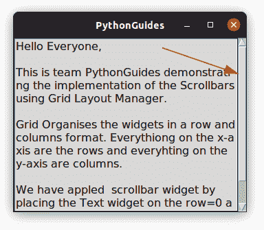
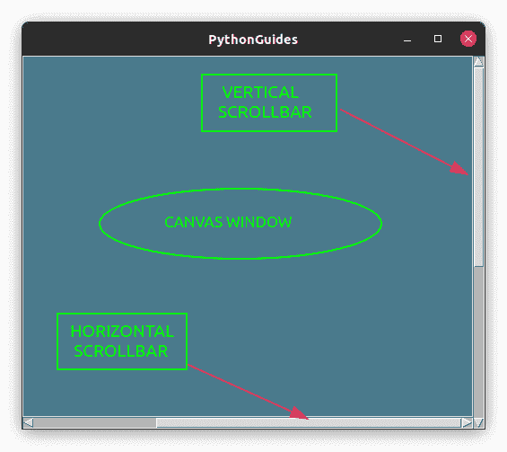
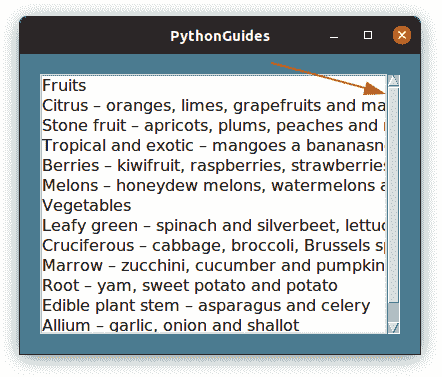

# Python Tkinter 滚动条–如何使用

> 原文：<https://pythonguides.com/python-tkinter-scrollbar/>

[](https://sharepointsky.teachable.com/p/python-and-machine-learning-training-course)

在这个 [Python tkinter 教程](https://pythonguides.com/python-gui-programming/)中，我们将学习 **Python Tkinter 滚动条**。此外，我们还将讨论以下主题:

*   Python Tkinter 滚动条
*   Python Tkinter 滚动条网格
*   Python Tkinter 滚动条框架
*   Python Tkinter 滚动条画布
*   Python Tkinter 滚动条文本框
*   Python Tkinter 滚动条不起作用
*   Python Tkinter 滚动条文本微件
*   Python Tkinter 滚动条方向

目录

[](#)

*   [Python Tkinter 滚动条](#Python_Tkinter_Scrollbar "Python Tkinter Scrollbar")
*   [Python Tkinter 滚动条网格](#Python_Tkinter_Scrollbar_Grid "Python Tkinter Scrollbar Grid")
*   [Python Tkinter 滚动条框架](#Python_Tkinter_Scrollbar_Frame "Python Tkinter Scrollbar Frame")
*   [Python Tkinter 滚动条画布](#Python_Tkinter_Scrollbar_Canvas "Python Tkinter Scrollbar Canvas")
*   [Python Tkinter 滚动条文本框](#Python_Tkinter_Scrollbar_Text_box "Python Tkinter Scrollbar Text box")
*   [Python Tkinter 滚动条不工作](#Python_Tkinter_Scrollbar_Not_Working "Python Tkinter Scrollbar Not Working")
*   [Python Tkinter 滚动条文本小工具](#Python_Tkinter_Scrollbar_Text_Widget "Python Tkinter Scrollbar Text Widget")
*   [Python Tkinter 滚动条定向](#Python_Tkinter_Scrollbar_Orient "Python Tkinter Scrollbar Orient")

## Python Tkinter 滚动条

Python Tkinter 中的**滚动条是一个小部件，其中连续的文本、图片或任何其他多媒体内容可以在计算机窗口屏幕上以预定的方向(水平或垂直)滚动。**

*   当内容超出屏幕方向时，滚动条会被添加，这样用户就可以从左右或上下方向导航到看不见的内容。
*   在 Python 中，Tkinter 小部件使用布局管理器来定位，如 **Place()、Grid()和 Pack()** 。我们可以使用这些布局管理器在应用程序窗口上定位滚动条小部件。

**Python Tkinter 中滚动条的语法**

*   在这个语法中， **ws** 是我们想要放置滚动条的主屏幕。 **Orient** 决定滚动条是**垂直**还是**水平**。
*   我们使用的布局管理器是 **Pack()** 。
*   一旦我们成功地创建了滚动条部件，现在是时候把它应用到一个部件上了。这是一个重要的步骤，因为它将滚动条与应用程序中的特定小部件绑定在一起。
*   例如，在电子邮件应用程序中，当内容超出文本小部件的方向时，我们只能在文本区域看到滚动条。
*   在将滚动条与其他应用程序绑定时，我们通过在 scollcommand 中传递 X 或 Y 来指定滚动方向。第 11、12 行的代码显示了绑定代码。

```py
# creating and placing scrollbar
sb = Scrollbar(
    ws,
    orient=VERTICAL
)
sb.pack()

# binding scrollbar with other widget (Text, Listbox, Frame, etc)

<other_widget>.config(yscrollcommand=sb.set)
sb.config(command=<other_widget>.yview) 
```

这里是 Python Tkinter 中**滚动条的预览。该图显示了垂直滚动条。**


Scrollbar in Python Tkinter

阅读: [Python tkinter 标签–如何使用](https://pythonguides.com/python-tkinter-label/)

## Python Tkinter 滚动条网格

Python Tkinter 中的网格是一个布局管理器，它以行列格式组织小部件。 **x 轴**上的一切都是行， **y 轴**上的一切都是列。

*   在本节中，我们将学习如何使用 Python Tkinter 中的网格布局管理器在文本小部件上添加滚动条。
*   策略是我们将文本小部件和滚动条小部件放置在文本小部件的 row=0 和 column=0 处，滚动条小部件的 column=1 处。通过这种方式，两个小部件看起来是相互平行的(第 19、27 行)。
*   通过使用 **sticky** 我们将在南北方向拉伸滚动条(第 27 行)。
*   最后，我们将滚动条与文本框小部件绑定在一起(第 29，30 行)
*   *注意:文本小部件可以被任何小部件*替换。

**下面是使用网格**的滚动条的实现

在这段代码中，我们使用文本框小部件创建了一个文本编辑器，如果字数超过了文本小部件的方向，就会出现滚动条。

```py
from tkinter import *

ws = Tk()
ws.title('PythonGuides')
ws.config(bg='#5F734C')

frame = Frame(
    ws,
    bg='#A8B9BF'
    )

text_box = Text(
    ws,
    height=13,
    width=32, 
    font=(12)  
)

text_box.grid(row=0, column=0)
text_box.config(bg='#D9D8D7')

sb = Scrollbar(
    ws,
    orient=VERTICAL
    )

sb.grid(row=0, column=1, sticky=NS)

text_box.config(yscrollcommand=sb.set)
sb.config(command=text_box.yview)

ws.mainloop()
```

**下面是上面代码**的输出

在这个输出中，您可以看到在单词开始超过文本框大小时，滚动条立即开始出现。



Python Tkinter Scrollbar

阅读:[Python Tkinter Entry–如何使用](https://pythonguides.com/python-tkinter-entry/)

## Python Tkinter 滚动条框架

Python Tkinter 中的滚动条可应用于框架，帮助用户水平或垂直滚动屏幕。

*   在屏幕上输入所有文本并不总是可能的。因为这将妨碍内容的可读性，而且在屏幕上也很难看。
*   为了解决这个问题，引入了滚动条。现在用户只需滚动滚动条就可以访问大量的文本信息。
*   在框架上应用滚动条是最简单也是最好的方法。只需将两者(滚动条和其他部件)放入框架窗口中，然后将它们打包到相反的方向。
*   例如，把滚动条放在右边，把其他部件放在左边。
*   下面是 Python Tkinter 中框架小部件上滚动条的实现。

在 Python Tkinter 中展示在框架 **上实现滚动条的完整代码**

在这段代码中，我们在 Python Tkinter 的框架中放置了滚动条和文本框小部件。然后，通过使用包布局管理器，我们已经定位到右边的滚动条和左边的文本框。这可以在**第 19 行和第 27 行**中看到。最后，我们将滚动条和文本框绑定在一起，代码在**第 29，30 行**。

```py
from tkinter import *

ws = Tk()
ws.title('PythonGuides')
ws.geometry('400x300')
ws.config(bg='#5F734C')

frame = Frame(
    ws,
    bg='#A8B9BF'
    )

text_box = Text(
    ws,
    height=13,
    width=32, 
    font=(12)  
)
text_box.pack(side=LEFT,expand=True)
text_box.config(bg='#D9D8D7')

sb_ver = Scrollbar(
    ws,
    orient=VERTICAL
    )

sb_ver.pack(side=RIGHT, fill=Y)

text_box.config(yscrollcommand=sb_ver.set)
sb_ver.config(command=text_box.yview)

ws.mainloop()
```

**上面代码的输出显示了 Python Tkinter 中滚动条在框架上的实现**

在这个输出中，滚动条被标记在右边。滚动滚动条将显示文本框中的文本。


Python Tkinter Scrollbar Frame

阅读: [Python Tkinter 按钮–如何使用](https://pythonguides.com/python-tkinter-button/)

## Python Tkinter 滚动条画布

画布是一个可以画图表的自由空间。除了绘图，我们还可以在上面放置图形和小部件(框架，文本框，按钮等)。

*   在这一节中，我们将学习如何在画布上添加滚动条。此外，我们将创建一个应用程序来演示画布上的 Python Tkinter 滚动条。
*   Canvas 用于在程序中创建一个 canvas 小部件，后跟您想要放置它的窗口的名称。另外，提供画布窗口的宽度和高度。

```py
Canvas(
    ws,
    width=500,
    height=400,
    )
```

*   我们已经创建了一个框架，并在框架内放置了画布和滚动条小部件。
*   然后我们用画布绑定两个滚动条(水平和垂直)

。这里是 Python Tkinter Scrollbar Canvas 的完整源代码。

```py
from tkinter import *

ws = Tk()
ws.title('PythonGuides')

frame = Frame(
    ws,
    width=500,
    height=400
    )
frame.pack(expand=True, fill=BOTH)

canvas=Canvas(
    frame,
    bg='#4A7A8C',
    width=500,
    height=400,
    scrollregion=(0,0,700,700)
    )

vertibar=Scrollbar(
    frame,
    orient=VERTICAL
    )
vertibar.pack(side=RIGHT,fill=Y)
vertibar.config(command=canvas.yview)

horibar=Scrollbar(
    frame,
    orient=HORIZONTAL
    )
horibar.pack(side=BOTTOM,fill=X)
horibar.config(command=canvas.xview)

canvas.config(width=500,height=400)

canvas.config(
    xscrollcommand=horibar.set, 
    yscrollcommand=vertibar.set
    )
canvas.pack(expand=True,side=LEFT,fill=BOTH)

ws.mainloop()
```

**下面是上面代码在画布上实现 Python Tkinter 滚动条** **的输出**



Python Tkinter Scrollbar Canvas

阅读: [Python Tkinter 单选按钮–如何使用](https://pythonguides.com/python-tkinter-radiobutton/)

## Python Tkinter 滚动条文本框

在本节中，我们在文本小部件上应用了**滚动条。这个程序的输出看起来类似于 **Python Tkinter 滚动条框架**。**

*   在**Python Tkinter scroll bar Frame**中，我们已经在框架小部件上应用了滚动条，但这里我们将直接在文本小部件上应用它。
*   我们在 Python Tkinter 中创建了一个文本小部件，并将其打包到左侧。然后，我们创建了一个滚动条部件，并将其打包到右侧。
*   使用的布局管理器是 Pack()代码出现在**行的第 15、23 行**

```py
from tkinter import *

ws = Tk()
ws.title('PythonGuides')
ws.geometry('400x300')
ws.config(bg='#F25252')

frame = Frame(ws)

text_box = Text(
    ws,
    height=13,
    width=32, 
    font=(12)  
)

text_box.pack(side=LEFT,expand=True)

sb_ver = Scrollbar(
    ws,
    orient=VERTICAL
    )

sb_ver.pack(side=RIGHT, fill=Y)

text_box.config(yscrollcommand=sb_ver.set)
sb_ver.config(command=text_box.yview)

ws.mainloop()
```

**下面是上面代码的输出，它实现了文本小部件**上的滚动条

在这个输出中，您可以看到文本显示在文本框中，并且滚动条出现在窗口的右侧。


Python Tkinter Scrollbar Text box

阅读: [Python Tkinter 窗口大小](https://pythonguides.com/python-tkinter-window-size/)

## Python Tkinter 滚动条不工作

在本节中，我们将看到滚动条不起作用的可能原因。此外，我们将讨论在 Python Tkinter 中实现**滚动条时的常见错误及其修复。**

*   **缺少布局管理器:**如果您没有在屏幕上看到滚动条，首先要检查滚动条部件是否使用布局管理器(pack，grid，place)定位。
*   **看起来很小:**如果 Python Tkinter 中的滚动条看起来很小
    *   如果您使用的是**网格**布局管理器，使用**粘性**并将滚动条设置为 ***NS*** 垂直滚动条和 ***EW*** 水平滚动条。
    *   如果你正在使用 **Pack** 布局管理器，使用 **fill=X** 用于水平滚动条，使用 **fill=Y** 用于垂直滚动条。

## Python Tkinter 滚动条文本小工具

在本节中，我们已经在文本小部件上应用了滚动条。这个程序的输出看起来类似于 **Python Tkinter 滚动条框架**。

*   在**Python Tkinter scroll bar Frame**中，我们已经在框架小部件上应用了滚动条，但这里我们将直接在文本小部件上应用它。
*   我们在 Python Tkinter 中创建了一个文本小部件，并将其打包到左侧。然后，我们创建了一个滚动条部件，并将其打包到右侧。
*   使用的布局管理器是 **Pack()** 代码出现在**行 15、23** 上。

这里是在文本小部件上实现滚动条的完整代码

```py
from tkinter import *

ws = Tk()
ws.title('PythonGuides')
ws.geometry('400x300')
ws.config(bg='#F25252')

text_box = Text(
    ws,
    height=13,
    width=32, 
    font=(12)  
)

text_box.pack(side=LEFT,expand=True)

sb_ver = Scrollbar(
    ws,
    orient=VERTICAL
    )

sb_ver.pack(side=RIGHT, fill=Y)

text_box.config(yscrollcommand=sb_ver.set)
sb_ver.config(command=text_box.yview)

ws.mainloop()
```

**下面是上面代码的输出，它实现了文本小部件**上的滚动条

在这个输出中，您可以看到文本显示在文本框中，并且滚动条出现在窗口的右侧。


Python Tkinter Scrollbar Text Widget

阅读: [Python Tkinter 画布教程](https://pythonguides.com/python-tkinter-canvas/)

## Python Tkinter 滚动条定向

Python Tkinter 中的 **Scrollbar 提供了一个 **Orient** 选项，使用它我们可以将滚动条调整到水平到垂直的位置。**

*   滚动条可以应用在文本框、框架、列表框等小部件上。该要求可以是垂直滚动条，水平滚动条，或两者兼而有之。
*   要应用滚动条，应用以下命令。这里 *lb* 是列表框的变量， *sb* 是分配给滚动条的变量。

```py
lb.configure(yscrollcommand=sb.set)
sb.config(command=lb.yview)
```

**Python Tkinter 中垂直方向滚动条的代码**

在这段代码中，我们将滚动条的方向设置为垂直，现在用户可以上下滚动来访问内容。该代码可在第 **19** 行找到。

```py
from tkinter import *

ws = Tk()
ws.title('PythonGuides')
ws.geometry('400x300')
ws.config(bg='#4A7A8C')

frame = Frame(ws)
frame.pack(expand=True, fill=BOTH, padx=20, pady=20)

lb = Listbox(
    frame,
    font= (12)
    )
lb.pack(expand=True, fill=BOTH, side=LEFT)

sb = Scrollbar(
    frame, 
    orient=VERTICAL
    )
sb.pack(fill=Y, side=RIGHT)

lb.configure(yscrollcommand=sb.set)
sb.config(command=lb.yview)

lb.insert(0, 'Fruits')
lb.insert(1,'Citrus – oranges, limes, grapefruits and mandarins')
lb.insert(2,'Stone fruit – apricots, plums, peaches and nectarines')
lb.insert(3,'Tropical and exotic – mangoes a bananasnd ')
lb.insert(4,'Berries – kiwifruit, raspberries, strawberries, blueberries,  and passionfruit')
lb.insert(5,'Melons – honeydew melons, watermelons and rockmelons')
lb.insert(6, 'Vegetables')
lb.insert(7, 'Leafy green – spinach and silverbeet, lettuce')
lb.insert(8, 'Cruciferous – cabbage, broccoli, Brussels sprouts and cauliflower')
lb.insert(9, 'Marrow – zucchini, cucumber and pumpkin')
lb.insert(10, 'Root – yam, sweet potato and potato')
lb.insert(11, 'Edible plant stem – asparagus and celery')
lb.insert(12, 'Allium – garlic, onion and shallot')

ws.mainloop()
```

Python Tkinter 中垂直方向滚动条的代码。

在这个输出中，我们创建了一个垂直方向的滚动条。如果文本大于文本容纳小工具的边距，滚动条将开始出现。这样，用户可以上下滚动来访问文本。



Python Tkinter Scrollbar Orient

**Python Tkinter**中水平方向滚动条的代码

在这段代码中，我们在 Python Tkinter 中创建了一个**水平滚动条。在第 19 行，您可以看到我们已经将滚动条的方向设置为水平。**

```py
from tkinter import *

ws = Tk()
ws.title('PythonGuides')
ws.geometry('400x300')
ws.config(bg='#4A7A8C')

frame = Frame(ws)
frame.pack(expand=True, fill=BOTH, padx=20, pady=20)

lb = Listbox(
    frame,
    font= (12)
    )
lb.pack(expand=True, fill=BOTH)

sb = Scrollbar(
    frame, 
    orient=HORIZONTAL
    )
sb.pack(fill=X)

lb.configure(xscrollcommand=sb.set)
sb.config(command=lb.xview)

lb.insert(0, 'Not all heros wear capes.')
lb.insert(1, 'Game changers are in blue')
lb.insert(2, 'With great power comes great responsibility')
lb.insert(3, 'A noun phrase has a noun or pronoun as the main word')
lb.insert(4, 'With great power comes great responsibility')
lb.insert(5, 'contribute to open source, as this will help & motivate you.')

ws.mainloop()
```

**Python Tkinter 中水平方向滚动条的输出**

在这个输出中，我们将滚动条的方向设置为水平。用户现在可以左右滚动来查看内容。

```py
text_box.config(yscrollcommand=sb.set)
sb.config(command=text_box.yview)
```

您可能会喜欢以下 Python tkinter 教程:

*   [Python Tkinter 文本框小工具+示例](https://pythonguides.com/python-tkinter-text-box/)
*   [Python Tkinter Grid](https://pythonguides.com/python-tkinter-grid/)
*   [Python Tkinter 选项菜单](https://pythonguides.com/python-tkinter-optionmenu/)
*   [使用 Tkinter 的 Python 注册表](https://pythonguides.com/registration-form-in-python-using-tkinter/)
*   [从 PDF Python 中提取文本+有用示例](https://pythonguides.com/extract-text-from-pdf-python/)
*   [Python NumPy appe](https://pythonguides.com/python-numpy-append/)[n](https://pythonguides.com/python-numpy-append/)[d](https://pythonguides.com/python-numpy-append/)

在本教程中，我们已经讨论了关于 **Python Tkinter 滚动条**的所有内容和以下几点:

*   Python Tkinter 滚动条网格
*   Python Tkinter 滚动条框架
*   Python Tkinter 滚动条画布
*   Python Tkinter 滚动条鼠标滚轮
*   Python Tkinter 滚动条不起作用
*   Python Tkinter 滚动条文本微件
*   Python Tkinter 滚动条方向

[Bijay Kumar](https://pythonguides.com/author/fewlines4biju/)

Python 是美国最流行的语言之一。我从事 Python 工作已经有很长时间了，我在与 Tkinter、Pandas、NumPy、Turtle、Django、Matplotlib、Tensorflow、Scipy、Scikit-Learn 等各种库合作方面拥有专业知识。我有与美国、加拿大、英国、澳大利亚、新西兰等国家的各种客户合作的经验。查看我的个人资料。

[enjoysharepoint.com/](https://enjoysharepoint.com/)[](https://www.facebook.com/fewlines4biju "Facebook")[](https://www.linkedin.com/in/fewlines4biju/ "Linkedin")[](https://twitter.com/fewlines4biju "Twitter")