# 如何在 Python 中将 DateTime 转换成 UNIX 时间戳

> 原文：<https://pythonguides.com/convert-datetime-to-unix-timestamp-in-python/>

[](https://sharepointsky.teachable.com/p/python-and-machine-learning-training-course)

在这个 [Python 教程](https://pythonguides.com/python-programming-for-the-absolute-beginner/)中，我们将学习如何在 Python ( **Python 日期时间到 UNIX 时间戳**)、中**转换日期时间到 UNIX 时间戳，我们还将涉及以下主题:**

*   什么是 Unix 时间戳？
*   将日期时间转换为 Unix 时间戳 python
*   Python DateTime 到 Unix 时间戳毫秒
*   Python 日期时间到 Unix 时间戳 13 位数
*   Python 日期时间到 Unix 时间戳 UTC
*   Python 日期时间字符串到 Unix 时间戳
*   Python datetime.now 到 Unix 时间戳
*   Python datetime.date 到 Unix 时间戳
*   Python 日期时间到 Unix 时间戳秒数
*   Python 日期时间到 Unix 时间戳时区
*   Python Unix 时间戳到日期时间
*   格式化 Unix 时间戳 python

目录

[](#)

*   [什么是 Unix 时间戳？](#What_is_the_Unix_timestamp "What is the Unix timestamp?")
*   [将日期时间转换为 Unix 时间戳 python](#Convert_DateTime_to_Unix_timestamp_python "Convert DateTime to Unix timestamp python")
*   [Python 日期时间到 Unix 时间戳毫秒](#Python_DateTime_to_Unix_timestamp_milliseconds "Python DateTime to Unix timestamp milliseconds")
*   [Python 日期时间到 Unix 时间戳 13 位数](#Python_DateTime_to_Unix_timestamp_13_digits "Python DateTime to Unix timestamp 13 digits")
*   [Python 日期时间到 Unix 时间戳 UTC](#Python_DateTime_to_Unix_timestamp_UTC "Python DateTime to Unix timestamp UTC")
*   [Python 日期时间字符串到 Unix 时间戳](#Python_DateTime_string_to_Unix_timestamp "Python DateTime string to Unix timestamp")
*   [Python datetime.now 到 Unix 时间戳](#Python_datetimenow_to_Unix_timestamp "Python datetime.now to Unix timestamp   ")
*   [Python datetime.date 到 unix 时间戳](#Python_datetimedate_to_unix_timestamp "Python datetime.date to unix timestamp")
*   [Python 日期时间到 Unix 时间戳秒数](#Python_DateTime_to_Unix_timestamp_seconds "Python DateTime to Unix timestamp seconds")
*   [Python 日期时间到 Unix 时间戳时区](#Python_Datetime_to_Unix_timestamp_timezone "Python Datetime to Unix timestamp timezone")
*   [Python Unix 时间戳到日期时间](#Python_Unix_timestamp_to_datetime "Python Unix timestamp to datetime")
*   [格式化 Unix 时间戳 python](#Format_Unix_timestamp_python "Format Unix timestamp python")

## 什么是 Unix 时间戳？

*   Unix 时间是一个每秒增加的单个有符号数字，它使计算机能够存储和操作传统的日期系统。然后，程序被转换成人类可读的格式。
*   Unix 时间戳是从 1970 年 1 月 1 日开始计算的秒数。

## 将日期时间转换为 Unix 时间戳 python

现在，我们可以看到**如何在 python 中将** **DateTime 转换为 Unix 时间戳**。

*   在这个例子中，我导入了一个名为 **datetime** 和 **time** 的模块，变量 datetime 被声明并赋值为 **datetime.datetime(2020，2，11，10，20)** 。
*   这里 2020 是年，2 是月，11 是日，10 是小时，20 是分钟。
*   **datetime** 模块有许多方法返回关于日期对象的许多信息。
*   **mktime** 是时间的方法，是本地时间的反函数，该方法用于将 datetime**转换为 Unix 时间戳。**
*   **timetuple()** 是 datetime 类的一个方法，它以名称元组的形式返回 datetime 的属性。

示例:

```py
import datetime
import time
datetime = datetime.datetime(2020, 2, 11, 10, 20)
print("Unix_Time_stamp: ",(time.mktime(datetime.timetuple())))
```

下面的屏幕截图显示了 unix 时间戳作为输出:

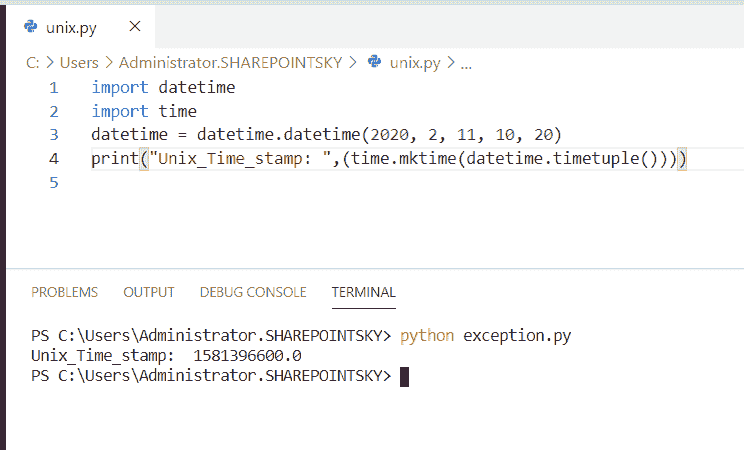

Convert DateTime to Unix timestamp python

你可能也喜欢用例子连接列表[。](https://pythonguides.com/python-concatenate-list/)

## Python 日期时间到 Unix 时间戳毫秒

在这里，我们可以看到**如何在 python 中将 DateTime 转换为 Unix 时间戳毫秒**。

*   在这个例子中，我已经导入了一个名为 **datetime** 的模块来获取 Unix 时间戳，单位为毫秒。 **datetime.now()** 用于获取当前时间。
*   **mktime** 是时间的方法，是本地时间的反函数，这个方法**是**用于将 datetime 转换为 Unix 时间戳毫秒。
*   **timetuple()** 是 datetime 类的一个方法，它以名称元组的形式返回 datetime 的属性。要得到以毫秒为单位的时间，必须乘以 1000。

示例:

```py
import datetime, time
millisecond = datetime.datetime.now()
print(time.mktime(millisecond.timetuple()) * 1000)
```

我们可以看到以毫秒为单位的 unix 时间戳。您可以参考下面的输出截图:

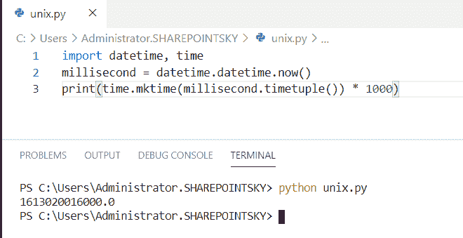

Python DateTime to Unix timestamp milliseconds

阅读:[从 PDF Python 中提取文本](https://pythonguides.com/extract-text-from-pdf-python/)

## Python 日期时间到 Unix 时间戳 13 位数

现在，我们可以在 python 中看到 **DateTime 到 Unix 时间戳的 13 位数**。

*   在这个例子中，我导入了像**时间**和**日期时间这样的模块。**
*   **datetime.datetime.now()** 用于获取当前时间。
*   **timetuple()** 是 datetime 类的一个方法，它以名称元组的形式返回 datetime 的属性。要得到 13 位数的时间戳，必须乘以 1000。

示例:

```py
import time
import datetime
date = datetime.datetime.now()
unix_time = datetime.datetime.timestamp(date)*1000
print(unix_time)
```

下面的屏幕截图显示了由 unix 时间戳中的 13 个数字组成的输出。

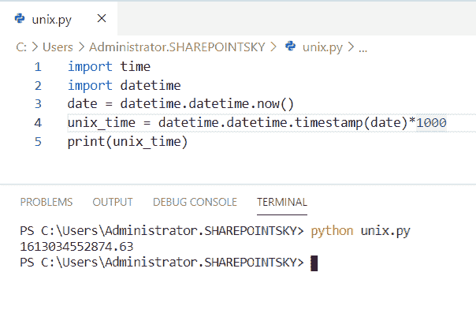

Python DateTime to Unix timestamp 13 digits

## Python 日期时间到 Unix 时间戳 UTC

在这里，我们可以看到**如何在 python 中将 DateTime 转换为 Unix 时间戳 UTC** 。

*   在这个例子中，我导入了一个名为**日历**和**日期时间**的模块。日历模块提供了与日历相关的有用功能。
*   **utc.now** 用于获取 utc 时区的当前时间。时间模块中的 **timegm** 函数返回 unix 时间戳。
*   **timetuple()** 是 datetime 类的一个方法，它以名称元组的形式返回 datetime 的属性。print(UTC)用于获取 Unix 时间戳。

示例:

```py
import calendar
import datetime
date_time = datetime.datetime.utcnow()
UTC = calendar.timegm(date_time.utctimetuple())
print(UTC)
```

下面的截图显示了输出。

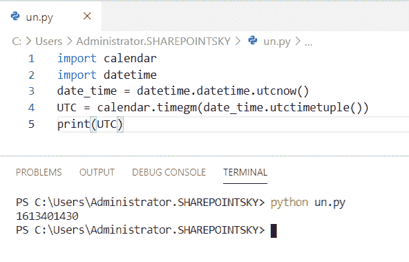

Python DateTime to Unix timestamp UTC

## Python 日期时间字符串到 Unix 时间戳

现在，我们可以在 python 中看到 Unix 时间戳的 **DateTime 字符串。**

*   在这个例子中，我导入了一个名为 **datetime** 的模块，并将一个变量声明为 date_string。
*   在这里，我指定了 **date_string = "2/11/2021，04:5:8"** 这里的日期和时间以字符串格式给出。
*   这里 2 是月，11 是日，2021 是年，04 是小时，5 是分钟，8 是秒。
*   **strptime()** 是 datetime 模块的函数，它用于将字符串解析为 datetime 和 time 对象。 **timestamp()** 方法返回当地时间。

示例:

```py
import datetime
date_string = "2/11/2021, 04:5:8"
date = datetime.datetime.strptime(date_string, "%m/%d/%Y, %H:%M:%S")
time_stamp = datetime.datetime.timestamp(date)
print(time_stamp)
```

下面的屏幕截图显示日期时间字符串形式被转换成 Unix 时间戳作为输出。

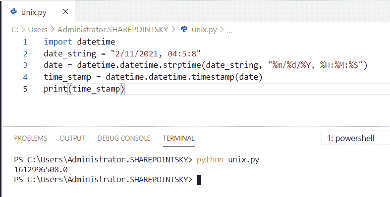

Python DateTime string to Unix timestamp

## Python datetime.now 到 Unix 时间戳

现在，我们可以看到 python 中的 **datetime.now 到 Unix 时间戳**。

*   在这个例子中，我导入了一个名为 **datetime** 的模块，并声明了一个变量为 **time_stamp** ，并分配了 **datetime.now()** 方法来获取 Unix 时间戳中的 now 时间。
*   **timestamp()** 函数返回以秒数表示的时间。

示例:

```py
from datetime import datetime
time_stamp= datetime.now()
now = datetime.timestamp(time_stamp)
print(now)
```

下面的截图显示了输出。

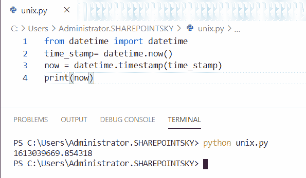

Python datetime.now to Unix timestamp

## Python datetime.date 到 unix 时间戳

在这里，我们可以看到 python 中的 **datetime.date 到 unix 时间戳**。

*   在本例中，我导入了一个名为 datetime 和 time 的模块。这里使用了 **datetime.date()** ，我们只能在其中传递日期。
*   这里 2020 是年，2 是月，11 是日。
*   **mktime()** 是时间的方法，是本地时间的反函数，这个方法**是**用于将日期转换为 Unix 时间戳。

示例:

```py
import datetime
import time
datetime = datetime.date(2020, 2, 11)
print("Unix_Time_stamp: ",(time.mktime(datetime.timetuple())))
```

我们可以看到日期被转换成时间戳作为输出。您可以参考下面的输出截图:

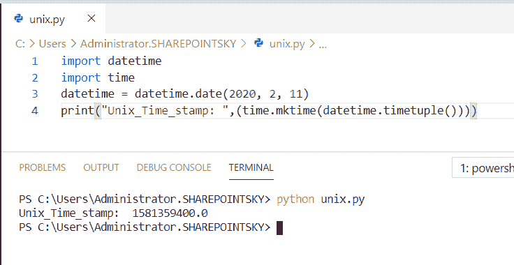

Python datetime.date to unix timestamp

## Python 日期时间到 Unix 时间戳秒数

现在，让我们看看 python 中的 **DateTime 到 Unix 时间戳秒**。

*   在这个例子中，我导入了名为**的 datetime** ，为了计算 Unix 时间戳秒数，我们必须从 Unix 时间戳中用**减去**所需的日期，即 **1970，1，1** 。
*   这里 2020 是年，2 是月，11 是日。
*   总秒数由 **total_seconds()** 返回。
*   为了获得输出，我使用了 print(seconds)

示例:

```py
import datetime
seconds = (datetime.datetime(2020,2,11) - datetime.datetime(1970, 1, 1)).total_seconds()
print(seconds)
```

下面的屏幕截图显示了输出

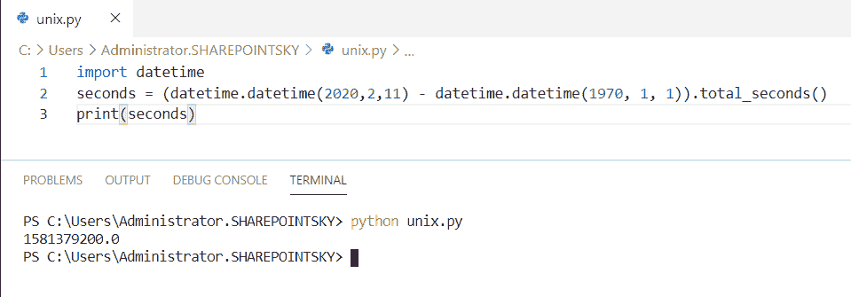

Python DateTime to Unix timestamp seconds

## Python 日期时间到 Unix 时间戳时区

在这里，我们可以看到 python 中的 **Datetime 到 unix 时间戳时区**。

*   在这个例子中，我导入了名为 **datetime** 和 **timezone** 的模块，并将一个变量声明为 timestring，并为 datetime 指定了 timezone。
*   将时区为的日期时间转换为 Unix 时间戳。
*   我用过**d = datetime . datetime . strptime(timestring，" %Y-%m-%dT%H:%M:%SZ")** 。
*   这里 2020 是年，2 是月，25 是日，23 是小时，51 是分钟，03 是秒。
*   **timetuple()** 是 datetime 类的一个方法，它以名称元组的形式返回 datetime 的属性。

示例:

```py
import datetime
import pytz
import time
timestring = "2020-02-25T23:51:03Z"
d = datetime.datetime.strptime(timestring, "%Y-%m-%dT%H:%M:%SZ")
print("Unix_Time_stamp: ",(time.mktime(d.timetuple())))
```

我们可以看到 datetime timezone 到 UNIX timestamp 的输出。您可以参考下面的输出截图:

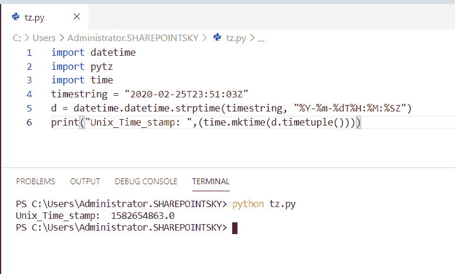

Python Datetime to unix timestamp timezone

## Python Unix 时间戳到日期时间

在这里，我们可以看到**如何在 python 中将** **Unix 时间戳转换为 datetime** 。

*   在这个例子中，我导入了类似于 **datetime** 和 **pytz** 的模块，并声明了一个变量，并将其赋值为 **timestamp = 1613327400.0** 。
*   为了将 Unix 时间戳转换为 datetime，我使用了**datetime = datetime . from timestamp(timestamp)**。
*   为了打印日期时间，我使用了 **print("Unixdatetime = "，datetime)** 。

示例:

```py
from datetime import datetime
import pytz
timestamp =  1613327400.0
datetime = datetime.fromtimestamp(timestamp)
print("Unixdatetime =", datetime)
```

我们可以看到由 unixtimestamp 转换成 datetime 作为输出。您可以参考下面的输出截图:

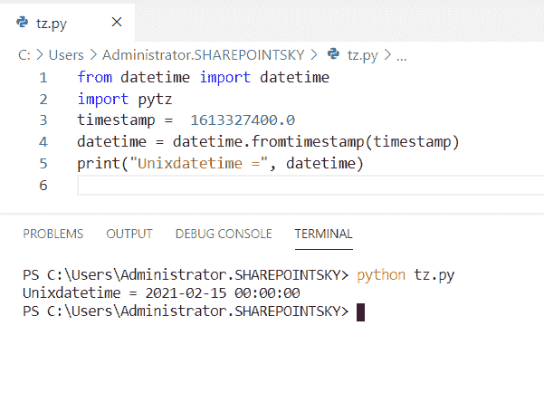

Python Unix timestamp to datetime

## 格式化 Unix 时间戳 python

在这里，我们可以看到 python 中的**格式 Unix 时间戳**。

unix 时间戳的格式为 **10 位数字**。

*   在这个例子中，我导入了一个名为 **datetime** 和 **time** 的模块，并将一个变量声明为 datetime，并赋值为 **datetime = datetime.date(2020，2，15)** 。
*   这里 2020 是年份，2 是月份，15 是日子
*   我们可以用 **print("Unix_Time_stamp:"，(Time . mktime(datetime . Time tuple()))**看到 Unix 时间戳的格式。

示例:

```py
import datetime
import time
datetime = datetime.date(2020, 2, 15)
print("Unix_Time_stamp: ",(time.mktime(datetime.timetuple())))
```

我们可以看到 unix 时间戳的格式作为输出。下面的屏幕截图显示了输出

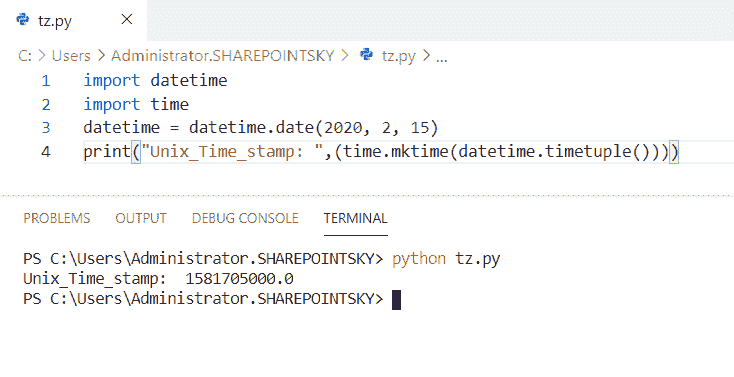

Format Unix timestamp python

您可能会喜欢以下 Python 教程:

*   [Python 捕捉多个异常](https://pythonguides.com/python-catch-multiple-exceptions/)
*   [Python 异常处理](https://pythonguides.com/python-exceptions-handling/)
*   [Python Tkinter Map()函数](https://pythonguides.com/python-tkinter-map-function/)
*   [Python 将图像保存到文件](https://pythonguides.com/python-save-an-image-to-file/)
*   [如何使用 Python Tkinter 创建日期时间选取器](https://pythonguides.com/create-date-time-picker-using-python-tkinter/)
*   [如何使用 Python Tkinter 读取文本文件](https://pythonguides.com/python-tkinter-read-text-file/)
*   [如何进入 Python Tkinter 程序的下一页](https://pythonguides.com/go-to-next-page-in-python-tkinter/)

在本教程中，我们学习了关于 **Python DateTime 到 UNIX 时间戳**的知识，并且我们还讨论了以下主题:

*   什么是 Unix 时间戳？
*   将日期时间转换为 Unix 时间戳 python
*   Python DateTime 到 Unix 时间戳毫秒
*   Python 日期时间到 Unix 时间戳 13 位数
*   Python 日期时间到 Unix 时间戳 UTC
*   Python 日期时间字符串到 Unix 时间戳
*   Python datetime.now 到 Unix 时间戳
*   Python datetime.date 到 Unix 时间戳
*   Python 日期时间到 Unix 时间戳秒数
*   Python 日期时间到 Unix 时间戳时区
*   Python Unix 时间戳到日期时间
*   格式化 Unix 时间戳 python

[Bijay Kumar](https://pythonguides.com/author/fewlines4biju/)

Python 是美国最流行的语言之一。我从事 Python 工作已经有很长时间了，我在与 Tkinter、Pandas、NumPy、Turtle、Django、Matplotlib、Tensorflow、Scipy、Scikit-Learn 等各种库合作方面拥有专业知识。我有与美国、加拿大、英国、澳大利亚、新西兰等国家的各种客户合作的经验。查看我的个人资料。

[enjoysharepoint.com/](https://enjoysharepoint.com/)[](https://www.facebook.com/fewlines4biju "Facebook")[](https://www.linkedin.com/in/fewlines4biju/ "Linkedin")[](https://twitter.com/fewlines4biju "Twitter")