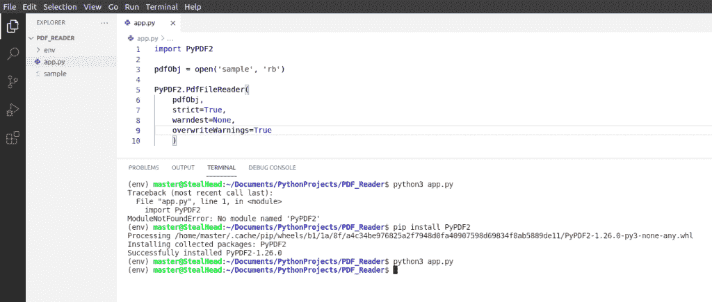
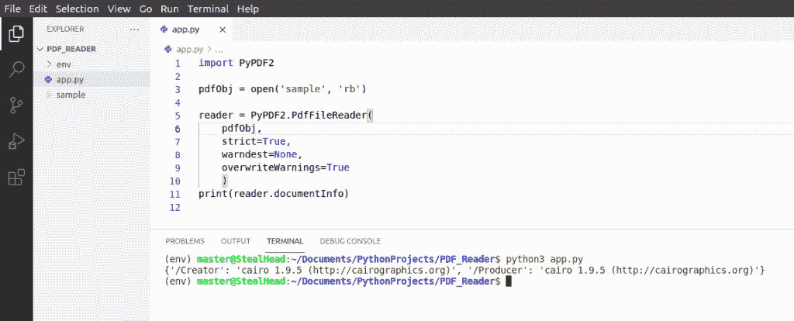
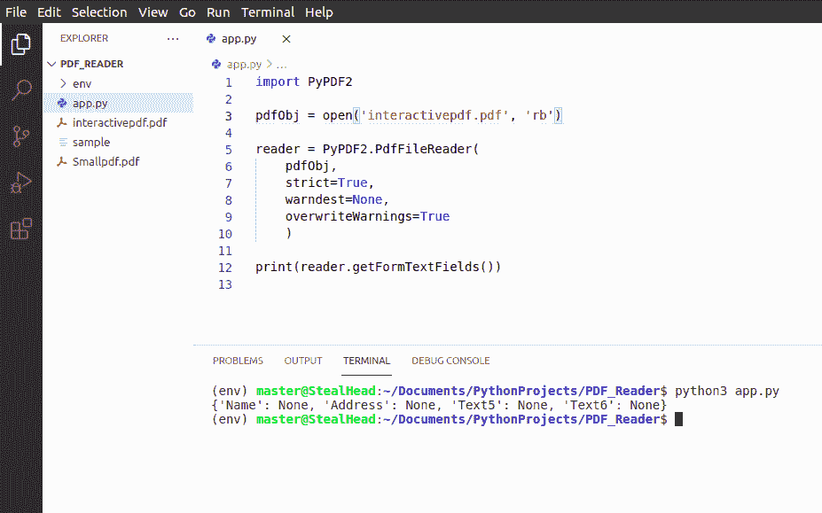
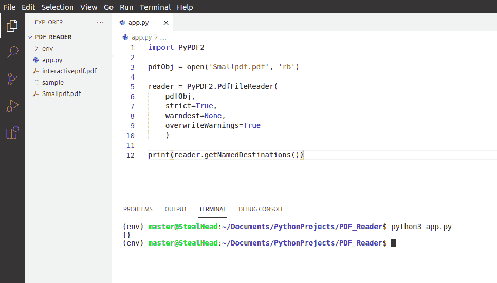
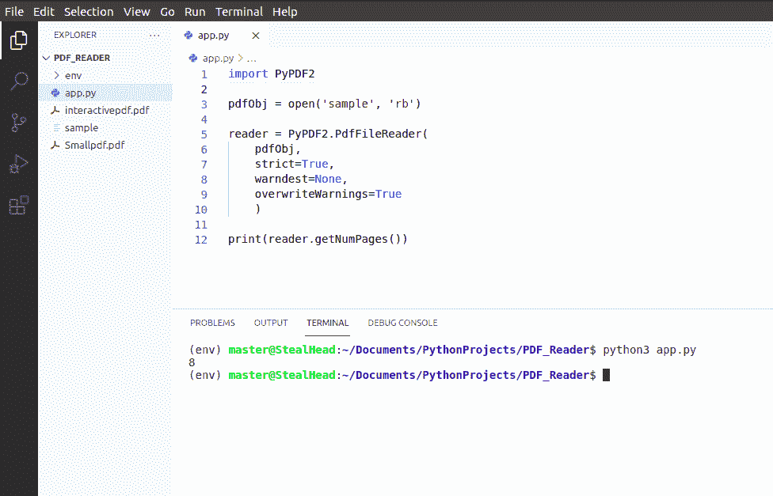
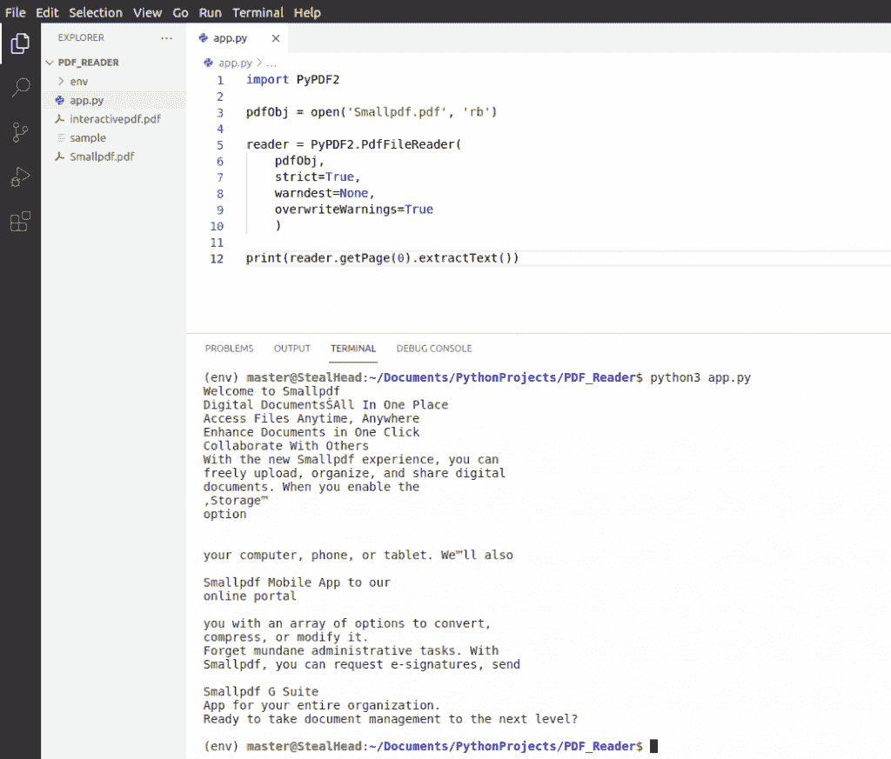
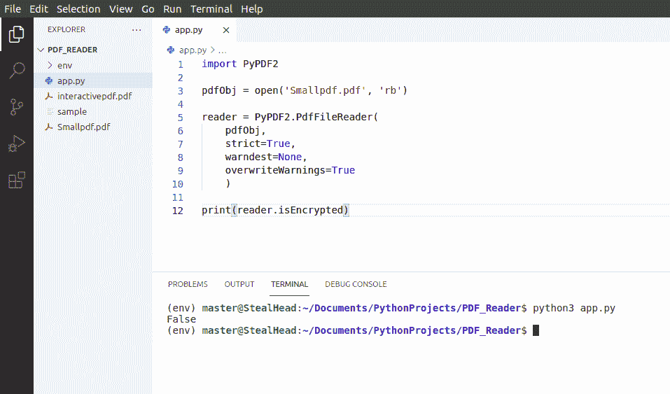

# PdfFileReader Python 示例

> 原文：<https://pythonguides.com/pdffilereader-python-example/>

[](https://sharepointsky.teachable.com/p/python-and-machine-learning-training-course)

在本 [Python 教程](https://pythonguides.com/learn-python/)中，我们将讨论什么是 python 中的 **PyPDF2 以及 PdfFileReader 的各种方法，还有 **PdfFileReader Python 示例**。**

我们将学习 PdfFileReader 类和方法。PyPDF2 模块中的类被广泛用于在 Python 中访问和操作 **PDF 文件。**

目录

[](#)

*   [PyPDF2 Python 库](#PyPDF2_Python_Library "PyPDF2 Python Library")
*   [在 python 中安装 pypdf 2](#Install_pypdf2_in_python "Install pypdf2 in python")
*   [Python 中的 PdfFileReader](#PdfFileReader_in_Python "PdfFileReader in Python")
*   [PdfFileReader python 示例](#PdfFileReader_python_example "PdfFileReader python example")
    *   [使用 Python 中的 PdfFileReader 获取 PDF 信息](#Get_PDF_information_using_PdfFileReader_in_Python "Get PDF information using PdfFileReader in Python")
    *   [使用 Python 中的 PDF 文件阅读器获取特定页面的 PDF 信息](#Get_PDF_information_of_a_specific_page_using_PdfFileReader_in_Python "Get PDF information of a specific page using PdfFileReader in Python")
    *   [使用 Python 中的 PdfFileReader 从 PDF 获取字段数据](#Get_field_data_from_PDF_using_PdfFileReader_in_Python "Get field data from PDF using PdfFileReader in Python")
    *   [使用 Python 中的 PDF 文件阅读器从 PDF 的字段中获取文本数据](#Get_text_data_from_fields_in_PDF_using_PdfFileReader_in_Python "Get text data from fields in PDF using PdfFileReader in Python")
    *   [使用 Python 中的 PdfFileReader 访问 PDF 中的指定目的地](#Get_to_the_named_Destinations_in_PDF_using_PdfFileReader_in_Python "Get to the named Destinations in PDF using PdfFileReader in Python")
    *   [使用 Python 中的 PDF 文件阅读器获取 PDF 的总页数](#Get_the_total_page_count_of_PDF_using_PdfFileReader_in_Python "Get the total page count of PDF using PdfFileReader in Python")
    *   [使用 Python 中的 PDF 文件阅读器获取 PDF 文件的轮廓](#Get_outlines_in_the_PDF_using_PdfFileReader_in_Python "Get outlines in the PDF using PdfFileReader in Python")
    *   [使用 Python 中的 PDF 文件阅读器跳转到 PDF 的特定页面](#Jump_to_a_specific_page_of_PDF_using_PdfFileReader_in_Python "Jump to a specific page of PDF using PdfFileReader in Python")
    *   [使用 Python 中的 PDF 文件阅读器获取 PDF 的页面模式](#Get_Page_Mode_of_PDF_using_PdfFileReader_in_Python "Get Page Mode of PDF using PdfFileReader in Python")
    *   [使用 Python 中的 PdfFileReader 获取 PDF 的页面布局](#Get_Page_Layout_of_the_PDF_usingPdfFileReader_in_Python "Get Page Layout of the PDF usingPdfFileReader in Python")
    *   [使用 Python 中的 PdfFileReader 获取 PDF 的加密信息](#Get_Encryption_information_of_the_PDF_using_PdfFileReader_in_Python "Get Encryption information of the PDF using PdfFileReader in Python")

## PyPDF2 Python 库

*   Python 被用于各种各样的目的&用各种活动的库和类来装饰。出于这些目的，其中一个是用 Python 从 PDF 中读取文本。
*   **PyPDF2** 提供的类帮助我们**读取**，**合并**，**编写**一个 PDF 文件。
    *   **PdfFileReader** 用于执行与读取文件相关的所有操作。
    *   **pdf 文件合并器**用于将多个 pdf 文件合并在一起。
    *   **PdfFileWriter** 用于对 pdf 执行写操作。
*   所有的类都有不同的功能，方便程序员控制和执行 pdf 上的任何操作。
*   PyPDF2 在 Python3.5 之后已经停止接收任何更新，但仍用于控制 PDF。在本教程中，我们将涵盖所有关于 **PdfFileReader** 类&的内容，我们将告诉你所有的函数都被贬值或损坏了。

阅读: [PdfFileMerger Python 示例](https://pythonguides.com/pdffilemerger-python-examples/)

## 在 python 中安装 pypdf 2

要在 Python 中使用 **PyPDF2 库，我们需要首先安装 PyPDF2。按照下面的代码在您的系统中安装 **PyPDF2 模块**。**

```
pip install PyPDF2
```

阅读完本教程后，您将对 PdfFileReader 类中的每个函数有完整的了解。此外，我们将演示 PdfFileReader 类中每个函数的示例。

## Python 中的 PdfFileReader

*   Python 中的 PdfFileReader 提供了帮助阅读&查看 pdf 文件的函数。它提供了各种功能，您可以使用这些功能根据页码、内容、页面模式等过滤 pdf。
*   第一步是导入 **PyPDF2** 模块，键入 **`import PyPDF2`**

```
import PyPDF2
```

*   下一步是创建一个保存 pdf 文件路径的对象。我们提供了另一个参数，即 **rb** ，这意味着读取二进制。我们使用了名为“样本”&的 pdf 文件，它存储在主程序所在的同一个目录中。

```
pdfObj = open('sample', 'rb')
```

*   ， **PdfFileReader** 函数用于读取保存 pdf 文件路径的对象。此外，它还提供了一些可以传递的参数。

```
PyPDF2.PdfFileReader(
    stream, 
    strict=True, 
    warndest=None, 
    overwriteWarnings=True
    )
```

*   以下是对所有四个论点的解释:
    *   **stream:** 传递保存 pdf 文件的对象的名称。在我们的例子中，它是 **pdfObj** 。
    *   **strict** :是否要通知用户读取 pdf 文件时出现的致命错误。如果是，则将其设置为**真**。如果否，则将其设置为**假**。默认情况下，这是真的。
    *   **warndest:** 记录警告的目的地(默认为`sys.stderr`)。
    *   **overwriteWarnings:** 确定是否用自定义实现覆盖 python 的 warning.py 模块(默认为 True)。
*   下面是上面提到的所有代码的实现。



PdfFileReader in Python

*   这张照片展示了三件事:
    1.  您可以注意到左侧的文件。“样本”是我们在这个程序中使用的 pdf 文件。
    2.  以上所有代码都在中间。
    3.  当我们试图运行这个程序时，终端显示一个错误，所以我们安装了 PyPDF2 模块。现在我们运行程序，什么也没有出现，因为我们刚刚读取了文件。

阅读: [PdfFileWriter Python 示例](https://pythonguides.com/pdffilewriter-python-examples/)

## PdfFileReader python 示例

在这一节中，我们将介绍 PdfFileReader 类的所有功能。我们的方法是用最简单的方式解释这个函数&为每个函数演示一个例子。所以让我们看几个 **PdfFileReader python 例子**。

### 使用 Python 中的 PdfFileReader 获取 PDF 信息

PdfFileReader 提供了一个名为 **documentInfo()** 的方法，它为我们提供了关于 Python 中 PDF 文件的信息。

*   如果存在，以字典格式检索 pdf 文档信息。
*   `TypeError: 'DocumentInformation' object is not callable`
*   如果你看到上面的错误，只需从文档信息中删除 **`()`** 。

**举例:**

下面是 documentinfo 函数的实现示例。

**代码片段:**

在这段代码中，我们用 Python 显示了 sample.pdf 的信息。

```
import PyPDF2

pdfObj = open('sample', 'rb')

reader = PyPDF2.PdfFileReader(
    pdfObj,
    strict=True, 
    warndest=None, 
    overwriteWarnings=True
    )
print(reader.documentInfo) 
```

**输出:**

在这个输出中，您可以注意到 sample.pdf 的信息是以字典格式显示的。



pdffilereader python example

### 使用 Python 中的 PDF 文件阅读器获取特定页面的 PDF 信息

PdfFileReader 提供了一个名为**getdestinationpage number()**的方法，它为我们提供了关于特定页面上的 Python 中的 PDF 文件的信息。

*   检索所提供页码上的可用信息。
*   如果您想查看特定页面的内容，那么您可以简单地将页码作为参数传递给这个函数。
*   只有当你知道页码或者你有内容的索引时，它才是有用的。
*   PyPDF2 库在 python3.5 之后没有更新，所以很少有 bugs &坏函数。只有与 python3.5 或更低版本一起使用时，这种方法才能完美地工作。

### 使用 Python 中的 PdfFileReader 从 PDF 获取字段数据

PdfFileReader 提供了一个方法 **getFields(tree=None，retval=None，FileObj=None)** 从 Python 中的交互式 PDF 中提取字段数据。

*   tree & retval 参数用于递归使用。
*   如果 PDF 包含交互式表单字段，此功能将提取字段数据。
*   交互式表单是用户可以填写信息的表单。[点击这里](https://royalegroupnyc.com/wp-content/uploads/seating_areas/sample_pdf.pdf)看互动形式演示。
*   如果直接下载，这些交互式 pdf 将无法工作，因此我们在下面提到了可以在工作状态下下载交互式 pdf 的 python 代码。

**代码** **片段:**

您可以在互联网上找到交互式表单&可以使用给定的代码下载这些表单。只需提供交互式 pdf 文件的路径。在我们的例子中，我们是从 https://royalegroupnyc.com 下载的

```
import urllib.request

pdf_path = "https://royalegroupnyc.com/wp-content/uploads/seating_areas/sample_pdf.pdf"

def download_file(download_url, filename):
    response = urllib.request.urlopen(download_url)    
    file = open(filename + ".pdf", 'wb')
    file.write(response.read())
    file.close()

download_file(pdf_path, "Test")
```

下面是用 python 阅读交互式 PDF 的代码片段。

```
import PyPDF2

pdfObj = open('interactivepdf.pdf', 'rb')

reader = PyPDF2.PdfFileReader(
    pdfObj,
    strict=True, 
    warndest=None, 
    overwriteWarnings=True
    )

print(reader.getFields()) 
```

**输出:**

在这个输出中，您可以注意到所有信息都是以字典格式获取的。如果 PDF 不包含交互字段，则不会返回任何内容。


read the interactive PDF in python

### 使用 Python 中的 PDF 文件阅读器从 PDF 的字段中获取文本数据

PdfFileReader 提供了一个方法 **getFormTextFields()** 来从 Python 中的交互式 PDF 中提取文本数据。

*   该函数用于检索用户在 Python 交互式 PDF 中提供的文本数据。
*   数据以字典格式显示
*   如果您看到一个错误:`**TypeError: 'NoneType' object is not iterable**`这意味着 pdf 不包含交互式文本字段。
*   **getFields()** 和 **getFormTextFields()** 的主要区别在于，getFileds 显示所有已归档的信息，而 **getFormTextFields** 显示在交互式 pdf 中输入的信息。

**代码片段:**

在这段代码中，我们在显示输出的最后一行中使用了这个函数。

```
import PyPDF2

pdfObj = open('interactivepdf.pdf', 'rb')

reader = PyPDF2.PdfFileReader(
    pdfObj,
    strict=True, 
    warndest=None, 
    overwriteWarnings=True
    )

print(reader.getFormTextFields()) 
```

**输出:**

在这个输出中，您可以注意到在 terminal 部分 Name 的值为 None。这意味着 PDF 中没有传递任何值。



PdfFileReader example

### 使用 Python 中的 PdfFileReader 访问 PDF 中的指定目的地

PdfFileReader 提供了一个方法**getNamedDestinations(tree = None，retval=None)** 来轻松获得 Python 中 PDF 的命名目的地。

*   此函数用于检索文档中的指定目的地。
*   如果没有找到指定的目的地，则返回空字典。

**代码片段:**

在这段代码中，这个函数用在最后一行。它显示 Smallpdf.pdf 中的指定目的地。

```
import PyPDF2

pdfObj = open('Smallpdf.pdf', 'rb')

reader = PyPDF2.PdfFileReader(
    pdfObj,
    strict=True, 
    warndest=None, 
    overwriteWarnings=True
    )

print(reader.getNamedDestinations())
```

**输出:**

在这个输出中，您可以注意到终端返回了空的花括号。这意味着指定的目的地不在 Smallpdf.pdf。



Python tkinter PyPDF2

### 使用 Python 中的 PDF 文件阅读器获取 PDF 的总页数

PdfFileReader 提供了一个方法 **getNumPages()** ，用 Python 返回 PDF 文件的总页数。

*   这个函数返回 Python 中 PDF 文件的总页数。
*   它通过页码检索页面信息

**代码片段**:

在这段代码中，该函数用在显示“sample.pdf”页码的最后一行

```
import PyPDF2

pdfObj = open('sample', 'rb')

reader = PyPDF2.PdfFileReader(
    pdfObj,
    strict=True, 
    warndest=None, 
    overwriteWarnings=True
    )

print(reader.getNumPages())
```

**输出:**

在这个输出中，您可以注意到终端上的结果。sample.pdf 总共有 8 页。



Get total number of pages from PDF in Python

### 使用 Python 中的 PDF 文件阅读器获取 PDF 文件的轮廓

PdfFileReader 提供了一个方法 **getOutlines(node=None，outlines=None)** 允许在 Python 中检索 PDF 文件中的轮廓

*   此函数检索 PDF 文件中的大纲。
*   换句话说，它检索目标的嵌套列表。
*   当一群人开始看 pdf 时，他们通常会添加一些标记，也称为注释。使用此功能，您可以获取所有标记或轮廓。
*   PyPDF2 在 python3.5 之后没有更新，所以有些东西坏了。轮廓功能是其中一个坏的，在 python3.5 之后就停止工作了
*   我们试过了，但对我们没用。即使在向 pdf 添加轮廓后，输出仍显示空字符串。
*   一旦找到解决方案，我们将更新博客。

### 使用 Python 中的 PDF 文件阅读器跳转到 PDF 的特定页面

PdfFileReader 提供了一个方法 **getPage(pageNumber)** 允许查看特定页面的内容。

*   这个函数返回所提供的页码上的内容。
*   为了提取可读格式的内容，我们必须使用名为 **extractText()** 的函数。
*   **extractText()** 是 PageObject 类的一个函数。使用此功能，我们可以阅读 pdf 的内容。

**代码片段:**

在这段代码中，我们使用了名为 Smallpdf.pdf 的单页 pdf 文件。在代码的最后一行，我们传递了 pagenumber 0 作为参数&我们应用了 extractText()函数来显示内容。

```
import PyPDF2

pdfObj = open('Smallpdf.pdf', 'rb')

reader = PyPDF2.PdfFileReader(
    pdfObj,
    strict=True, 
    warndest=None, 
    overwriteWarnings=True
    )

print(reader.getPage(0).extractText())
```

**输出:**

在此输出中，您可以看到屏幕上显示了第 0 页的数据，即第一页。内容是人类可读的格式。



python tkinter PyPDF2 getPage

### 使用 Python 中的 PDF 文件阅读器获取 PDF 的页面模式

PdfFileReader 提供了一个方法 **getPageMode()** 允许用 Python 获取 PDF 的页面模式。

*   该函数用于获取页面模式。
*   有多种有效的页面模式

| 模式 | 使用 |
| --- | --- |
| /useNone | 不显示轮廓或缩略图面板 |
| /使用大纲 | 显示轮廓面板 |
| /使用拇指 | 显示页面缩略图 |
| /全屏 | 全屏显示 |
| /useOC | 显示可选内容组(OCG) |
| /use 附件 | 显示附件面板 |

### 使用 Python 中的 PdfFileReader 获取 PDF 的页面布局

PdfFileReader 提供了一个方法 **getPageLayout()** ，该方法用 Python 返回 PDF 的页面布局

*   用 Python 获取 PDF 的页面布局
*   有各种有效的布局。

| 布局 | 使用 |
| --- | --- |
| /NoLayout | 未明确指定布局 |
| /单页 | 一次显示一页 |
| 一栏 | 一次显示一列 |
| /TwoColumnLeft | 显示页面分两栏，左边
添加页码。 |
| /TwoColumnRight | 显示页面分两栏，
在右边添加页码。 |
| /TwoPageLeft | 一次显示两页，
在左边添加页码。 |
| /TwoPageRight | 一次显示两页，
在右边添加页码 |

### 使用 Python 中的 PdfFileReader 获取 PDF 的加密信息

PdfFileReader 提供了方法 **isEncrypted()** ，该方法允许检查 PDF 文件是否用 Python 加密

*   显示 PDF 是否使用 Python 加密。
*   返回类型为布尔型(True/False ),并且该函数不可调用。
*   如果 PDF 文件返回 true，那么即使被解密，它也将保持 True。
*   在下图中，你可以看到 Smallpdf.pdf 没有加密，这就是为什么输出是假的。



pdffilereader python example

您可能还会喜欢以下 Python 教程:

*   [添加字符串到列表 Python](https://pythonguides.com/add-string-to-list-python/)
*   [Python zip()函数示例](https://pythonguides.com/python-zip/)
*   [使用 Python Tkinter 的身体质量指数计算器](https://pythonguides.com/bmi-calculator-using-python-tkinter/)
*   [Python 熊猫掉行例子](https://pythonguides.com/python-pandas-drop-rows-example/)
*   [Python 程序检查闰年](https://pythonguides.com/python-program-to-check-leap-year/)

至此，我们已经完成了 Python PdfFileReader 类及其函数。有两个函数被贬低了 **getOutlines()** 和`**getDestinationPageNumber()**`。

下面是几个 PdfFileReader python 例子。

*   使用 Python 中的 PDF 文件阅读器获取 PDF 信息
*   如何在 Python 中使用 PdfFileReader 获取特定页面的 PDF 信息
*   使用 Python 中的 PdfFileReader 从 PDF 获取字段数据
*   如何使用 Python 中的 PdfFileReader 从 PDF 中的字段获取文本数据
*   使用 Python 中的 PdfFileReader 访问 PDF 中的命名目的地
*   如何在 Python 中使用 PdfFileReader 获取 PDF 的总页数
*   如何使用 Python 中的 PdfFileReader 在 PDF 中获得轮廓
*   使用 Python 中的 PdfFileReader 跳转到 PDF 的特定页面
*   如何在 Python 中使用 PdfFileReader 获得 PDF 的页面模式
*   使用 Python 中的 PDF 文件阅读器获取 PDF 的页面布局
*   如何在 Python 中使用 PdfFileReader 获取 PDF 的加密信息

[Bijay Kumar](https://pythonguides.com/author/fewlines4biju/)

Python 是美国最流行的语言之一。我从事 Python 工作已经有很长时间了，我在与 Tkinter、Pandas、NumPy、Turtle、Django、Matplotlib、Tensorflow、Scipy、Scikit-Learn 等各种库合作方面拥有专业知识。我有与美国、加拿大、英国、澳大利亚、新西兰等国家的各种客户合作的经验。查看我的个人资料。

[enjoysharepoint.com/](https://enjoysharepoint.com/)[](https://www.facebook.com/fewlines4biju "Facebook")[](https://www.linkedin.com/in/fewlines4biju/ "Linkedin")[](https://twitter.com/fewlines4biju "Twitter")