# 如何在 Python 中将列表转换成字符串

> 原文：<https://pythonguides.com/python-convert-list-to-string/>

[](https://sharepointsky.teachable.com/p/python-and-machine-learning-training-course)

在本 [Python 教程](https://pythonguides.com/python-programming-for-the-absolute-beginner/)中，我们将讨论如何在 python 中**将列表转换成字符串。此外，我们还将讨论:**

*   Python 将列表转换为字符串
*   在 Python 中将字符串转换为列表
*   从字符串 Python 中移除字符
*   Python 将字符串的第一个字母大写
*   Python 字符串转换为小写
*   python 中字符串的长度
*   Python 从字符串中删除空格
*   从字符串 python 中移除换行符
*   python 删除字符串中的最后一个字符
*   Python 将数组转换为字符串
*   转换列表以设置 python

目录

[](#)

*   [Python 将列表转换成字符串](#Python_convert_list_to_string "Python convert list to string")
*   [在 Python 中把字符串转换成列表](#Convert_string_to_list_in_Python "Convert string to list in Python")
*   [从字符串 Python 中删除字符](#Remove_character_from_string_Python "Remove character from string Python")
*   [Python 将字符串的第一个字母大写](#Python_capitalize_the_first_letter_of_string "Python capitalize the first letter of string")
*   [Python 字符串转为小写](#Python_string_to_lowercase "Python string to lowercase")
*   [python 中字符串的长度](#Length_of_string_in_python "Length of string in python")
*   [Python 删除字符串中的空格](#Python_remove_spaces_from_a_string "Python remove spaces from a string")
*   [从字符串 python 中移除换行符](#Remove_newline_from_string_python "Remove newline from string python")
*   [Python 删除字符串的最后一个字符](#Python_remove_the_last_character_from_string "Python remove the last character from string")
*   [Python 将数组转换成字符串](#Python_convert_array_to_string "Python convert array to string")
*   [转换列表设置 python](#Convert_list_to_set_python "Convert list to set python")

## Python 将列表转换成字符串

**Python join()方法**用于轻松地将列表转换成字符串。

**举例:**

```
place = ['California', 'Chicago', 'Houston']
value = ' '.join(place)
print(value)
```

写完上面的代码(Python 将 list 转换成 string)，你将打印出 **" value "** ，然后输出将显示为**"加州** **【芝加哥休斯顿】**。在这里，**”。join "** 会将列表转换成字符串。你可以参考下面的截图来创建一个 python 转换列表为字符串。

我们也可以使用 python 中的**列表理解方法将列表转换成字符串。**

**举例:**

```
place = ['California', 'Chicago', 'Houston']
value = ' '.join([str(element) for element in place])
print(value)
```

写完上面的代码(Python 将列表转换为字符串)，你将打印出 **" value "** ，然后输出将显示为**" California Chicago Houston "**。在这里，**”。join([str(element)for element in place])"**会将列表转换为字符串。你可以参考下面的截图来创建一个 python 转换列表为字符串。

这样，我们就可以**用 Python** 把一个列表转换成一个字符串。

您可能喜欢，[添加字符串到列表 Python](https://pythonguides.com/add-string-to-list-python/) 。

## 在 Python 中把字符串转换成列表

为了在 Python 中将字符串转换成列表，我们有了用于在 Python 中分隔字符串的 **split()方法**。

**举例:**

```
string = "New to Python"
print("Converted string to list :",string.split())
```

在编写完上面的代码(在 Python 中将字符串转换为列表)后，您将打印出 **" split() "** ，然后输出将显示为 **"['New '，' to '，' Python'] "** 。这里， **"split()"** 方法将把字符串转换成用逗号分隔的列表。你可以参考下面的截图来创建一个 python 转换字符串为列表。

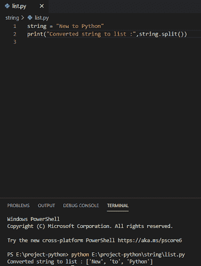

Convert string to list in Python

这样，我们就可以在 Python 中将 string 转换成 list。

*   [Python 将元组转换为列表](https://pythonguides.com/python-convert-tuple-to-list/)
*   [Python 关键字与示例](https://pythonguides.com/python-keywords/)
*   [Python 读取 excel 文件并在 Python 中写入 Excel](https://pythonguides.com/python-read-excel-file/)
*   [面向对象编程 python](https://pythonguides.com/object-oriented-programming-python/)
*   [Python 匿名函数](https://pythonguides.com/python-anonymous-function/)
*   [Python 串联数组](https://pythonguides.com/python-concatenate-arrays/)

## 从字符串 Python 中删除字符

我们可以在 python 中使用 **string replace()函数**从给定的字符串中删除一个字符，它将从字符串中删除特别提到的字符，结果将是一个没有指定字符的新字符串。

**举例:**

```
my_string = 'Good Knowledge'
print(my_string.replace('o'))
```

写完上面的代码后(从字符串 Python 中删除一个字符)，你将打印出**“replace(' o ')”**，然后错误将显示为**“replace 至少需要 2 个参数(给定 1 个)”**。这里，**“replace()”**将从字符串中删除字符，但它需要两个参数，否则会给出错误消息。你可以参考下面的截图来删除字符串 Python 中的一个字符。

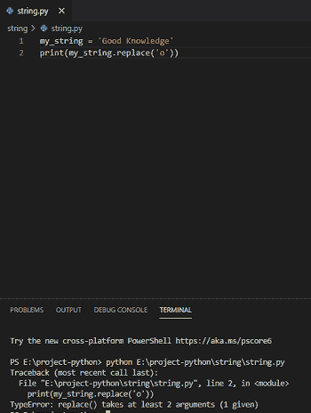

Remove character from string Python

上面的错误可以通过给出两个参数来替换()来解决。你可以看到下面的代码。

**举例:**

```
my_string = 'Good Knowledge'
print(my_string.replace('o',''))
```

你可以参考下面的截图来**从字符串 Python** 中删除一个字符。

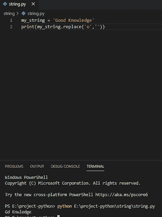

通过这种方式，我们可以在 Python 中删除字符串中的字符。

## Python 将字符串的第一个字母大写

python 有一个**内置的 capitalize()方法**，用于以大写形式返回字符串的第一个字符。

**举例:**

```
msg = 'welcome to python'
s = msg.capitalize()
print(s)
```

在编写完上面的代码( **python 将字符串**的第一个字母大写)后，您将打印出**“s”**，然后输出将显示为**“欢迎使用 python”**。这里，**" capital()"**方法将以大写形式返回字符串的第一个字符。你可以参考下面 python 字符串首字母大写的截图。

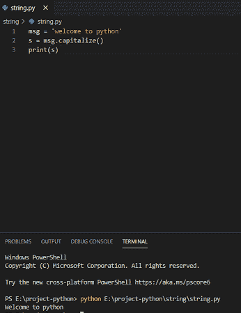

Python capitalize the first letter of string

这就是在 Python 中，我们如何大写一个字符串的第一个字母。

## Python 字符串转为小写

在 python 中， **string lowercase()方法**会将一个字符串的所有大写字符转换成小写字符。

**举例:**

```
msg = 'PYTHON Is Interesting'
s = msg.lower()
print(s)
```

写完上面的代码(python 字符串变成小写)，你将打印出 **" s "** ，然后输出将显示为 **" python 很有趣"**。这里， **" lower() "** 方法将返回所有小写字符。你可以参考下面的 python 字符串到小写的截图。

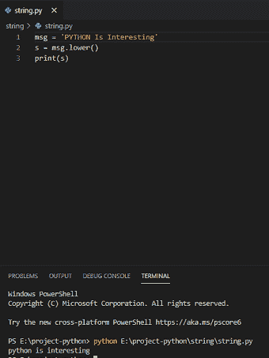

Python string to lowercase

这就是我们如何在 Python 中将字符串转换成小写字母。

## python 中字符串的长度

在 python 中，我们可以使用内置的 **len()方法**来**获取 Python 中字符串的长度**，这将返回一个整数值作为字符串的长度。

**举例:**

```
msg = 'Welcome to python learning sites'
print("Length is: ', len(msg))
```

写完上面的代码(python 中字符串的长度)，你将打印出 **" len(msg) "** ，然后输出将显示为 **" 32 "** 。这里， **" len() "** 方法将返回字符串的长度。关于 python 中字符串的长度，可以参考下面的截图。

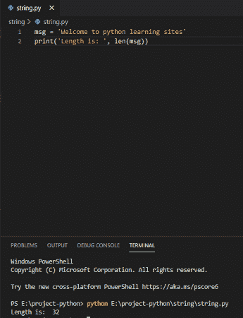

Length of string in python

这就是我们在 Python 中获取字符串长度的方法。

## Python 删除字符串中的空格

在 python 中，为了**从字符串**中移除空格，我们可以定义一个函数，并且我们将使用 **replace()方法**从字符串中移除所有空格。

**举例:**

```
def removespace(string1):
return string1.replace(" ", "")
string1 = ' P Y T H O N '
print(removespace(string1))
```

写完上面的代码(python 从字符串中删除空格)，你将打印出**(remove space(string 1))"**，然后输出将显示为 **" PYTHON "** 。这里，**“replace()”**方法将删除字符串中的所有空格。你可以参考下面的 python 截图来删除字符串中的空格。

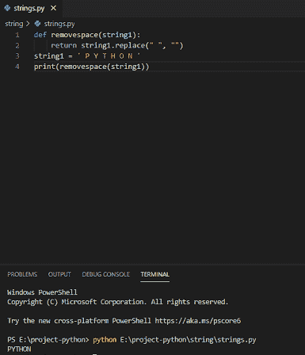

Python remove spaces from a string

这就是我们如何在 Python 中删除字符串中的空格。

## 从字符串 python 中移除换行符

在 Python 中，为了**从字符串**中移除换行符，我们使用了函数 **rstrip()** 来移除尾部换行符。

**举例:**

```
my_string = 'New to Python\n'
print(my_string)
print(my_string.rstrip())
```

写完上面的代码(去掉字符串 python 中的换行符)，你将打印出 **" rstrip() "** ，然后输出将显示为**" Python 的新特性"**。这里， **" rstrip() "** 函数将从字符串中移除换行符。

你可以参考下面 python 的截图，把字符串 python 中的换行符去掉。

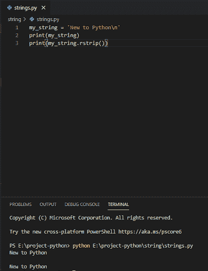

Remove newline from string python

在这里，我们检查了如何在 Python 中从字符串中移除换行。

## Python 删除字符串的最后一个字符

为了从 Python 的字符串中移除最后一个字符，我们可以使用一个字符串索引。字符串索引 **" [:-1]** "指定字符串中除最后一个字符以外的所有字符。**索引-1** 是字符串的最后一个字符。

**举例:**

```
my_string = 'Python'
remove = my_string[:-1]
print(remove)
```

写完上面的代码(Python 从一个字符串中删除最后一个字符)，你将打印出 **" remove "** ，然后输出将显示为**"皮索"**， **"** **n** **"** 被删除。这里，为了从字符串中删除最后一个字符，使用了字符串切片技术。你可以参考下面的 python 截图来删除字符串中的最后一个字符。

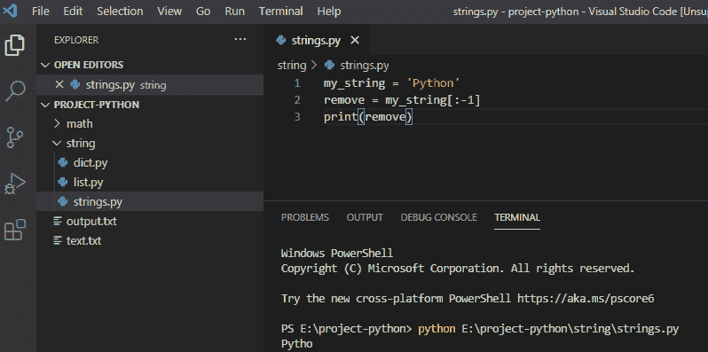

Python remove last character from string

这里，我们检查了如何从字符串中删除最后一个字符。

## Python 将数组转换成字符串

为了在 Python 中**将数组转换为字符串，我们可以使用 **join()** 方法将其转换为字符串。**

**举例:**

```
array = ["Hello", "World"]
string = ' '.join(array)
print(string)
```

写完上面的代码(Python 将数组转换为字符串)，你将打印出**“string”**，然后输出将显示为**“Hello World”**。在这里，**”。join "** 会将数组转换成字符串。你可以参考下面的截图来创建一个 python 转换数组为字符串。

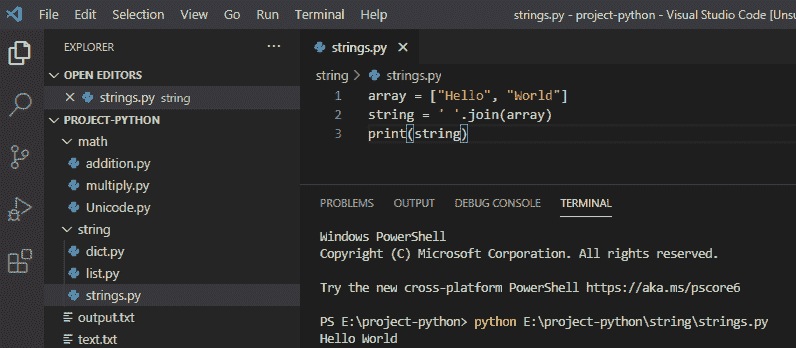

Python convert array to string

在这里，我们检查了如何将数组转换为字符串。

## 转换列表设置 python

为了在 Python 中**将列表转换为集合，我们可以使用 **set()** 函数将列表转换为集合，而集合不允许重复，因此**会从列表中移除所有重复的列表**。**

**举例:**

```
my_list = ['Tom', 'Jack', 'Harry', 'Tom']
value = set(my_list)
print("Set is: ", Value)
```

写完上面的代码(convert list to set python)，你会打印出 **" value "** 然后输出会出现一个 **" Set is: {'Jack '，' Harry '，' Tom'} "** 。这里， **set()** 函数将把列表转换成集合，所有重复的元素都将被删除。转换列表设置 python 可以参考下面的截图。

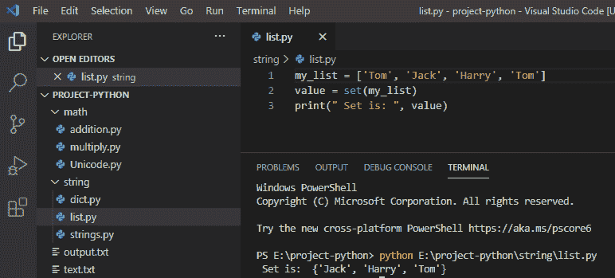

Convert list to set python

在这里，我们检查了如何将 list 转换为 set python

您可能会喜欢以下 python 教程:

*   [如何在 python 中把整数转换成字符串](https://pythonguides.com/convert-an-integer-to-string-in-python/)
*   [如何在 python 中连接字符串](https://pythonguides.com/concatenate-strings-in-python/)
*   [Python 方块一号](https://pythonguides.com/python-square-a-number/)
*   [什么是 Python 字典+用 Python 创建字典](https://pythonguides.com/create-a-dictionary-in-python/)
*   [无换行符的 Python 打印](https://pythonguides.com/python-print-without-newline/)
*   [Python 字典方法+示例](https://pythonguides.com/python-dictionary-methods/)
*   [11 Python 列表方法](https://pythonguides.com/python-list-methods/)
*   [如何在 Python 中创建列表](https://pythonguides.com/create-list-in-python/)
*   [Python 字符串函数](https://pythonguides.com/string-methods-in-python/)
*   [如何在 python 中连接字符串](https://pythonguides.com/concatenate-strings-in-python/)
*   [如何在 python 中把整数转换成字符串](https://pythonguides.com/convert-an-integer-to-string-in-python/)
*   [Python 访问修饰符+示例](https://pythonguides.com/python-access-modifiers/)

在本教程中，我们已经看到了如何用 python 将列表转换成字符串。此外，我们还讨论了:

*   Python 将列表转换为字符串
*   在 Python 中将字符串转换为列表
*   从字符串 Python 中移除字符
*   Python 将字符串的第一个字母大写
*   Python 字符串转换为小写
*   python 中字符串的长度
*   Python 从字符串中删除空格
*   从字符串 python 中移除换行符
*   python 删除字符串中的最后一个字符
*   Python 将数组转换为字符串
*   转换列表以设置 python

[Bijay Kumar](https://pythonguides.com/author/fewlines4biju/)

Python 是美国最流行的语言之一。我从事 Python 工作已经有很长时间了，我在与 Tkinter、Pandas、NumPy、Turtle、Django、Matplotlib、Tensorflow、Scipy、Scikit-Learn 等各种库合作方面拥有专业知识。我有与美国、加拿大、英国、澳大利亚、新西兰等国家的各种客户合作的经验。查看我的个人资料。

[enjoysharepoint.com/](https://enjoysharepoint.com/)[](https://www.facebook.com/fewlines4biju "Facebook")[](https://www.linkedin.com/in/fewlines4biju/ "Linkedin")[](https://twitter.com/fewlines4biju "Twitter")