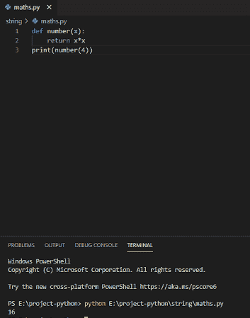
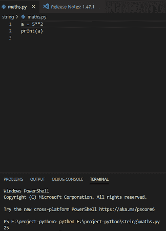
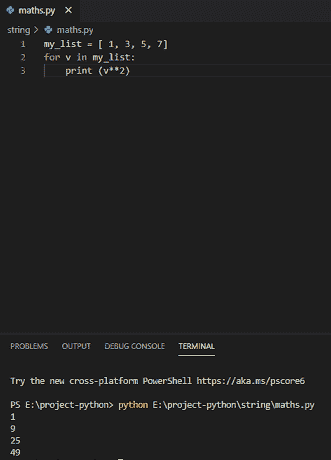
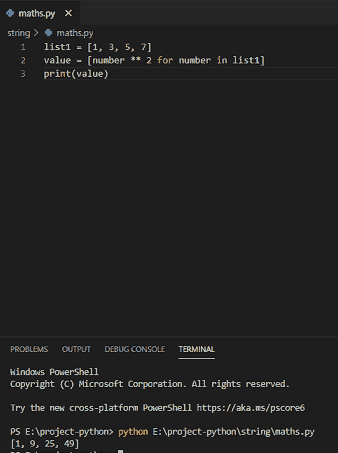
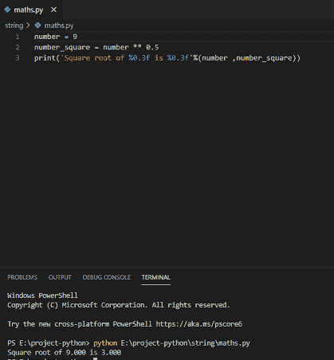
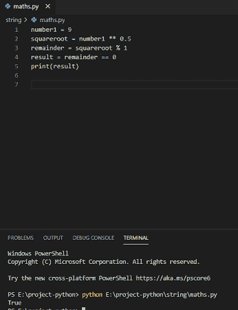
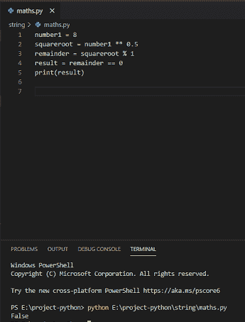
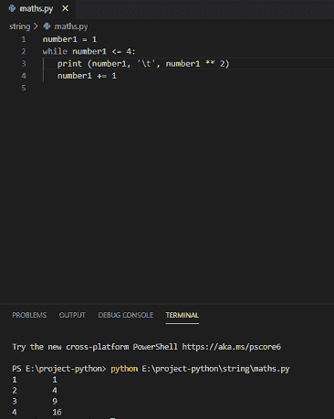
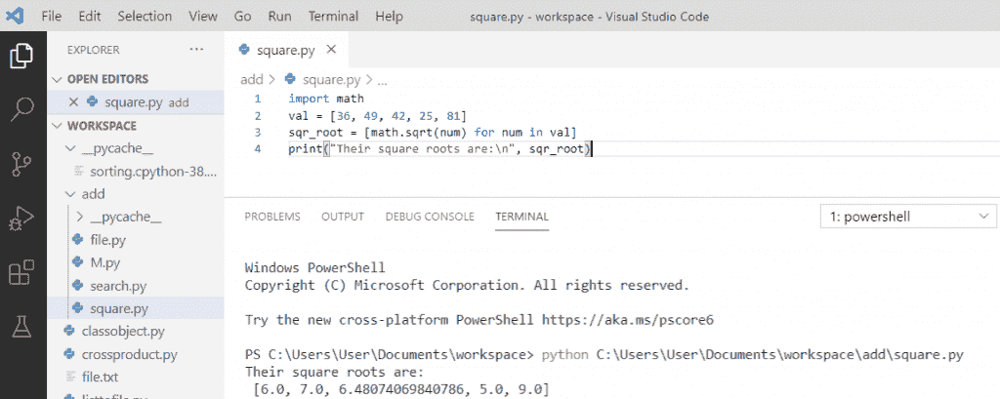
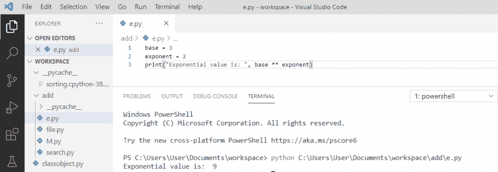

# Python 平方一个数字

> 原文：<https://pythonguides.com/python-square-a-number/>

[](https://sharepointsky.teachable.com/p/python-and-machine-learning-training-course)

在这个 [python 教程](https://pythonguides.com/python-programming-for-the-absolute-beginner/)中，你将了解到**如何在 python** 中平方一个数字，这是用来乘两个数字的，我们也将看到不同的方法。

*   Python 平方一个数字
*   Python 平方一个数字列表
*   Python 数字的平方根
*   Python 平方数校验
*   Python 平方数 while 循环
*   python 中的平方根函数
*   带列表理解的 Python 平方根
*   如何用 python 做指数

如果您是 Python 新手，请查看如何下载和安装 Python 。

目录

[](#)

*   [Python 方块一号](#Python_square_a_number "Python square a number")
*   [Python 方块一号列表](#Python_square_a_number_list "Python square a number list")
*   [Python 一个数的平方根](#Python_square_root_of_a_number "Python square root of a number")
*   [Python 方块数检查](#Python_square_number_check "Python square number check")
*   [Python 平方数 while 循环](#Python_square_number_while_loop "Python square number while loop")
*   [python 中的平方根函数](#Square_root_function_in_python "Square root function in python")
*   [带列表理解的 Python 平方根](#Python_square_roots_with_list_comprehension "Python square roots with list comprehension")
*   [如何用 python 做指数](#How_to_do_exponents_in_python "How to do exponents in python")

## Python 方块一号

现在，我们将看到**如何在 Python** 中求一个数的平方。在 python 中，我们可以定义一个可以返回数字平方的函数。

**举例:**

```py
def number(x):
return x*x
print(number(4))
```

写完上面的代码(python 平方一个数)，你将打印出 **" number(4) "** ，然后输出将显示为 **" 16 "** 。这里， **def** 用于定义一个函数，**“x”**是要相乘的数。你可以参考下面 python square a 号的截图。



Python square a number

我们也可以通过使用指数运算符*** * "**来平方一个数，它会以简单的方式乘以这个数。

**举例**:

```py
a = 5**2
print(a)
```

写完上面的代码(python 平方一个数)，你将打印出 **" a "** ，然后输出将显示为 **" 25 "** 。你可以参考下面的 python square a 号截图



How to square a number in Python

## Python 方块一号列表

在 python 中对一个数字列表求平方，它将对列表中的每个数字求平方，并将每个数字与自身相乘。

**举例:**

```py
my_list = [1, 3, 5, 7]
for v in my_list:
print (v**2)
```

写完上面的代码(python square a number list)，你将打印出 **" v**2 "** ，然后输出将显示为 **" 1 9 25 49 "** 。在这里，列表将迭代，它将乘以 2。你可以参考下面的 python square a 号列表截图。



Python square a number list

我们也可以通过使用列表理解来平方列表中的每个数字。

**举例:**

```py
list1 = [1, 3, 5, 7]
value = [number ** 2 for number in list1]
print(value)
```

写完上面的代码(python square a number list)，你将打印出 **" value "** ，然后输出将显示为 **" [1 9 25 49] "** 。这里，列表编号将乘以 2。你可以参考下面的 python square a 号列表截图。



How to Python square a number list

## Python 一个数的平方根

在 python 中，我们可以通过使用指数运算符来计算数字的平方根。

**举例:**

```py
number = 9
number_square = number ** 0.5
print('Square root of %0.3f is %0.3f'%(number ,number_square))
```

写完上面的代码(python 一个数的平方根)，你会打印出**(number，number _ Square)**然后输出会出现一个**“9.000 的平方根是 3.000”**。在这里，我们存储数字，指数运算符将计算平方根。你可以参考下面的一个数字的 python 平方根截图。



Python square root of a number

## Python 方块数检查

在 Python 中，为了检查数字是否是完美的平方，使用指数为 0.5 的幂运算符*** * "**和模运算符 **"** **% "** 来得到余数。

它将检查输出并分别返回 true 或 false。

**举例:**

```py
number1 = 9
squareroot = number1 ** 0.5
remainder = squareroot % 1
result = remainder == 0
print(result)
```

写完上面的代码(python 平方数检查)，你将打印出**“结果”**，然后输出将显示为**“真”**。这里，9 是完美的平方，余数是 0，因为它是整数。你可以参考下面的 python 方块数检查截图。



Python square number check

我们还会看到什么时候数字不是一个完美的平方，余数不等于 0。那么它将给出 false 作为输出。

**举例:**

```py
number1 = 8
squareroot = number1 ** 0.5
remainder = squareroot % 1
result = remainder == 0
print(result)
```

这里，8 不是完美的平方，余数不等于 0。因此，输出为**“假”**，因为它不是完美的正方形。你可以参考下面的 python 方块数检查截图。



How to Python square number check

## Python 平方数 while 循环

在 python 中， [while 循环](https://pythonguides.com/python-while-loop/)多次重复该序列，直到条件变为假。这里，使用 while 循环计算数字的平方，直到条件为假，它将返回数字平方的输出。

**举例:**

```py
number1 = 1 
while number1 <= 4:
print (number1, '\t', number1 ** 2)
number1 += 1
```

在编写了上面的代码(python square number while loop)之后，您将打印出**(number 1 * * 2)**，然后输出将显示为 **" 1 4 9 16 "** ，它是数字的平方。这里，循环内的变量 **number1** 从 **1 迭代到 4** 。你可以参考下面 python 平方数 while 循环的截图。



Python square number while loop

## python 中的平方根函数

Python **math** 模块包含了许多有用的函数，它还包含了用于计算平方根的 Python 平方根函数 **sqrt()** 。首先，我们需要**导入数学**模块。

```py
import math
a = math.sqrt(64)
print(a)
```

写完上面的代码(python 中的平方根函数)后，你将打印“a”，然后输出将显示为“8.0”。这里，我们将使用 math.sqrt()来计算平方根，它将返回浮点数作为输出。


Square root function in python

## 带列表理解的 Python 平方根

为了从列表中得到平方根，我们将使用列表理解。我们将首先导入**数学**模块，其中的**数学. sqrt()** 函数可用。然后我们用随机数生成列表，循环用于遍历列表中的所有元素。

```py
import math
val = [36, 49, 42, 25, 81]
sqr_root = [math.sqrt(num) for num in val]
print("Their square roots are:\n", sqr_root)
```

写完上面的代码(python 平方根和列表理解)，你将打印出 **"sqr_root"** ，然后输出将显示为 **"[6.0，7.0，6.48074069840786，5.0，9.0]"** 。这里，我们将使用 **math.sqrt(num)** 来计算列表的平方根，并且 **sqr_root** 列表具有原始值列表中每个数字的平方根。



Python square roots with list comprehension

## 如何用 python 做指数

双星号**“* *”**运算符用于计算指数值。被自身相乘的数叫做**底数**，被相乘的次数叫做**指数**。

**举例:**

```py
base = 3
exponent = 2
print("Exponential value is: ", base ** exponent)
```

写完上面的代码(如何在 python 中做指数)，一旦你打印出 **" base ** exponent "** 那么输出将显示为 **" 9 "** 。这里，基数是 3，指数是 2，它将返回相应的值。你可以参考下面关于如何用 python 做指数的截图。



How to do exponents in python

您可能还会喜欢以下教程:

*   [什么是 Python 字典+用 Python 创建字典](https://pythonguides.com/create-a-dictionary-in-python/)
*   [无换行符的 Python 打印](https://pythonguides.com/python-print-without-newline/)
*   [Python 字典方法+示例](https://pythonguides.com/python-dictionary-methods/)
*   [11 Python 列表方法](https://pythonguides.com/python-list-methods/)
*   [如何在 Python 中创建列表](https://pythonguides.com/create-list-in-python/)
*   [Python 字符串函数](https://pythonguides.com/string-methods-in-python/)
*   [如何在 python 中把整数转换成字符串](https://pythonguides.com/convert-an-integer-to-string-in-python/)
*   [如何在 python 中连接字符串](https://pythonguides.com/concatenate-strings-in-python/)
*   [面向对象编程 python](https://pythonguides.com/object-oriented-programming-python/)
*   [Python 匿名函数](https://pythonguides.com/python-anonymous-function/)
*   [添加字符串到列表 Python](https://pythonguides.com/add-string-to-list-python/)

在本教程中，你已经学习了用 Python 对一个数字求平方的不同方法，我们也看到了很多例子，比如。

*   Python 平方一个数字
*   Python 平方一个数字列表
*   Python 数字的平方根
*   Python 平方数校验
*   Python 平方数 while 循环
*   python 中的平方根函数
*   带列表理解的 Python 平方根
*   如何用 python 做指数

[Bijay Kumar](https://pythonguides.com/author/fewlines4biju/)

Python 是美国最流行的语言之一。我从事 Python 工作已经有很长时间了，我在与 Tkinter、Pandas、NumPy、Turtle、Django、Matplotlib、Tensorflow、Scipy、Scikit-Learn 等各种库合作方面拥有专业知识。我有与美国、加拿大、英国、澳大利亚、新西兰等国家的各种客户合作的经验。查看我的个人资料。

[enjoysharepoint.com/](https://enjoysharepoint.com/)[](https://www.facebook.com/fewlines4biju "Facebook")[](https://www.linkedin.com/in/fewlines4biju/ "Linkedin")[](https://twitter.com/fewlines4biju "Twitter")