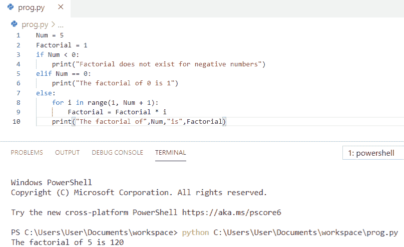
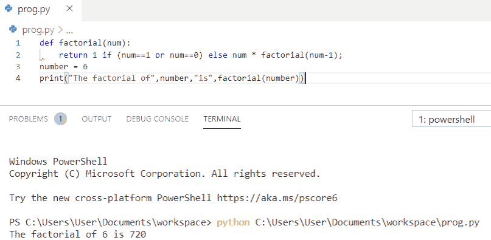
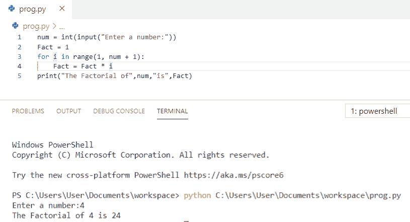
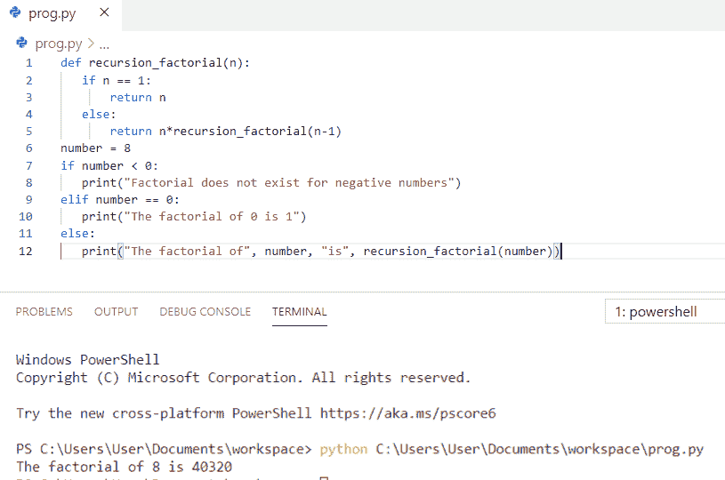
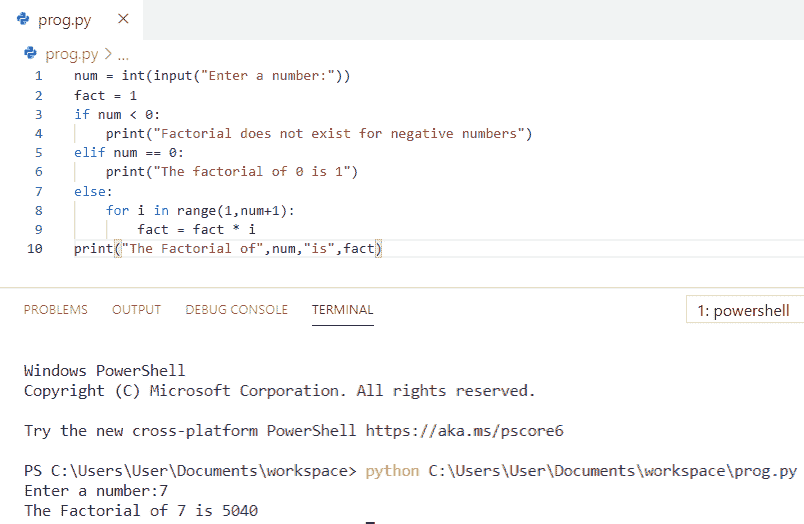
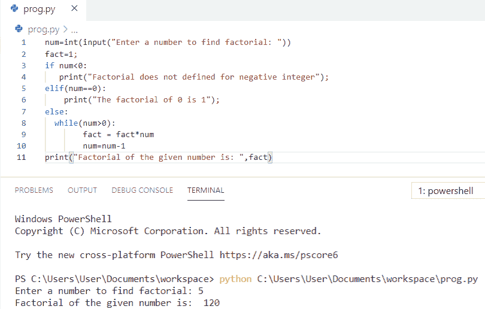
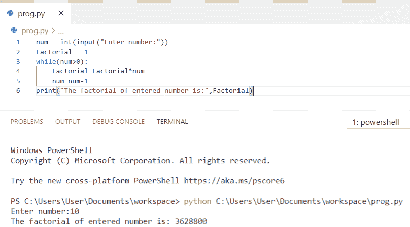
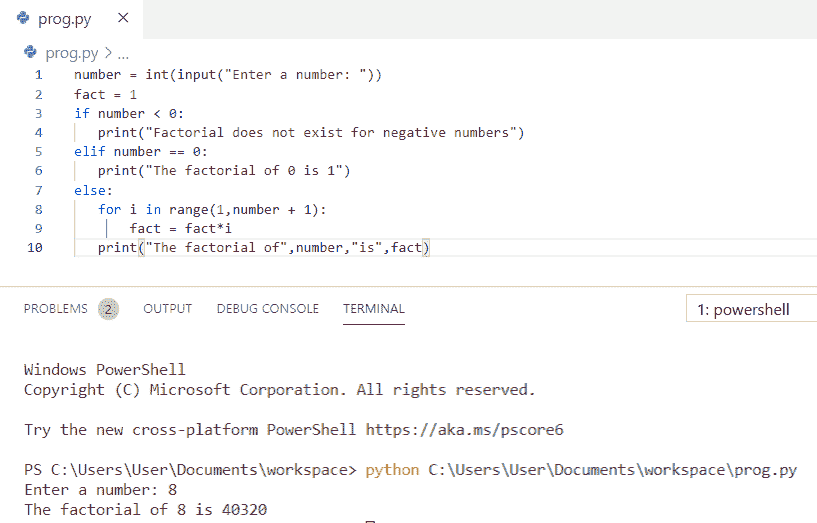
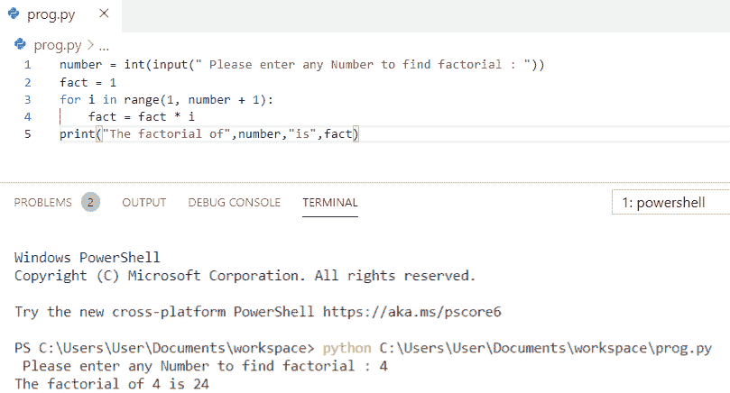
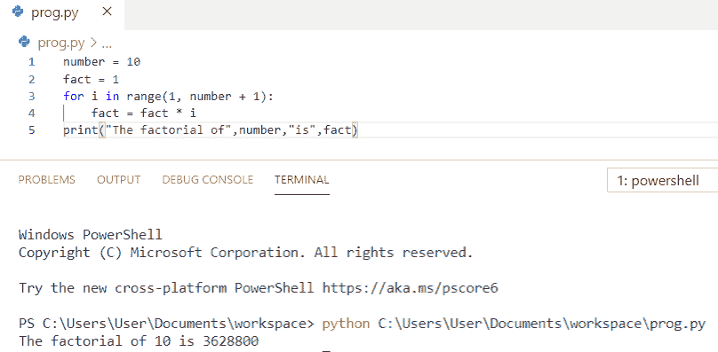

# 如何用 Python 打印一个数的阶乘

> 原文：<https://pythonguides.com/factorial-of-a-number-in-python/>

[](https://sharepointsky.teachable.com/p/python-and-machine-learning-training-course)

在这个 [python 教程中，](https://pythonguides.com/python-hello-world-program/)你将学习如何在 Python 中**打印一个数的阶乘，以及 **Python 程序打印一个数的阶乘**，我们还将检查 **:****

*   Python 程序打印一个数的阶乘
*   使用函数打印数字阶乘的 Python 程序
*   使用 for 循环打印数字阶乘的 Python 程序
*   Python 程序使用递归查找数字的阶乘
*   Python 程序，通过获取用户输入来打印数字的阶乘
*   Python 程序使用 while 循环查找数字的阶乘
*   Python 程序打印一个数字的阶乘，无需递归
*   python 中使用 if-else 的阶乘程序
*   Python 程序打印数字 4 的阶乘
*   Python 程序打印数字 10 的阶乘

目录

[](#)

*   [用 Python 打印一个数的阶乘](#Print_factorial_of_a_number_in_Python "Print factorial of a number in Python")
*   [Python 程序使用函数](#Python_program_to_print_factorial_of_a_number_using_function "Python program to print factorial of a number using function")打印一个数的阶乘
*   [Python 程序使用 for 循环打印一个数的阶乘](#Python_program_to_print_factorial_of_a_number_using_for_loop "Python program to print factorial of a number using for loop")
*   [Python 程序使用递归寻找一个数的阶乘](#Python_program_to_find_factorial_of_a_number_using_recursion "Python program to find factorial of a number using recursion")
*   [Python 程序通过获取用户输入来打印数字的阶乘](#Python_program_to_print_factorial_of_a_number_by_getting_input_from_a_user "Python program to print factorial of a number by getting input from a user")
*   [Python 程序使用 while 循环寻找一个数的阶乘](#Python_program_to_find_factorial_of_a_number_using_while_loop "Python program to find factorial of a number using while loop")
*   [Python 程序打印一个数的阶乘，无需递归](#Python_program_to_print_factorial_of_a_number_without_recursion "Python program to print factorial of a number without recursion")
*   [python 中使用 if-else 的阶乘程序](#Factorial_program_in_python_using_if-else "Factorial program in python using if-else")
*   [Python 程序打印数字 4 的阶乘](#Python_program_to_print_factorial_of_number_4 "Python program to print factorial of number 4")
*   [Python 程序打印数字 10 的阶乘](#Python_program_to_print_factorial_of_number_10 "Python program to print factorial of number 10")

## 用 Python 打印一个数的阶乘

让我们看看 **python 程序打印一个数**的阶乘。

*   首先，要求其**阶乘**的数存储在 **Num** 中。
*   声明并初始化阶乘变量为 1。
*   我们将使用一个 **if-else** 语句来检查数字是**负**、**零**还是**正**。
*   如果数字为正数，则使用循环和**范围()**函数的**来计算数字的阶乘。**
*   最后用 **print** 得到一个数的阶乘。

**举例:**

```
Num = 5
Factorial = 1
if Num < 0:
    print("Factorial does not exist for negative numbers")
elif Num == 0:
    print("The factorial of 0 is 1")
else:
    for i in range(1, Num + 1):
        Factorial = Factorial * i
    print("The factorial of",Num,"is",Factorial)
```

我们可以看到输出中一个数的阶乘是 **120** 。您可以参考下面的输出截图。



Python program to print factorial of a number

上面的代码，我们可以用 Python 中的来**打印一个数的阶乘。**

你可能喜欢， [Python zip()函数](https://pythonguides.com/python-zip/)。

## Python 程序使用函数打印一个数的阶乘

现在，我们将看到 **python 程序使用函数**打印一个数的阶乘。

*   在本例中，我们将函数定义为**阶乘(数字)**。
*   为了找到**的阶乘**，我们使用了单行的 **if-else** 语句，并且我们将**的数字指定为 6** 来计算阶乘。
*   最后用 **print** 得到一个数的阶乘。

**举例:**

```
def factorial(num):
    return 1 if (num==1 or num==0) else num * factorial(num-1);
number = 6
print("The factorial of",number,"is",factorial(number))
```

我们可以看到输出中一个数的阶乘是 **720** 。您可以参考下面的输出截图。



Python program to print factorial of a number using function

这就是如何使用 Python 中的函数**打印一个数的阶乘。**

## Python 程序使用 for 循环打印一个数的阶乘

这里，我们将看到 **python 程序使用 for 循环**打印一个数的阶乘

*   首先，我们将从要计算阶乘的用户那里获取输入。
*   将事实变量声明并初始化为 1。
*   **for 循环**和 **range()** 函数用于计算一个数的阶乘。
*   最后用 **print** 得到一个数的阶乘。

**举例:**

```
num = int(input("Enter a number:"))
Fact = 1
for i in range(1, num + 1):
    Fact = Fact * i
print("The Factorial of",num,"is",Fact)
```

我们可以看到输出中一个数的阶乘是 **24** 。您可以参考下面的输出截图。



Python program to print factorial of a number using for loop

上面的代码，我们可以使用 Python 中的 for 循环来**打印一个数的阶乘。**

*   [Python For 循环示例](https://pythonguides.com/python-for-loop/)
*   [Python While 循环示例](https://pythonguides.com/python-while-loop/)

## Python 程序使用递归寻找一个数的阶乘

现在，我们将看到 **python 程序使用递归**来寻找一个数的阶乘。

*   这里，我们将使用递归来求一个数的阶乘。
*   在本例中，我们将函数定义为 **recursion_factorial(n)**
*   我们将把该值存储在**号**中。我们将使用一个 **if-else** 语句来检查数字是 **负** 、 **零** 还是 **正** 。
*   将**数字**传递给**递归 _ 阶乘()**函数，以计算该数字的阶乘。

**举例:**

```
def recursion_factorial(n):
   if n == 1:
       return n
   else:
       return n*recursion_factorial(n-1)
number = 8
if number < 0:
   print("Factorial does not exist for negative numbers")
elif number == 0:
   print("The factorial of 0 is 1")
else:
   print("The factorial of", number, "is", recursion_factorial(number))
```

我们可以看到输出中一个数的阶乘是 **40320** 。您可以参考下面的输出截图。



Python program to find factorial of a number using recursion

上面的代码是用 Python 中的递归来**求一个数的阶乘。**

## Python 程序通过获取用户输入来打印数字的阶乘

让我们来看看 **python 程序通过从用户那里获得输入来打印一个数的阶乘**

*   首先，我们将从要计算阶乘的用户那里获取输入。
*   将**事实**变量声明并初始化为 **1** 。
*   我们将使用一个 **if-else** 语句来检查数字是**负**、**零**还是**正**。
*   如果数字为正数，则使用循环和**范围()**函数的**来计算数字的阶乘。**
*   最后用 **print** 得到一个数的阶乘。

**举例:**

```
num = int(input("Enter a number:"))
fact = 1
if num < 0:
    print("Factorial does not exist for negative numbers")
elif num == 0:
    print("The factorial of 0 is 1")
else:
    for i in range(1,num+1):
        fact = fact * i
print("The Factorial of",num,"is",fact)
```

我们可以看到输出中一个数的阶乘是 **5040** 。您可以参考下面的输出截图。



Python program to print factorial of a number by getting input from a user

这是一个 Python 程序，通过获取用户输入来打印一个数字的阶乘。

## Python 程序使用 while 循环寻找一个数的阶乘

在这里，我们将看到 **python 程序使用 while 循环**寻找一个数的阶乘。

*   首先，我们将从要计算阶乘的用户那里获取输入。
*   将**事实**变量声明并初始化为 **1** 。
*   我们将使用一个 **if-else** 语句来检查数字是**负**、**零**还是**正**。
*   一个 **while 循环**被用来在一个连续的过程中把数字相乘以得到阶乘。
*   该过程继续，直到数字的值大于零。
*   最后用 **print** 得到一个数的阶乘。

**举例:**

```
num=int(input("Enter a number to find factorial: "))
fact=1;
if num<0:
   print("Factorial does not defined for negative integer");
elif(num==0):
    print("The factorial of 0 is 1");
else:
  while(num>0):
        fact = fact*num
        num=num-1
print("Factorial of the given number is: ",fact)
```

我们可以看到输出中一个数的阶乘是 **120** 。您可以参考下面的输出截图。



Python program to find factorial of a number using while loop

上面的代码，我们可以用 Python 中的 while 循环来**求一个数的阶乘。**

## Python 程序打印一个数的阶乘，无需递归

在这里，我们将看到 **python 程序在没有递归**的情况下打印一个数的阶乘。

*   首先，我们将从要计算阶乘的用户那里获取输入。
*   将**事实**变量声明并初始化为 **1** 。
*   一个 **while 循环**被用来在一个连续的过程中把数字相乘以得到阶乘。
*   该过程继续，直到数字的值大于零。
*   最后用 **print** 得到一个数的阶乘。

**举例:**

```
num = int(input("Enter number:"))
Factorial = 1
while(num>0):
    Factorial=Factorial*num
    num=num-1
print("The factorial of entered number is:",Factorial)
```

我们可以看到输出中一个数的阶乘是 **3628800** 。您可以参考下面的输出截图。



Python program to print factorial of a number without recursion

上面的代码是为了**打印一个数字的阶乘而不用 Python** 中的递归。

## python 中使用 if-else 的阶乘程序

现在，我们将看到 python 中使用 if-else 的**阶乘程序**

*   首先，我们将从要计算阶乘的用户那里获取输入。
*   声明并初始化**事实**变量为 1。
*   我们将使用一个 **if-else** 语句来检查数字是**负**、**零**还是**正**。
*   如果数字为正数，则使用循环和**范围()**函数的**来计算数字的阶乘。**
*   最后用 **print** 得到一个数的阶乘。

**举例:**

```
number = int(input("Enter a number: "))  
fact = 1  
if number < 0:  
   print("Factorial does not exist for negative numbers")  
elif number == 0:  
   print("The factorial of 0 is 1")  
else:  
   for i in range(1,number + 1):  
       fact = fact*i  
   print("The factorial of",number,"is",fact)
```

我们可以看到输出中一个数的阶乘是 **40320** 。您可以参考下面的输出截图。



Factorial program in python using if-else

这是 python 中使用 if-else 的**阶乘程序。**

## Python 程序打印数字 4 的阶乘

让我们看看 **python 程序打印数字 4** 的阶乘。

*   首先，我们将从要计算阶乘的用户那里获取输入。
*   将**事实**变量声明并初始化为 **1** 。
*   **for 循环**和 **range()** 函数用于计算一个数的阶乘。
*   最后用 **print** 得到一个数的阶乘。

**举例:**

```
number = int(input(" Please enter any Number to find factorial : "))
fact = 1
for i in range(1, number + 1):
    fact = fact * i
print("The factorial of",number,"is",fact)
```

我们可以看到输出中一个数的阶乘是 **24** 。您可以参考下面的输出截图



Python program to print factorial of number 4

这是用 Python 打印数字 4 的阶乘的代码。

## Python 程序打印数字 10 的阶乘

现在，我们将看到 **python 程序打印数字 10** 的阶乘。

*   首先，我们将从要计算阶乘的用户那里获取输入。
*   将**事实**变量声明并初始化为 **1** 。
*   **for 循环**和 **range()** 函数用于计算一个数的阶乘。
*   最后用 **print** 得到一个数的阶乘。

**举例:**

```
number = 10
fact = 1
for i in range(1, number + 1):
    fact = fact * i
print("The factorial of",number,"is",fact)
```

我们可以看到输出中一个数的阶乘是 **3628800** 。您可以参考下面的输出截图



Python program to print factorial of number 10

这是打印数字 10 的阶乘的 **Python 代码。**

您可能会喜欢以下 Python 教程:

*   [如何在 Python 中交换两个数](https://pythonguides.com/swap-two-numbers-in-python/)
*   [如何打印 Python 斐波那契数列](https://pythonguides.com/python-fibonacci-series/)
*   [如何在 Python 中减去两个数](https://pythonguides.com/subtract-two-numbers-in-python/)
*   [Python 中两个数如何除法](https://pythonguides.com/divide-two-numbers-in-python/)
*   [如何在 Python 中添加两个变量](https://pythonguides.com/add-two-variables-in-python/)

在这篇 Python 教程中，我们学习了打印数字的阶乘的 **Python 程序。此外，我们还讨论了以下主题:**

*   Python 程序打印一个数的阶乘
*   使用函数打印数字阶乘的 Python 程序
*   使用 for 循环打印数字阶乘的 Python 程序
*   Python 程序使用递归查找数字的阶乘
*   Python 程序，通过获取用户输入来打印数字的阶乘
*   Python 程序使用 while 循环查找数字的阶乘
*   Python 程序打印一个数字的阶乘，无需递归
*   python 中使用 if-else 的阶乘程序
*   Python 程序打印数字 4 的阶乘
*   Python 程序打印数字 10 的阶乘

[Bijay Kumar](https://pythonguides.com/author/fewlines4biju/)

Python 是美国最流行的语言之一。我从事 Python 工作已经有很长时间了，我在与 Tkinter、Pandas、NumPy、Turtle、Django、Matplotlib、Tensorflow、Scipy、Scikit-Learn 等各种库合作方面拥有专业知识。我有与美国、加拿大、英国、澳大利亚、新西兰等国家的各种客户合作的经验。查看我的个人资料。

[enjoysharepoint.com/](https://enjoysharepoint.com/)[](https://www.facebook.com/fewlines4biju "Facebook")[](https://www.linkedin.com/in/fewlines4biju/ "Linkedin")[](https://twitter.com/fewlines4biju "Twitter")