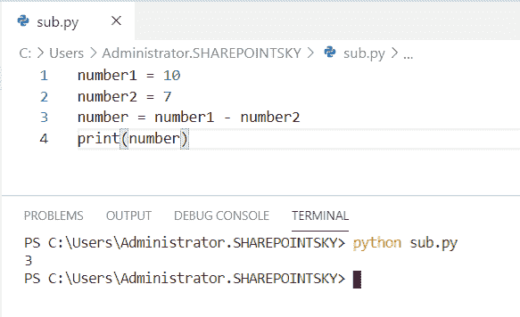
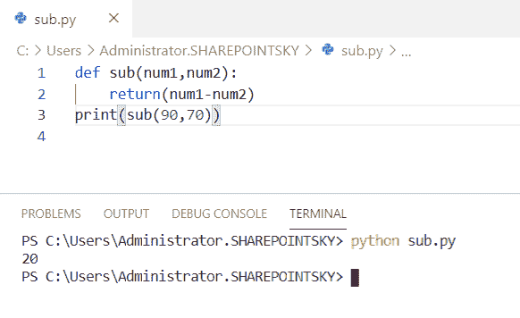
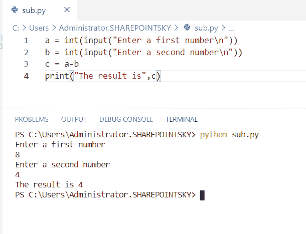
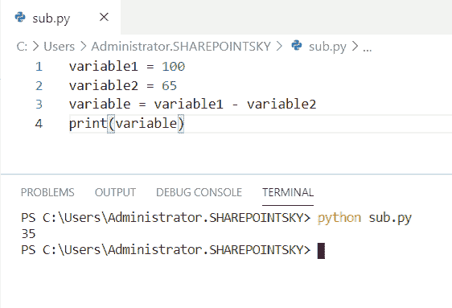
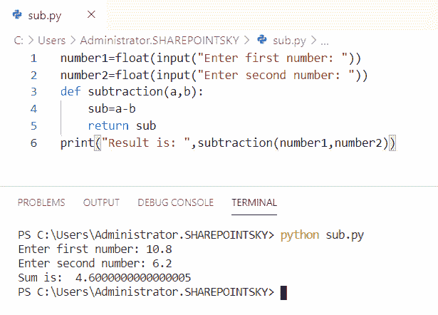
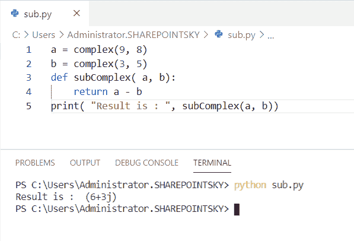
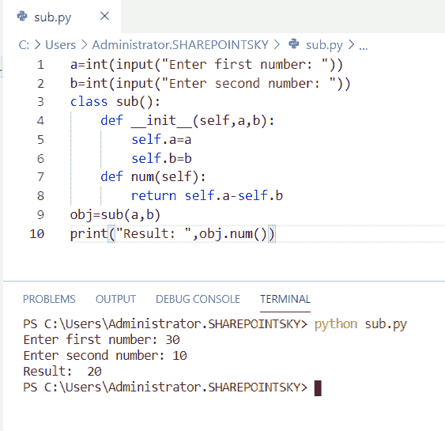
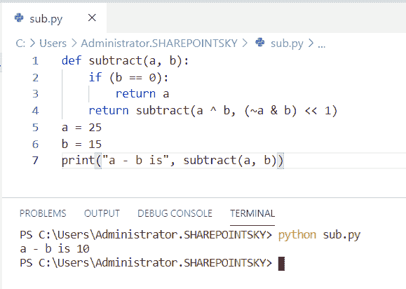
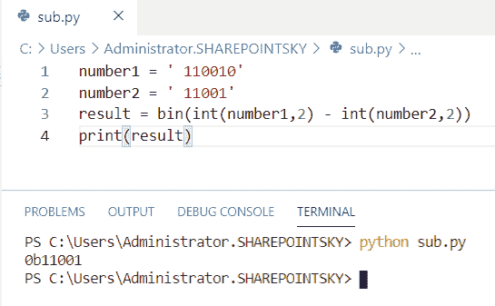

# 如何在 Python 中减去两个数

> 原文：<https://pythonguides.com/subtract-two-numbers-in-python/>

[](https://sharepointsky.teachable.com/p/python-and-machine-learning-training-course)

在这个 [python 教程中，](https://pythonguides.com/python-hello-world-program/)你将了解到 **Python 程序减去两个数**，我们还将检查 **:**

*   Python 程序减去两个数
*   使用函数减去两个数的 Python 程序
*   Python 程序减去用户输入的两个数
*   如何在 python 中减去变量
*   使用函数减去两个浮点数程序
*   python 中减去复数的程序
*   程序使用类减去数字
*   不使用算术运算符减去数字的程序
*   Python 程序减去两个二进制数

目录

[](#)

*   [Python 程序将两个数相减](#Python_program_to_subtract_two_numbers "Python program to subtract two numbers")
*   [Python 程序使用函数将两个数相减](#Python_program_to_subtract_two_numbers_using_a_function "Python program to subtract two numbers using a function")
*   [Python 程序将用户输入的两个数相减](#Python_program_to_subtract_two_number_user_input "Python program to subtract two number user input")
*   [如何在 python 中减去变量](#How_to_subtract_variables_in_python "How to subtract variables in python")
*   [程序使用函数](#Program_to_subtract_two_float_number_using_a_function "Program to subtract two float number using a function")减去两个浮点数
*   [python 中减去复数的程序](#Program_to_subtract_the_complex_number_in_python "Program to subtract the complex number in python")
*   [使用类](#Program_to_subtract_numbers_using_class "Program to subtract numbers using class")编程减去数字
*   [不使用算术运算符的程序减去数字](#Program_to_subtract_the_numbers_without_using_arithmetic_operator "Program to subtract the numbers without using arithmetic operator")
*   [Python 程序将两个数二进制相减](#Python_program_to_subtract_two_numbers_binary "Python program to subtract two numbers binary")

## Python 程序将两个数相减

这里可以看到**程序用 python 减去两个数**。

*   在这个例子中，我取了两个数字作为**数字 1 = 10** 和**数字 2 = 7** 。
*   **"-"** 运算符用于将两个数相减。
*   我已经用 **print(number)** 得到了输出。

示例:

```
number1 = 10
number2 = 7
number = number1 - number2
print(number)
```

下面的截图显示了输出结果。



Python program to subtract two numbers

这是**如何用 Python** 减去两个数。

阅读， [Python 程序查闰年](https://pythonguides.com/python-program-to-check-leap-year/)。

## Python 程序使用函数将两个数相减

在这里，我们可以看到**如何使用 python 中的函数**编写一个程序来减去两个数。

*   在这个例子中，我定义了一个函数为 **def sub(num1，num2)** 。
*   该函数使用表达式作为 **return(num1-num2)** 返回。
*   要减去的值作为参数传递到函数中，如 **print(sub(90，70))** 。

示例:

```
def sub(num1,num2):
    return(num1-num2)
print(sub(90,70)) 
```

你可以参考下面的输出截图。



Python program to subtract two numbers using a function

这段代码，我们可以用 Python 中的函数将两个数相减。

## Python 程序将用户输入的两个数相减

现在，我们可以看到**如何用 python 写一个程序来减去用户输入的两个数**。

*   在这个例子中，我使用了 **input()** 方法。接受用户的输入。
*   我已经用 **c = a-b** 减去了数字。
*   **print("结果是"，c)** 用于获取输出。

示例:

```
a = int(input("Enter a first number\n"))
b = int(input("Enter a second number\n"))
c = a-b
print("The result is",c)
```

下面的截图显示了输出。



Python program to subtract two number user input

## 如何在 python 中减去变量

这里可以看到**如何在 python 中减去变量**。

*   在这个例子中，我取了两个变量作为变量 1 和变量 2。
*   变量 1 被赋值为**变量 1 = 100** ，变量 2 被赋值为**变量 2 = 65** 。
*   为了减去变量，我使用了 **"-"** 操作符。
*   我已经用 **print(variable)** 得到了输出。

示例:

```
variable1 = 100
variable2 = 65
variable = variable1 - variable2
print(variable)
```

结果显示为输出。您可以参考下面的输出截图。



How to subtract variables in python

上面的代码，我们可以用 Python 中的来**减去变量。**

## 程序使用函数减去两个浮点数

在这里，我们可以看到**程序使用 python 中的函数**减去两个浮点数。

*   在这个例子中，我使用了 **input()** 方法。接受用户的输入。
*   **float** 数据类型用于输入十进制数作为输入。
*   我已经定义了一个叫做减法的函数为 **def subtraction(a，b):**
*   为了减去这些数字，我使用了 **sub=a-b.**
*   该函数作为**返回子函数**返回。
*   为了得到输出，我使用了 **print("Result is:"，subtraction(number1，number2))** 。

示例:

```
number1=float(input("Enter first number: "))
number2=float(input("Enter second number: "))
def subtraction(a,b): 
    sub=a-b
    return sub
print("Result is: ",subtraction(number1,number2))
```

下面的截图显示了两个数字相减的结果。



Program to subtract two float number using a function

这段代码，我们可以用 Python 中的函数来用**减去两个浮点数。**

## python 中减去复数的程序

这里可以看到**如何用 python 写一个程序来减去复数**。

*   在这个例子中，我取了两个复数作为 **a =复数(9，8)** 和 **b =复数(3，5)。**
*   **complex()** 函数用于通过指定实数和虚数来返回复数。
*   该函数被定义为 **def 子复数(a，b)** 。
*   该函数作为**return a–b**返回。
*   我已经使用了 **print( "Result is:"，subComplex(a，b))** 来获得输出。

示例:

```
a = complex(9, 8) 
b = complex(3, 5) 
def subComplex( a, b): 
	return a - b 
print( "Result is : ", subComplex(a, b)) 
```

我们可以看到实数和虚数的减法作为输出。下面的截图显示了输出。



Program to subtract the complex number in python

上面的代码，我们可以用 Python 中的**减去复数**。

## 使用类编程减去数字

在这里，我们可以看到**如何使用 python 中的类**编写一个程序来减去数字。

*   在这个例子中，我使用了 **input()** 方法。接受用户的输入。
*   我已经创建了一个**类**,使用一个构造函数来初始化这个类的值
*   我创造了一个方法来从数字中减去。
*   对象是为类创建的，用于传递参数。
*   **self** 是用于将属性和方法传递给类的关键字。
*   为了得到输出，我使用了 **print("Result:"，obj.num())** 。

示例:

```
a=int(input("Enter first number: "))
b=int(input("Enter second number: "))
class sub():
    def __init__(self,a,b):
        self.a=a
        self.b=b
    def num(self):
        return self.a-self.b
obj=sub(a,b)
print("Result: ",obj.num())
```

下面的截图显示了输出。



Program to subtract the numbers using class

这就是我们如何使用 Python 中的类来减去数字。

## 不使用算术运算符的程序减去数字

在这里，我们可以看到**如何在 python 中不使用算术运算符**的情况下，编写一个将数字相减的程序。

*   在这个例子中，我定义了一个函数为 **def subtract(a，b)**
*   使用 if 条件，如果条件为真，则返回。
*   如果条件不成立，则返回 **return subtract(a ^ b，(~a & b) < < 1)** 。
*   在 a 和 b 之间执行**异或**运算。
*   **~** 用于反转所有位
*   **&** 操作用于在两位都为 1 时将两位设置为 1。
*   **< <** 是零填充左移，它通过从右侧推入零来左移。
*   输入为 **a = 25** 和 **b = 15。**
*   为了得到输出，我使用了**print(" a–b is "，subtract(a，b))** 。

示例:

```
def subtract(a, b):
    if (b == 0):
	    return a
    return subtract(a ^ b, (~a & b) << 1)
a = 25
b = 15
print("a - b is", subtract(a, b))
```

我们可以看到输出是两个数的相减。您可以参考下面的输出截图。



Program to subtract the numbers without using arithmetic operator

这段代码我们可以用来**减去数字，而不需要使用 Python** 中的算术运算符。

## Python 程序将两个数二进制相减

现在，我们可以**如何用 python 写一个程序来减去二进制数**。

*   在这个例子中，我取了两个二进制数，如**数字 1 =‘110010’**，**数字 2 =‘11001’**。
*   使用内置函数 **bin** 减去二进制数。
*   2 作为基值传递以获得二进制数。
*   为了得到输出，我使用了 **print(result)** 。

示例:

```
number1 = '110010'
number2 = '11001'
result = bin(int(number1,2) - int(number2,2))
print(result)
```

我们可以将二进制数视为输出。您可以参考下面的输出截图。



Python program to subtract two numbers binary

这是将二进制数减去二进制数的 Python 程序。

您可能会喜欢以下 Python 教程:

*   [Python 中两个数如何除法](https://pythonguides.com/divide-two-numbers-in-python/)
*   [如何在 Python 中添加两个变量](https://pythonguides.com/add-two-variables-in-python/)
*   [如何用 Python 将两个数相加](https://pythonguides.com/add-two-numbers-in-python/)
*   [Os 改变目录 Python](https://pythonguides.com/os-change-directory-python/)
*   [Python 程序反转字符串的例子](https://pythonguides.com/python-program-to-reverse-a-string/)
*   [Python 程序求 n 个数之和并举例](https://pythonguides.com/python-program-to-find-sum-of-n-numbers/)
*   [Python 程序打印质数](https://pythonguides.com/python-program-to-print-prime-numbers/)

在本 Python 教程中，我们学习了关于****的 Python 程序来减去两个数**。此外，我们还讨论了以下主题:**

 ***   如何在 Python 中减去两个数
*   如何使用 Python 中的函数将两个数相减
*   Python 程序减去用户输入的两个数
*   如何在 python 中减去变量
*   如何使用 Python 中的函数减去两个浮点数
*   python 中如何做复数减法
*   程序使用类减去数字
*   不使用算术运算符减去数字的程序
*   Python 中如何进行两个数二进制相减

[Bijay Kumar](https://pythonguides.com/author/fewlines4biju/)

Python 是美国最流行的语言之一。我从事 Python 工作已经有很长时间了，我在与 Tkinter、Pandas、NumPy、Turtle、Django、Matplotlib、Tensorflow、Scipy、Scikit-Learn 等各种库合作方面拥有专业知识。我有与美国、加拿大、英国、澳大利亚、新西兰等国家的各种客户合作的经验。查看我的个人资料。

[enjoysharepoint.com/](https://enjoysharepoint.com/)[](https://www.facebook.com/fewlines4biju "Facebook")[](https://www.linkedin.com/in/fewlines4biju/ "Linkedin")[](https://twitter.com/fewlines4biju "Twitter")**