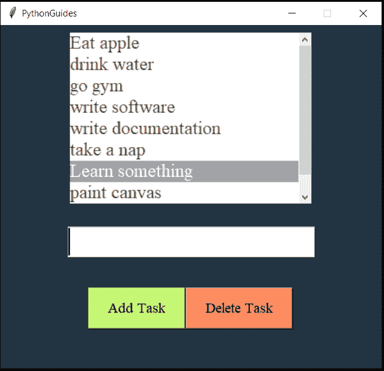

# Python Tkinter ToDo 列表(逐步构建)

> 原文：<https://pythonguides.com/python-tkinter-todo-list/>

[](https://sharepointsky.teachable.com/p/python-and-machine-learning-training-course)

在本 [Python Tkinter 教程](https://pythonguides.com/python-gui-programming/)中，我们来讨论一下 **Python Tkinter 待办事项**。我们将逐步了解如何使用 Python Tkinter 构建 todo 列表。

*   关于 Python 中的 Tkinter ToDo 列表
*   Python Tkinter 中 ToDo 列表的特性。
*   Python Tkinter 中 ToDo 列表的代码解释。
*   todo 使用 Python Tkinter 列出源代码和解释

目录

[](#)

*   [关于 Python Tkinter 中的 Tkinter 待办事宜](#About_Tkinter_ToDo_List_in_Python_Tkinter "About Tkinter ToDo List in Python Tkinter")
*   [Python Tkinter 中 ToDo 列表的特性](#Features_of_ToDo_List_in_Python_Tkinter "Features of ToDo List in Python Tkinter")
*   [Python Tkinter 中 ToDo 列表的代码解释](#Code_explanation_for_ToDo_list_in_Python_Tkinter "Code explanation for ToDo list in Python Tkinter")

## 关于 Python Tkinter 中的 Tkinter 待办事宜

*   Python ToDo List 是一个保存即将到来的任务或事件信息的软件。
*   用户需要一个方便的软件，可以用来快速记笔记。这就是待办事项清单的用途。
*   在本教程中，我们将**使用 Python Tkinter** 创建一个简单的待办事项应用程序，帮助用户组织他们的短笔记、消息或任务。
*   如果我们讨论常规的 todo 列表应用程序，那么我们会注意到一个用户可以输入消息的文本区域，一个保存

## Python Tkinter 中 ToDo 列表的特性

在这一节中，我们将讨论将要添加到我们的待办事项应用程序中的特性。

1.  **列表框**:我们将使用 [Python Tkinter 列表框](https://pythonguides.com/python-tkinter-listbox/)来显示一个接一个堆叠的多个任务。点击它可以选择任务。
2.  滚动条:滚动条将帮助我们堆叠大量的数据，而不用担心窗口上的空间。可以通过滚动列表框来访问任务。
3.  **Frame:** [Frame](https://pythonguides.com/python-tkinter-frame/) 将用于放置列表框和滚动条等小部件。这将使我们能够控制左边的列表框和右边的&滚动条的对齐，这样它们看起来都是平行的&。
4.  **按钮:**我们将在窗口上添加两个[按钮小部件](https://pythonguides.com/python-tkinter-button/)。一个是在列表框中添加更多的任务，另一个是从列表框中删除任务。
5.  **输入框** **框:**用户将在输入框中输入任务，该任务将进一步显示在列表框中。
6.  **消息框:**[Python Tkinter 消息框](https://pythonguides.com/python-tkinter-messagebox/)用于当用户点击一个空输入框的 add 按钮时显示一条错误消息。

## Python Tkinter 中 ToDo 列表的代码解释

在本节中，我们将了解 Python Tkinter 中的 **ToDo 列表的源代码。整个代码是按照创建的顺序来解释的。**

**第一步** **:导入模块**

在开始使用 Tkinter 之前，我们需要调用 Tkinter 进行使用。所以我们导入模块。这里*代表一切。因此，我们从 Tkinter 导入所有内容，然后在第二行中，我们从 Tkinter 导入消息框

```
from tkinter import *
from tkinter import messagebox 
```

**第二步:创建&配置窗口**

导入模块后，我们将创建一个窗口，以便我们可以在上面放置小部件。

*   **ws** 用于初始化 **Tk()** 。从现在开始 **ws** 将被称为父窗口。所有其他部件将被放置在它上面。
*   **ws.geometry('宽度 x 高度+ x 位置+ y 位置')**
    所有提供的值必须是整数。
    *   宽度是指窗口的水平空间。
    *   高度是指窗口的垂直空间。
    *   x 位置是指窗口在 x 轴上的显示位置。
    *   y 位置是指窗口在显示器上 y 轴上的位置。
*   **标题**会给窗口添加一个标题。在我们的例子中，我们提供了网站名称作为标题。你可以在羽毛旁边的窗口左上角找到标题。
*   **config** 用来给窗口提供背景颜色。
*   **resizable** 接受布尔值。由于高度和宽度的布尔值都为 false，这意味着窗口不能调整大小。要了解更多关于 resizable 的信息，请阅读我们关于 python Tkinter windows size 的博客。
*   **ws.mainloop()** 握住屏幕，这样我们就可以看到窗口了。这是一个无限循环。屏幕弹出，然后消失，但是在这个无限循环中，这个出现&消失的过程持续发生得非常快。我们不断看到更新的窗口。

```
ws = Tk()
ws.geometry('500x450+500+200')
ws.title('PythonGuides')
ws.config(bg='#223441')
ws.resizable(width=False, height=False)

....
....

ws.mainloop()
```

**第三步:创建框架**

在这一节中，我们将理解为什么我们在代码中使用框架作为第一个小部件。

*   **Frame** widgets 用于容纳其他 widgets。
*   他们帮助保持和维护用户界面(UI)和用户体验(UX)整洁有序。
*   接下来，我们将在框架中放置列表框、滚动条和按钮。
*   因此，通过这种方式，frame 将作为父窗口的附加窗口。
*   放置框架的另一个好处是现在我们将在框架中添加滚动条，这就解决了我们的目的。
*   滚动条并不容易放置，但是使用框架我们可以很快做到。
*   **pady=10** 意味着我们从外面在框架周围添加了额外的衬垫。

```
frame = Frame(ws)
frame.pack(pady=10) 
```

**第四步:添加列表框**

在本节中，我们将学习为什么以及如何在窗口中使用 Listbox。

*   **lb** 是存储 Listbox 的变量名。
*   列表框放置在框架窗口上。
*   **宽度:**提供的水平间距为 25。
*   **高度:**提供 8 排垂直位置。
*   **字体:** Times New Roman 字体提供 14 种大小。
*   **bd = 0** 指边界为零
*   **fg** 是前景色或者文字颜色。
*   **highlightthickness=0** 每次焦点移动到任何项目时，都不应显示任何值为 0 的移动。默认情况下，它有一些值。
*   选择背景它决定列表框中焦点项的颜色。
*   **activestyle="none"** 删除选中或聚焦项目时出现的下划线。
*   **使用的几何管理器**是 **pack()**
*   这将使列表框保持在框架的左侧。我们这样做是为了给滚动条分配正确的位置。
*   **fill=BOTH** 这将填充 x 和 y 两个方向的空白空间

```
lb = Listbox(
    frame,
    width=25,
    height=8,
    font=('Times', 18),
    bd=0,
    fg='#464646',
    highlightthickness=0,
    selectbackground='#a6a6a6',
    activestyle="none",

)
lb.pack(side=LEFT, fill=BOTH) 
```

**步骤 5:添加虚拟数据**

*   我们添加了虚拟数据，以便应用程序可以随时查看。你可以添加或删除任何你想要的数据。
*   数据采用列表格式，存储在名为 **task_list** 的变量中。
*   **for 循环**用于在 Listbox 中插入数据。
*   每次循环运行时，它都会在列表框中添加一个条目&这个过程会一直持续下去，直到 **task_list** 中的所有条目都被插入。
*   **lb.insert(END，item)** 该命令堆叠列表框中的项目。
    *   **lb** 是用于**列表框**的变量
    *   **insert** 是 Listbox 内置的插入数据的方法。
    *   **END** 表示最后会添加一个新项目。如果用 **0** 替换**结束**，那么新数据将被添加到顶部。
    *   **项**是来自**任务列表**的列表项

```
task_list = [
    'Eat apple',
    'drink water',
    'go gym',
    'write software',
    'write documentation',
    'take a nap',
    'Learn something',
    'paint canvas'
    ]

for item in task_list:
    lb.insert(END, item) 
```

**第六步:添加滚动条**

在这一节中，我们将理解为什么以及如何在窗口中添加滚动条。

*   使用滚动条是为了让用户可以滚动放置在窗口有限尺寸内的信息。
*   在这个例子中，滚动条被放置在一个框架上，被赋值的变量是 sb
*   使用的**几何**方法是一个 pack()，这样一切都保持动态和有序。
*   我们在框架的右侧放置了滚动条。
*   在上面的代码中，我们已经向 Listbox 提供了 **side=LEFT** 。这样，两个小部件被并行分配。
*   **fill=BOTH** 这将填充 x 和 y 两个方向的空白空间
*   **lb . config(yscrollcommand = sb . set)**这里我们给滚动条分配了一个用途。换句话说，我们有带滚动条的绑定列表框
*   **sb . config(command = lb . yview)**，这里 y view 的意思是滚动条会往垂直方向走。如果是 xview，那么滚动条会在水平方向工作。

```
sb = Scrollbar(frame)
sb.pack(side=RIGHT, fill=BOTH)

lb.config(yscrollcommand=sb.set)
sb.config(command=lb.yview) 
```

**第七步:添加输入框**

*   **条目** **框**用于接受用户的输入。
*   **ws** :输入框放置在父窗口上
*   **字体:**提供字体名称，即“Times New Roman”，字号为 14
*   **使用的几何管理器**是**包**，在小工具外填充 20

```
my_entry = Entry(
    ws,
    font=('times', 24)
    )

my_entry.pack(pady=20) 
```

**步骤:8 添加另一个按钮框**

框架用于组织小部件。我们为按钮使用了单独的框架。

```
button_frame = Frame(ws)
button_frame.pack(pady=20)
```

**第九步:添加按钮**

*   按钮被放置成当被按下时触发一些动作。
*   这里我们创建了两个按钮(**add task**&**delete task**)。它们有相同的特征和外观，接受**背景颜色**和**命令。**
*   **命令**:点击按钮，调用命令中提到的功能。在这种情况下，如果用户点击 **addTask_btn** 按钮，则 **newTask 函数**被调用&。

```
addTask_btn = Button(
    button_frame,
    text='Add Task',
    font=('times 14'),
    bg='#c5f776',
    padx=20,
    pady=10,
    command=newTask
)
addTask_btn.pack(fill=BOTH, expand=True, side=LEFT)

delTask_btn = Button(
    button_frame,
    text='Delete Task',
    font=('times 14'),
    bg='#ff8b61',
    padx=20,
    pady=10,
    command=deleteTask
)
delTask_btn.pack(fill=BOTH, expand=True, side=LEFT)
```

**第十步:newTask()函数**

*   在这个函数中，我们将输入框的值存储在任务变量中
*   get()方法用于提取用户在输入框中提供的值。
*   应用 If-else 条件以避免在列表框中输入空格。
*   如果任务没有空格，那么只有它将允许它在列表框中存储信息，否则它将显示一个警告消息框，通知用户输入框不能为空。

```
def newTask():
    task = my_entry.get()
    if task != "":
        lb.insert(END, task)
        my_entry.delete(0, "end")
    else:
        messagebox.showwarning("warning", "Please enter some task.")
```

**步骤 11: deleteTask()函数**

*   这里的**锚**指的是列表框中选中的项目。
*   **lb** 分配给列表框的变量
*   delete 是一个内置函数，用于删除列表框项目。
*   用户将选择列表框中的项目，然后点击**删除任务按钮**来触发该功能。该项将立即从列表框中消失。

```
def deleteTask():
    lb.delete(ANCHOR)
```

**完整源代码:**

下面是 Python Tkinter 中 ToDo 列表的完整源代码。

```
from tkinter import *
from tkinter import messagebox

def newTask():
    task = my_entry.get()
    if task != "":
        lb.insert(END, task)
        my_entry.delete(0, "end")
    else:
        messagebox.showwarning("warning", "Please enter some task.")

def deleteTask():
    lb.delete(ANCHOR)

ws = Tk()
ws.geometry('500x450+500+200')
ws.title('PythonGuides')
ws.config(bg='#223441')
ws.resizable(width=False, height=False)

frame = Frame(ws)
frame.pack(pady=10)

lb = Listbox(
    frame,
    width=25,
    height=8,
    font=('Times', 18),
    bd=0,
    fg='#464646',
    highlightthickness=0,
    selectbackground='#a6a6a6',
    activestyle="none",

)
lb.pack(side=LEFT, fill=BOTH)

task_list = [
    'Eat apple',
    'drink water',
    'go gym',
    'write software',
    'write documentation',
    'take a nap',
    'Learn something',
    'paint canvas'
    ]

for item in task_list:
    lb.insert(END, item)

sb = Scrollbar(frame)
sb.pack(side=RIGHT, fill=BOTH)

lb.config(yscrollcommand=sb.set)
sb.config(command=lb.yview)

my_entry = Entry(
    ws,
    font=('times', 24)
    )

my_entry.pack(pady=20)

button_frame = Frame(ws)
button_frame.pack(pady=20)

addTask_btn = Button(
    button_frame,
    text='Add Task',
    font=('times 14'),
    bg='#c5f776',
    padx=20,
    pady=10,
    command=newTask
)
addTask_btn.pack(fill=BOTH, expand=True, side=LEFT)

delTask_btn = Button(
    button_frame,
    text='Delete Task',
    font=('times 14'),
    bg='#ff8b61',
    padx=20,
    pady=10,
    command=deleteTask
)
delTask_btn.pack(fill=BOTH, expand=True, side=LEFT)

ws.mainloop()
```

**输出:**

下面是上面代码的输出截图。在这里，您可以注意到一个带有滚动条的列表框。我把输入框放在它的正下方，后面是两个按钮。



Python Tkinter ToDo List

这就是我们如何从一开始就使用 Python Tkinter 构建 ToDo 列表。

您可能会喜欢以下 Python Tkinter 教程:

*   [Python tkinter 标签–如何使用](https://pythonguides.com/python-tkinter-label/)
*   [Python Tkinter 条目–如何使用](https://pythonguides.com/python-tkinter-entry/)
*   [Python Tkinter 单选按钮–如何使用](https://pythonguides.com/python-tkinter-radiobutton/)
*   [Python Tkinter 窗口大小](https://pythonguides.com/python-tkinter-window-size/)
*   [Python Tkinter 画布教程](https://pythonguides.com/python-tkinter-canvas/)
*   [Python Tkinter Stopwatch](https://pythonguides.com/python-tkinter-stopwatch/)
*   [检查一个列表是否存在于另一个列表中 Python](https://pythonguides.com/check-if-a-list-exists-in-another-list-python/)
*   [如何在 Turtle Python 中附加图像](https://pythonguides.com/attach-image-to-turtle-python/)
*   [Python Tkinter Map()函数](https://pythonguides.com/python-tkinter-map-function/)
*   [Python Tkinter 拖拽](https://pythonguides.com/python-tkinter-drag-and-drop/)

在本教程中，我们已经学会了使用 Python tkinter 创建一个简单的 todo 列表应用程序。

*   关于 Python 中的 Tkinter ToDo 列表
*   Python Tkinter 中 ToDo 列表的特性。
*   Python Tkinter 中 ToDo 列表的代码解释。
*   todo 使用 Python Tkinter 列出源代码和解释

[Bijay Kumar](https://pythonguides.com/author/fewlines4biju/)

Python 是美国最流行的语言之一。我从事 Python 工作已经有很长时间了，我在与 Tkinter、Pandas、NumPy、Turtle、Django、Matplotlib、Tensorflow、Scipy、Scikit-Learn 等各种库合作方面拥有专业知识。我有与美国、加拿大、英国、澳大利亚、新西兰等国家的各种客户合作的经验。查看我的个人资料。

[enjoysharepoint.com/](https://enjoysharepoint.com/)[](https://www.facebook.com/fewlines4biju "Facebook")[](https://www.linkedin.com/in/fewlines4biju/ "Linkedin")[](https://twitter.com/fewlines4biju "Twitter")