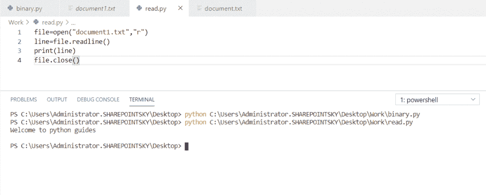
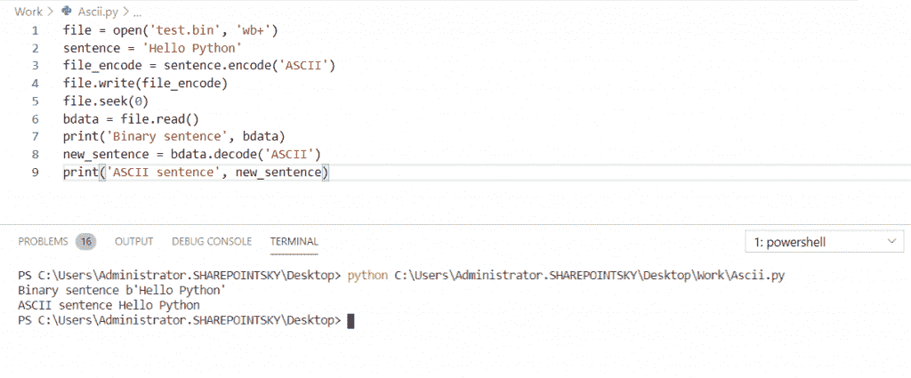
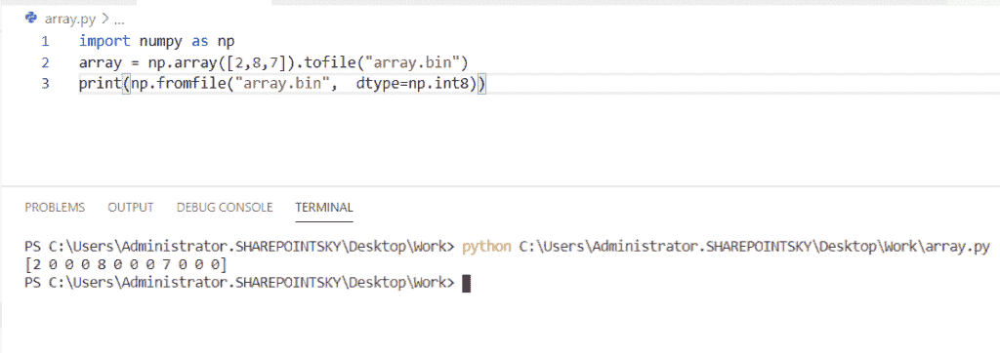
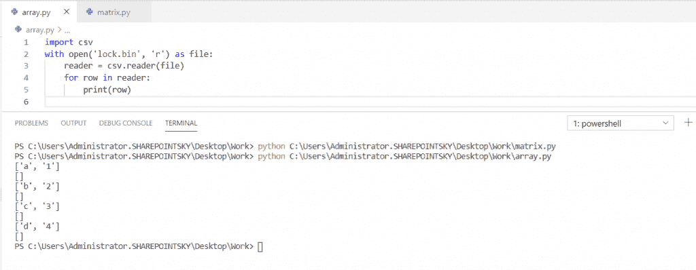

# Python 读取二进制文件(示例)

> 原文：<https://pythonguides.com/python-read-a-binary-file/>

[](https://sharepointsky.teachable.com/p/python-and-machine-learning-training-course)

在这个 [Python 教程](https://pythonguides.com/python-programming-for-the-absolute-beginner/)中，我们将学习**如何在 python** 中读取二进制文件，我们还将涉及以下主题:

*   如何用 Python 将二进制文件读入数组
*   如何在 Python 中将二进制文件读入字节数组
*   如何用 Python 逐行读取二进制文件
*   Python 将二进制文件读入 Ascii 码
*   如何在 Python 中将二进制文件读入 NumPy 数组
*   如何用 Python 将二进制文件读入 CSV

目录

[](#)

*   [Python 读取二进制文件](#Python_read_a_binary_file "Python read a binary file")
*   [Python 将二进制文件读入数组](#Python_read_a_binary_file_to_an_array "Python read a binary file to an array")
*   [Python 将二进制文件读入字节数组](#Python_read_a_binary_file_into_a_byte_array "Python read a binary file into a byte array")
*   [Python 逐行读取二进制文件](#Python_read_a_binary_file_line_by_line "Python read a binary file line by line")
*   [Python 将二进制文件读入 Ascii 码](#Python_read_a_binary_file_to_Ascii "Python read a binary file to Ascii")
*   [Python 将二进制文件读入 NumPy 数组](#Python_read_a_binary_file_into_a_NumPy_array "Python read a binary file into a NumPy array")
*   [Python 将二进制文件读入 CSV](#Python_read_a_binary_file_into_CSV "Python read a binary file into CSV")

## Python 读取二进制文件

在这里，我们将看到**如何在 Python 中读取二进制文件**。

*   在读取文件之前，我们必须写文件。在这个例子中，我使用 **file = open("document.bin "，" wb")** 打开了一个文件，并使用 **"wb"** 模式写入二进制文件。
*   **document.bin** 是文件的名称。
*   我已经把一个变量作为一个句子，并分配了一个句子**“这是好的”，**来解码句子，我已经使用了句子=**(bytearray)(“这是好的”)。编码(" ascii"))** 。
*   为了在文件中写入句子，我使用了 **file.write()** 方法。
*   **write()** 用于将指定的文本写入文件。然后关闭文件，我使用了 **file.close()** 。

写入文件的示例:

```
file = open("document.bin","wb")
sentence = bytearray("This is good".encode("ascii"))
file.write(sentence)
file.close() 
```

*   为了读取文件，我取了已经创建好的文件 **document.bin** ，用**“Rb”**模式读取二进制文件。
*   **document.bin** 是文件名。并且，我已经使用了 **read()** 的方法。 **read()** 方法从文件中返回指定的字节数。

读取文件的示例:

```
file = open("document.bin","rb")
print(file.read(4))
file.close()
```

在这个输出中，你可以看到我使用了 **print(file.read(4))** 。在这里，从句子来看，它只会读出四个字。如输出所示。


Python read a binary file

你可能喜欢 [Python 熊猫 CSV 教程](https://pythonguides.com/python-pandas-csv/)和[文件不存在 Python](https://pythonguides.com/file-does-not-exist-python/) 。

## Python 将二进制文件读入数组

在这里，我们可以看到**如何在 Python 中将二进制文件读取到数组**中。

*   在本例中，我打开了一个名为 **array.bin** 的文件，并使用**“WB”模式**写入了二进制文件。 **array.bin** 是文件的名称。
*   并将数组赋值为 **num=[2，4，6，8，10]** 为了得到字节转换格式的数组，我已经使用了 bytearray()。bytearray()方法返回字节数组对象。
*   为了在文件中写入数组，我使用了 **file.write()** 。和 **file.close()** 来关闭文件。

将数组写入文件的示例:

```
file=open("array.bin","wb")
num=[2,4,6,8,10]
array=bytearray(num)
file.write(array)
file.close()
```

*   为了从文件中读取写入的数组，我使用了同一个文件，即 **file=open("array.bin "，" rb")** 。
*   “rb”模式用于从文件中读取数组。
*   list()函数用于创建 list 对象**number = list(file . read(3))**。 **file.read()** 用于从文件中读取字节。
*   file.read(3)用于从数组中只读三个数字。 **file.close()** 用于关闭文件。

从文件中读取数组的示例:

```
file=open("array.bin","rb")
number=list(file.read(3))
print (number)
file.close()
```

为了得到输出，我使用了 **print(number)** 。为了关闭这个文件，我使用了 **file.close()** 。在下面的截图中，你可以看到输出。


Python read a binary file to an array

*   [如何将 Python 字符串转换成字节数组并举例](https://pythonguides.com/python-string-to-byte-array/)
*   [Python 数组与示例](https://pythonguides.com/python-array/)
*   [在 Python 中创建一个空数组](https://pythonguides.com/create-an-empty-array-in-python/)

## Python 将二进制文件读入字节数组

现在，我们可以看到**如何在 Python 中将二进制文件读入字节数组**。

*   在这个例子中，我打开了一个名为 **sonu.bin** 的文件，使用**“Rb”**模式读取一个二进制文件，而 **sonu.bin** 是这个文件的名称。这里，我在 **sonu.bin 文件中存储了一些数据。**
*   **字节= file.read(3)** 用于读取文件， **file.read(3)** 仅用于从文件中读取 3 个字节。
*   while 循环用于读取和迭代文件中的所有字节。

示例:

```
file = open("sonu.bin", "rb")
byte = file.read(3)
while byte:
    print(byte)
    byte = file.read(3)
```

为了从文件中读取字节，我使用了 **print(byte)。**你可以参考下面的输出截图。


Python read a binary file into a byte array

## Python 逐行读取二进制文件

在这里，我们可以看到**如何用 Python 逐行读取一个二进制文件**。

*   在这个例子中，我将一行代码设为**lines =[" Welcome to python guides \ n "]**，打开一个名为 **file=open("document1.txt "，" wb")** document1.txt 是文件名。
*   **“WB”**是用于写入二进制文件的模式。 **file.writelines(lines)** 用于从文件中写入行。
*   **writelines()** 将字符串序列返回到文件中。使用 **file.close()** 方法关闭文件。

写入文件的示例:

```
lines=["Welcome to python guides\n"]
file=open("document1.txt","wb")
file.writelines(lines)
file.close()
```

*   为了读取写入的文件，我使用了与 document1.txt 相同的文件名，我使用了 **file=open("document1.txt "，" rb")** 来打开文件， **"rb"** 模式用于读取二进制文件，并且，为了从文件中读取行，我使用了 **line=file.readline()。**
*   **readline()** 从文件中返回一行。

读取文件的示例:

```
file=open("document1.txt","rb")
line=file.readline()
print(line)
file.close()
```

为了得到输出，使用了 **print(line)** ，最后为了关闭文件，我使用了 **file.close()** 。



Python read a binary file line by line

## Python 将二进制文件读入 Ascii 码

现在，我们可以看到**如何在 Python 中将二进制文件读入 Ascii** 。

*   在这个例子中，我已经使用 **file = open('test.bin '，' wb')** 打开了一个名为 **test.bin** 的文件，使用 **'wb'** 模式写入二进制文件，我将一个变量作为一个句子，并分配了一个**句子= 'Hello Python'** 。对句子进行编码。
*   我用过**file _ encode = sentence . encode(' ASCII ')**。为了在文件中编写编码的句子，我使用了**。**
*   **file.seek()** 方法返回**的新位置**。为了读取写入的文件，我使用了 **file.read()** ，它从文件中返回一个字节。
*   然后为了将**二进制句子转换成 Ascii，**我使用了 **new_sentence = bdata。解码(' ASCII ')。**

示例:

```
file = open('test.bin', 'wb')
sentence = 'Hello Python'
file_encode = sentence.encode('ASCII')
file.write(file_encode)
file.seek(0)
bdata = file.read()
print('Binary sentence', bdata)
new_sentence = bdata.decode('ASCII')
print('ASCII sentence', new_sentence)
```

为了获得编码句子的输出，我使用了 **print('ASCII 句子'，new_sentence)** 。您可以参考下面的输出截图。



Python read a binary file to Ascii

## Python 将二进制文件读入 NumPy 数组

在这里，我们可以看到**如何将二进制文件读入 Python 中的 numpy 数组**。

*   在这个例子中，我导入了一个名为 NumPy 的模块。 **array = np.array([2，8，7])** 用于创建一个数组，**。tofile** 用于将所有数组写入文件。 **array.bin** 是二进制文件的名称。
*   **np.fromfile** 用于从文件中的数据构造一个数组。 **dtype=np.int8** 是数据类型对象。如果我们将 np **.int8** 更改为 **int32 或 int64** ，数组的输出也会发生变化。

示例:

```
import numpy as np
array = np.array([2,8,7]).tofile("array.bin")
print(np.fromfile("array.bin",  dtype=np.int8))
```

为了得到输出，我使用了**print(NP . from file(" array . bin "，dtype=np.int8))** 。下面的截图显示了输出。



Python read a binary file into a NumPy array

## Python 将二进制文件读入 CSV

这里可以看到**如何用 Python 将二进制文件读入 csv** 。

*   在这个例子中，我导入了一个名为 CSV 的**模块。 **CSV** 模块是一个逗号分隔值模块。它用于读取和写入 CSV 格式的表格数据。**
*   我打开了一个名为 **lock.bin** 的文件，用**【w】**模式来写**文件，用 writer = csv.writer(f)** 来写文件中的对象。 **lock.bin** 是文件的名称。
*   **writer()** 返回将数据转换成字符串的写对象。
*   **writer.writerows** 用于将所有行写入文件。要关闭文件，使用 **f.close()** 。

编写 csv 文件的示例:

```
import csv
f = open("lock.bin", "w")
writer = csv.writer(f)
writer.writerows([["a", 1], ["b", 2], ["c", 3], ["d",4]])
f.close() 
```

为了读取 **CSV** 文件，我打开了已经写入数据的文件 **lock.bin** ，使用**r**模式读取文件。为了读取 CSV 文件，我使用了 **reader = csv.reader(file)** 从文件中返回一个行列表。

读取 csv 文件的示例:

```
import csv
with open('lock.bin', 'r') as file:
    reader = csv.reader(file)
    for row in reader:
        print(row) 
```

为了得到输出，我使用了 **print(row)** 。下面的截图显示了输出。



Python read a binary file into CSV

您可能会喜欢以下 Python 教程:

*   [如何使用 Turtle 在 python 中绘制形状](https://pythonguides.com/turtle-programming-in-python/)
*   [Python 要求用户输入(示例)](https://pythonguides.com/python-ask-for-user-input/)
*   [如何将 Python 字符串转换成字节数组并举例](https://pythonguides.com/python-string-to-byte-array/)
*   [Python 通过引用或值传递示例](https://pythonguides.com/python-pass-by-reference-or-value/)
*   [Python 从列表中选择+示例](https://pythonguides.com/python-select-from-a-list/)
*   [集合的并集 Python +实例](https://pythonguides.com/union-of-sets-python/)
*   [Python 接口介绍](https://pythonguides.com/python-interface/)
*   [如何在 Python 中把字符串转换成日期时间](https://pythonguides.com/convert-a-string-to-datetime-in-python/)
*   [使用 if-else 理解 Python 列表](https://pythonguides.com/python-list-comprehension-using-if-else/)

在本教程中，我们已经了解了 **Python 读取二进制文件，**我们还讨论了以下主题:

*   Python 将二进制文件读入数组
*   Python 将二进制文件读入一个字节数组
*   Python 逐行读取二进制文件
*   Python 将二进制文件读入 Ascii 码
*   Python 将二进制文件读入 NumPy 数组
*   Python 将二进制文件读入 CSV

[Bijay Kumar](https://pythonguides.com/author/fewlines4biju/)

Python 是美国最流行的语言之一。我从事 Python 工作已经有很长时间了，我在与 Tkinter、Pandas、NumPy、Turtle、Django、Matplotlib、Tensorflow、Scipy、Scikit-Learn 等各种库合作方面拥有专业知识。我有与美国、加拿大、英国、澳大利亚、新西兰等国家的各种客户合作的经验。查看我的个人资料。

[enjoysharepoint.com/](https://enjoysharepoint.com/)[](https://www.facebook.com/fewlines4biju "Facebook")[](https://www.linkedin.com/in/fewlines4biju/ "Linkedin")[](https://twitter.com/fewlines4biju "Twitter")