# Python 连接数组(详细教程)

> 原文：<https://pythonguides.com/python-concatenate-arrays/>

[](https://sharepointsky.teachable.com/p/python-and-machine-learning-training-course)

在本 [python 教程中，](https://pythonguides.com/python-hello-world-program/)我们将讨论 **Python 连接数组**，我们还将涵盖以下主题:

*   如何在 python 中连接数组
*   Python 连接列表中的数组
*   Python 水平连接数组
*   Python 垂直连接数组
*   Python 将数组连接到矩阵
*   Python 在循环中连接数组
*   Python 连接不同维度的数组
*   Python 连接数组 numpy
*   Python 串联字符串数组
*   Python 通过列连接数组
*   Python 连接数组的数组
*   如何在 python 中连接两个一维数组
*   不使用 numpy 连接数组 python
*   连接两个数组 python
*   Python 连接多个数组
*   Python 连接 3 个数组
*   Python 沿着轴连接数组
*   二维数组 python 连接
*   Python 连接双字节数组
*   Python 连接了两个不同大小数组
*   Python 连接长度不等的数组

目录

[](#)

*   [如何在 python 中连接数组](#How_to_concatenate_arrays_in_python "How to concatenate arrays in python")
*   [Python 连接列表中的数组](#Python_concatenate_arrays_in_list "Python concatenate arrays in list")
*   [Python 水平连接数组](#Python_concatenate_arrays_horizontally "Python concatenate arrays horizontally")
*   [Python 垂直连接数组](#Python_concatenate_array_vertically "Python concatenate array vertically")
*   [Python 将数组连接成矩阵](#Python_concatenate_arrays_to_matrix "Python concatenate arrays to matrix")
*   [Python 在一个循环中串联数组](#Python_concatenate_arrays_in_a_loop "Python concatenate arrays in a loop")
*   [Python 串联不同维度的数组](#Python_concatenate_arrays_of_different_dimensions "Python concatenate arrays of different dimensions")
*   [Python 串联数组 numpy](#Python_concatenate_arrays_numpy "Python concatenate arrays numpy")
*   [Python 串联字符串数组](#Python_concatenate_arrays_of_strings "Python concatenate arrays of strings")
*   [Python 通过列连接数组](#Python_concatenate_arrays_by_column "Python concatenate arrays by column")
*   [Python 串联数组的数组](#Python_concatenate_arrays_of_arrays "Python concatenate arrays of arrays")
*   [如何在 python 中连接两个一维数组](#How_to_concatenate_two_1d_arrays_in_python "How to concatenate two 1d arrays in python")
*   [串联数组 python 不带 numpy](#Concatenate_arrays_python_without_numpy "Concatenate arrays python without numpy")
*   [串接两个数组 python](#Concatenate_two_array_python "Concatenate two array python  ")
*   [Python 串联多个数组](#Python_concatenate_multiple_arrays "Python concatenate multiple arrays")
*   [Python 串联 3 个数组](#Python_concatenate_3_arrays "Python concatenate 3 arrays")
*   [Python 沿着一个轴连接数组](#Python_concatenate_arrays_along_an_axis "Python concatenate arrays along an axis")
*   [二维数组 Python concatenate](#2-dimensional_array_Python_concatenate "2-dimensional array Python concatenate")
*   [Python 串联双字节数组](#Python_concatenate_two-byte_arrays "Python concatenate two-byte arrays")
*   [Python 连接两个不同大小的数组](#Python_concatenate_two_different_size_arrays "Python concatenate two different size arrays")
*   [Python 串联不等长数组](#Python_concatenate_arrays_of_unequal_length "Python concatenate arrays of unequal length")

## 如何在 python 中连接数组

我们可以使用 **numpy.concatenate()** 来连接多个 numpy 数组。

示例:

```
import numpy as test

a = test.arange(5,9)
b = test.arange(2,4)
c= test.arange(6,8)
test.concatenate([a,b,c])
```

哎呀，在执行上述代码后，我得到了以下错误

**ModuleNotFoundError:没有名为“numpy”的模块**

请参见下面的输出

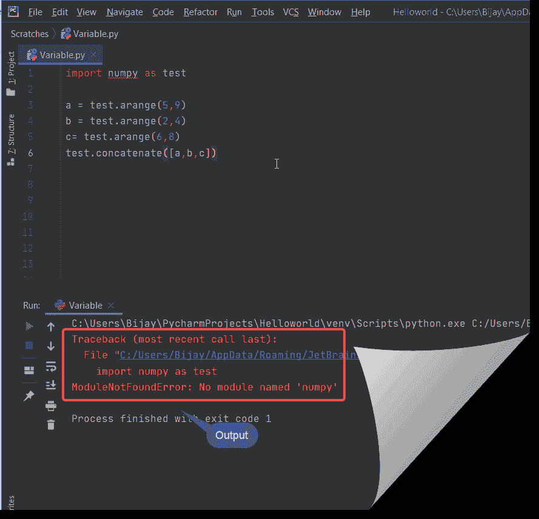

所以要修复上面的错误，你需要用 **pip install numpy** 命令安装**‘numpy’**。

要运行上述命令，您需要打开**命令提示符(以管理员模式运行)**并转到 python 的安装路径，然后运行上述命令。

见下文


现在，安装 numpy 之后，您可以运行上面的代码来连接两个数组。

你可能喜欢用 [Python 程序打印数组](https://pythonguides.com/python-program-to-print-element-in-an-array/)中的元素。

## Python 连接列表中的数组

在这里，我们可以看到**如何在 python 中连接列表**中的数组。

*   在这个例子中，我采用了两个数组作为**数组 1** 和**数组 2** 。为了连接列表，我创建了一个名为 list 的变量。**“+”**运算符用于连接。
*   为了将值转换成字符串，我使用了 **str()** 方法。

示例:

```
array1 = [1,3,5,7] 
array2=  [2,4,6,8] 
list= array1 + array2
print ("list = " + str(list))
```

在下面的屏幕截图中，我们可以看到该阵列连接在列表中。

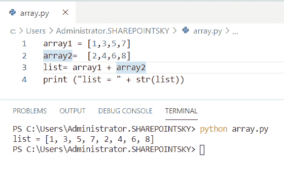

Python concatenate arrays in list

## Python 水平连接数组

在这里，我们可以看到 python 中的**水平连接数组**。

*   在这个例子中，我导入了一个名为 **numpy 的模块作为 np** 。
*   我取了两个数组作为**偶数组**和**奇数组**，用来传递数组 **np 的元素。**
*   为了水平连接数组，我使用了 **np.hstack** 。 **hstack** 用于堆叠数组水平序列。

示例:

```
import numpy as np
Even_array = np.array([2,4,6,8])
Odd_array = np.array([1,3,5,7])
Horizontal_array = np.hstack((Even_array, Odd_array))
print(Horizontal_array)
```

我们可以看到水平格式的数组作为输出。您可以参考下面的输出截图。

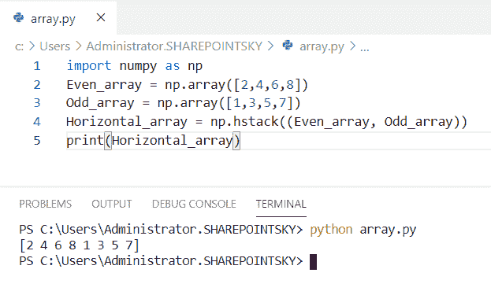

Python concatenate arrays horizontally

## Python 垂直连接数组

*   在这个例子中，我导入了一个名为 **numpy 的模块作为 np** 。
*   我取了两个数组作为**偶数组**和**奇数组**，并使用了数组 **np.array** 的元素来传递。
*   为了垂直连接数组，我使用了 **np.vstack** 。vstack 用于垂直堆叠数组序列。

示例:

```
import numpy as np
Even_array = np.array([2,4,6,8])
Odd_array = np.array([1,3,5,7])
Vertical_array = np.vstack((Even_array, Odd_array))
print(Vertical_array)
```

我们可以看到垂直格式的数组作为输出。您可以参考下面的输出截图。

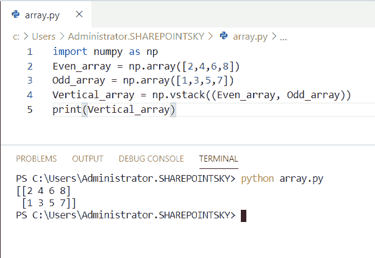

Python concatenate array vertically

## Python 将数组连接成矩阵

在这里，我们可以看到 python 中的**将数组连接到矩阵**。

*   在这个例子中，我将一个名为 **numpy 的模块作为 np** 导入，并将两个数组作为**数组 1** 和**数组 2。**
*   **np.array** 用于传递数组的元素。
*   使用 np.concatenate 来连接数组**，这里的**轴= 0** 表示行，所以数组被连接在行的下面。**
*   为了得到输出，我使用了 **print(matrix)** 。

示例:

```
import numpy as np 
array1 = np.array([[1, 2], [3, 4]])
array2 = np.array([[5, 6],[7,8]])
matrix = np.concatenate((array1, array2), axis=0)
print(matrix)
```

下面的屏幕截图显示了作为输出的矩阵格式的数组。您可以参考下面的输出截图。

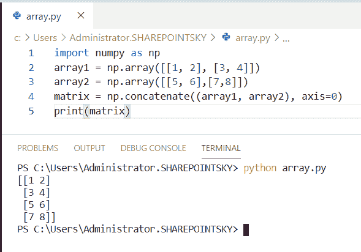

Python concatenate arrays to matrix

## Python 在一个循环中串联数组

在这里，我们可以看到 python 中的循环中的**连接数组。**

*   在这个例子中，我取了两个数组作为**水果**和**巧克力**。为了连接循环的数组**被用作巧克力**中项目的**。**
*   为了将巧克力添加到水果中，我使用了 **fruits.append** ()。
*   为了得到输出，我使用了 **print(fruits)** 。

示例:

```
fruits= ['mango','apple']
chocolate = ['dairymilk','milkybar']
for item in chocolate:
    fruits.append(item)
print(fruits)
```

在这里，我们可以看到两个数组的输出是一致的。您可以参考下面的输出截图。

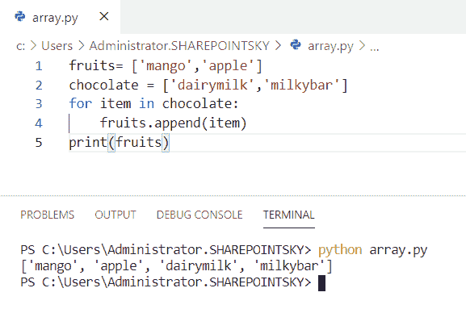

Python concatenate arrays in a loop

## Python 串联不同维度的数组

现在，我们可以看到**如何在 python 中连接不同维度的数组**。

*   在这个例子中，我导入了一个名为 **numpy 的模块作为 np** 。
*   我取了两个数组比如**数组 1** 和**数组 2** 。 **np.arange** 用于创建给定范围的数组。
*   这里， **np.arange(8)** 是给定的范围，给定另一个范围为 **np.arange(2)** 的数组。
*   连接两个不同维度的数组。使用 **np.column_stack((array1，array2))** 。
*   为了得到输出，我使用了 **print(array1)** 。

示例:

```
import numpy as np
array1 = np.arange(8).reshape(2,4)
array2 = np.arange(2)
array1 = np.column_stack((array1, array2))
print(array1)
```

这里，两个不同维度的数组被连接起来作为输出。下面的截图显示了输出。

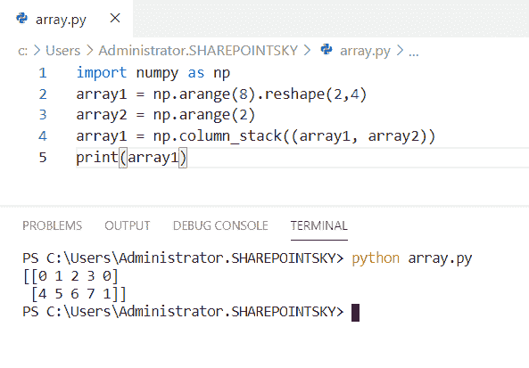

Python concatenate arrays of different dimensions

## Python 串联数组 numpy

现在，我们可以看到 python 中的**串联数组 numpy** 。

*   在这个例子中，我导入了一个名为 **numpy 的模块作为 np** 。Numpy 是用于处理阵列的库。
*   **np.array** 用于传递数组的元素。为了连接数组，我使用了 **np.concatenate()** 。
*   为了得到输出，我使用了 **print(array)。**

示例:

```
import numpy as np
array1 = np.array([2,4,6])
array2 = np.array([1,3,5])
array = np.concatenate((array1, array2))
print(array)
```

下面的截图显示了输出。

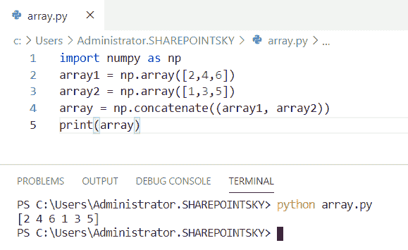

Python concatenate arrays numpy

## Python 串联字符串数组

在这里，我们可以看到 python 中的**串联字符串数组**。

*   在这个例子中，我导入了一个名为 **numpy 的模块作为 np** 。我取了两个数组作为**数组 1** 和**数组 2** 。 **np.array** 用于传递数组中的项目。
*   由于我们在数组中使用 string**NP . char . add(array 1，array2)** 被使用。
*   为了得到输出，我使用了 **print(string)** 。

示例:

```
import numpy as np
array1 = np.array(['mobile', 'Laptop'])
array2 = np.array([' box', ' pen'])
string = np.char.add(array1, array2)
print(string)
```

我们可以看到串联的字符串数组作为输出。你可以参考下面的截图。

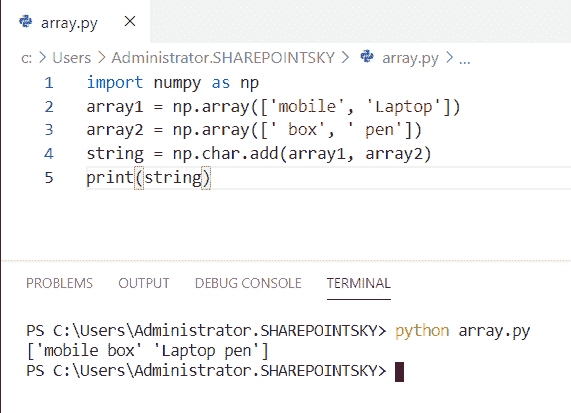

Python concatenate arrays of strings

## Python 通过列连接数组

在这里，我们可以看到 python 中通过列连接数组。

*   在这个例子中，我导入了一个名为 **numpy 的模块作为 np** 。我采用了两个数组作为**数组 1** 和**数组 2** ，并以列的形式连接数组。
*   我用过**NP . column _ stack**。**NP . column _ stack**获取一维数组的序列，并将它们堆叠在列中。
*   为了得到输出，我使用了 **print(array)** 。

示例:

```
import numpy as np
array1 = np.array((0, 1, 3))
array2 = np.array((2, 1, 4))
array = np.column_stack((array1,array2))
print(array)
```

下面的屏幕截图显示了 coloumn 格式的串联数组的输出。

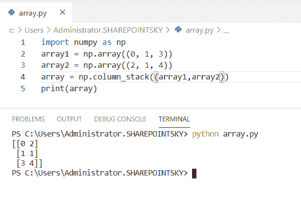

Python concatenate arrays by column

## Python 串联数组的数组

在这里，我们可以看到 python 中的**连接数组**的数组。

*   在这个例子中，我导入了一个名为 **numpy 的模块作为 np** 。
*   为了创建给定范围的数组，我使用了 **np.arange(5)** 。这里， **5** 是给定的范围
*   使用 **print(a)** 来检查创建的数组，使用 **np.concatenate (a，a)** 来连接数组的数组，这里使用 **axis=0** 来按行连接数组。
*   使用 print(b) 获得输出**。**

示例:

```
import numpy as np
a=[np.arange(5),np.arange(5)]
print(a)
b=np.concatenate((a,a),axis=0)
print(b)
```

在输出中可以看到串联的数组。您可以参考下面的输出截图。

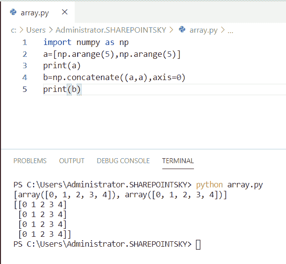

Python concatenate arrays of arrays

## 如何在 python 中连接两个一维数组

在这里，我们可以看到**如何在 python 中连接两个一维数组**。

*   在这个例子中，我采用了两个一维数组，如**数组 1** 和**数组 2** 。
*   为了确定数组 **+** 运算符被用作**数组=数组 1+数组 2** 。
*   为了获得输出，我使用了 print(array)。

示例:

```
array1 = [3,6,9,12]
array2 = [4,8,12,16]
array = array1+array2
print(array)
```

我们可以看到连接起来的字符串作为输出。您可以参考下面的输出截图。

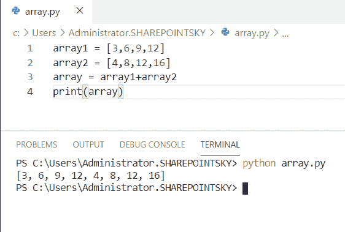

How to concatenate two 1d arrays in python

## 串联数组 python 不带 numpy

在这里，我们可以看到 python 中没有 numpy 的**连接数组 python。**

*   在这个例子中，我取了两个数组，比如**水果**和**巧克力**。
*   为了确定数组 **'+** '运算符，使用**数组=水果+巧克力**。
*   为了得到输出，我使用了 **print(array)** 。

示例:

```
fruits= ['mango','apple']
chocolate = ['dairymilk','milkybar']
array = fruits+chocolate
print(array)
```

下面的屏幕截图显示了作为输出的串联数组。您可以参考下面的输出截图。

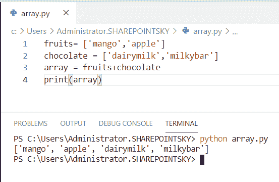

Concatenate arrays python without numpy

## 串接两个数组 python

在这里，我们可以看到 python 中的**连接了两个数组**。

*   在这个例子中，我取了两个数组作为**数组 1** 和**数组 2** 。为了连接数组，for 循环被用作数组 2 中项目的**。**
*   为了将数组 2 的项目追加到数组 1 中，我使用了 **array1.append(item)** 。
*   为了得到输出，我使用了 **print(array1)** 。

示例:

```
array1 = [1,2,3,4]
array2 = [5,6,7,8]
for item in array2:
    array1.append(item)
print(array1)
```

下面的屏幕截图显示了两个串联数组的输出。

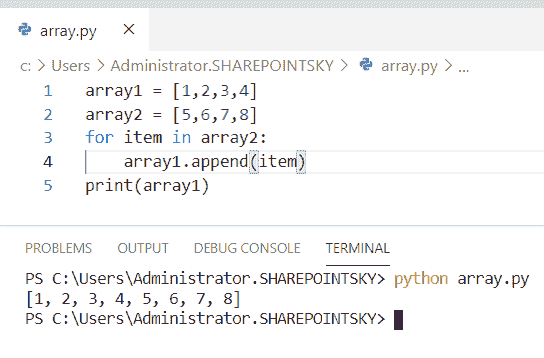

Concatenate two array python

## Python 串联多个数组

在这里，我们可以看到**如何在 python 中连接多个数组**

*   在这个例子中，我取了多个数组作为**数组 1，数组 2，数组 3，数组 4** 。为了连接所有的数组，使用了 **"+"** 操作符。
*   我已经用 **print(array)** 得到了输出。

示例:

```
array1 = [1,3,5,7] 
array2 = [2,4,6,8] 
array3 = [3,6,9,12]
array4 = [4,8,6,9]
array= array1 + array2 + array3 + array4
print(array)
```

下面的屏幕截图显示了作为输出的串联数组。

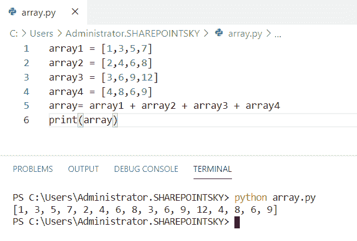

Python concatenate multiple arrays

## Python 串联 3 个数组

在这里，我们可以看到**如何在 python 中连接 3 个数组**

*   在这个例子中，我导入了一个名为 **numpy 的模块作为 np** 。我有三个数组作为**数组 1，数组 2，数组 3。**
*   为了连接数组，我使用了 **np.concatenate(array1，array2，array3)** 。
*   **轴=0** 代表**行**，**轴=1** 代表**列**。
*   我已经用 **print(array)** 得到了输出。

示例:

```
import numpy as np
array1 = [1,3,5,7] 
array2 = [2,4,6,8] 
array3 = [3,6,9,12]
array= np.concatenate((array1,array2,array3), axis=0)
print(array)
```

下面的截图显示了输出。

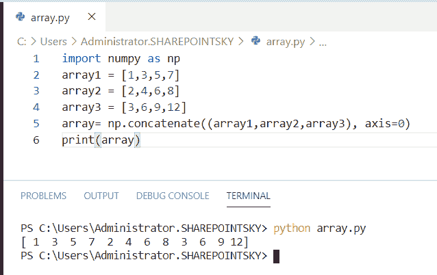

Python concatenate 3 arrays

这就是我们如何在 Python 中**连接 3 个数组。**

## Python 沿着一个轴连接数组

现在，我们可以看到**如何在 python 中沿着轴**连接数组

*   在这个例子中，我导入了一个名为 **numpy 的模块作为 np** 。我取了两个数组作为**数组 1，数组 2** 。
*   为了沿着一个轴连接数组，我为 axis0 取了 **np.stack((array1，array2)，axis = 0)** 。
*   对于 axis1，我用过 **np.stack((array1，array2)，axis = 1** 。
*   **轴=0** 代表**行**，**轴=1** 代表**列**。

示例:

```
import numpy as np
array1 = np.array([ 1, 2, 3] ) 
array2 = np.array([ 4, 5, 6] ) 
axisarray1 = np.stack((array1, array2), axis = 0) 
print ("axis 0:\n ", axisarray1) 
axisarray2 = np.stack((array1, array2), axis = 1) 
print ("axis 1:\n ", axisarray2) 
```

该数组沿轴串联。下面的截图显示了输出。

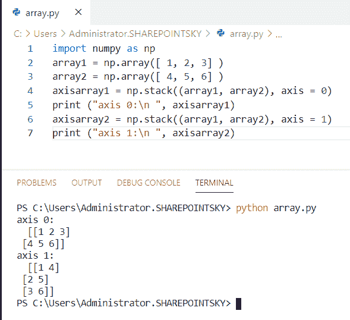

Python concatenate arrays along an axis

## 二维数组 Python concatenate

在这里，我们可以看到**如何在 python 中连接二维数组**。

*   在这个例子中，我导入了一个名为 **numpy 的模块作为 np** 。
*   为了创建二维数组，我使用了 **np.arange(2，11)。整形(3，3)** 。
*   为了打印创建的数组，我使用了 **print(array1)** ， **print(array2)** 。
*   **NP . concatenate****((array 1，array2)，axis=1)** 用于连接数组。
*   **轴=0** 代表**行**，**轴=1** 代表**列**。

示例:

```
import numpy as np 
array1 = np.arange(2,11).reshape(3,3) 
array2 = np.arange(31,40).reshape(3,3) 
print(array1) 
print(array2) 
array = np.concatenate((array1,array2),axis=1) 
print(array)
```

二维数组被连接起来作为输出。您可以参考下面的输出截图。

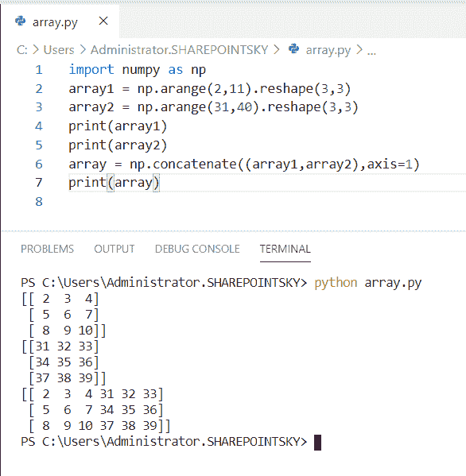

2-dimensional array python concatenate

这就是如何在 Python 中**连接二维数组。**

## Python 串联双字节数组

在这里，我们可以看到**如何在 python 中连接双字节数组**。

*   在这个例子中，我将双字节数组作为**字节 1** 、**字节 2** 。
*   为了连接两个字节的数组，我使用了**。join([bytearray(10)，bytearray(5)])** 。
*   为了得到输出，我使用了 **print(a)** 。

示例:

```
byt1 = bytearray(10)
byt2 = bytearray(5)
a = b"".join([byt1, byt2])
print(a)
```

我们可以看到 bytearray 被连接起来作为输出。下面的截图显示了输出。

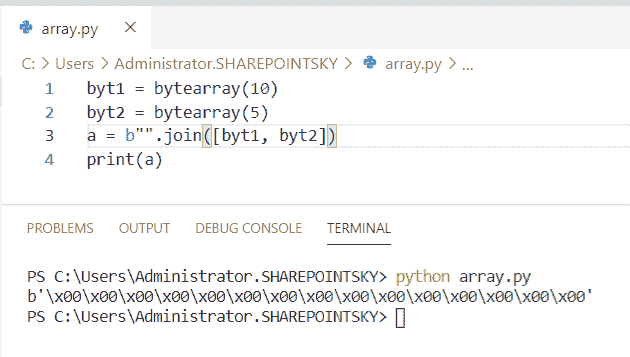

Python concatenate two-byte arrays

这就是如何在 Python 中**连接双字节数组。**

## Python 连接两个不同大小的数组

在这里，我们可以看到**如何在 python 中连接两个不同大小的数组**

*   在这个例子中，我取了三个不同大小的数组。我已经使用了 **"+"** 来连接数组。
*   **print(array)** 用于获取输出。

示例:

```
array1 = [1] 
array2 = [2,4]
array3 = [3,6,9]
array = array1+array2+array3
print(array) 
```

您可以参考下面的输出截图。

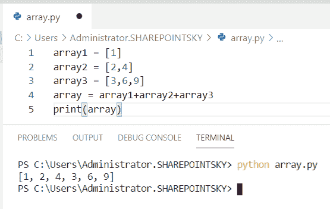

Python concatenate two different size arrays

这就是如何在 Python 中**连接两个不同大小的数组。**

## Python 串联不等长数组

现在，我们可以看到**如何在 python 中连接不等长的数组**。

*   在这个例子中，我导入了一个名为 **numpy 的模块作为 np** ，我使用了 **np.zeros** ， **np.ones** 来创建不等长的数组。
*   **np.append** 用于连接长度不等的数组。
*   **print(array)** 用于获取输出。

示例:

```
import numpy as np
array1 = np.zeros(8)
array2 = np.ones(2)
array = np.append(array1, array2)
print(array)
```

我们可以看到 0 和 1 连接在一起作为输出。您可以参考下面的输出截图。

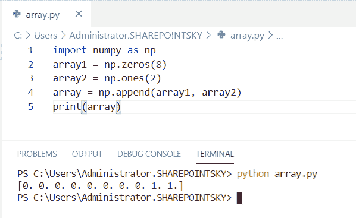

Python concatenate arrays of unequal length

这就是我们如何在 Python 中**连接不等长的数组。**

您可能会喜欢以下 Python 教程:

*   [Python 中的索引和切片](https://pythonguides.com/indexing-and-slicing-in-python/)
*   [Python Tkinter 拖拽](https://pythonguides.com/python-tkinter-drag-and-drop/)
*   [Python 集合的交集](https://pythonguides.com/python-intersection-of-sets/)
*   [Python 逐行读取文件示例](https://pythonguides.com/python-read-a-file-line-by-line/)

在本教程中，我们已经学习了 **Python concatenate arrays** ，并且我们已经涵盖了以下主题:

*   如何在 python 中连接数组
*   Python 连接列表中的数组
*   Python 水平连接数组
*   Python 垂直连接数组
*   Python 将数组连接到矩阵
*   Python 在循环中连接数组
*   Python 连接不同维度的数组
*   Python 连接数组 numpy
*   Python 串联字符串数组
*   Python 通过列连接数组
*   Python 连接数组的数组
*   如何在 python 中连接两个一维数组
*   不使用 numpy 连接数组 python
*   连接两个数组 python
*   Python 连接多个数组
*   Python 连接 3 个数组
*   Python 沿着轴连接数组
*   二维数组 python 连接
*   Python 连接双字节数组
*   Python 连接了两个不同大小数组
*   Python 连接长度不等的数组

[Bijay Kumar](https://pythonguides.com/author/fewlines4biju/)

Python 是美国最流行的语言之一。我从事 Python 工作已经有很长时间了，我在与 Tkinter、Pandas、NumPy、Turtle、Django、Matplotlib、Tensorflow、Scipy、Scikit-Learn 等各种库合作方面拥有专业知识。我有与美国、加拿大、英国、澳大利亚、新西兰等国家的各种客户合作的经验。查看我的个人资料。

[enjoysharepoint.com/](https://enjoysharepoint.com/)[](https://www.facebook.com/fewlines4biju "Facebook")[](https://www.linkedin.com/in/fewlines4biju/ "Linkedin")[](https://twitter.com/fewlines4biju "Twitter")