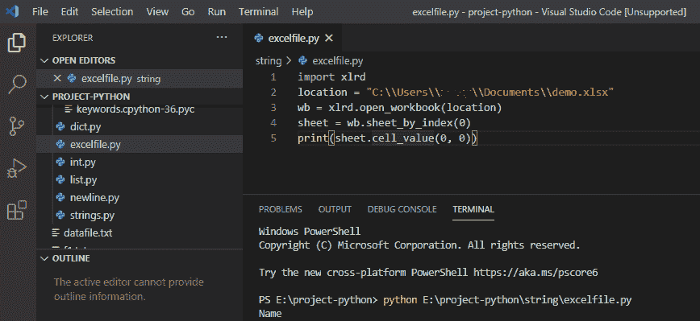
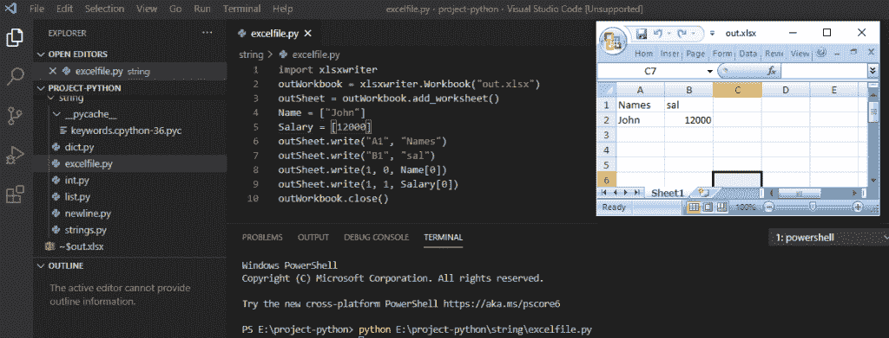
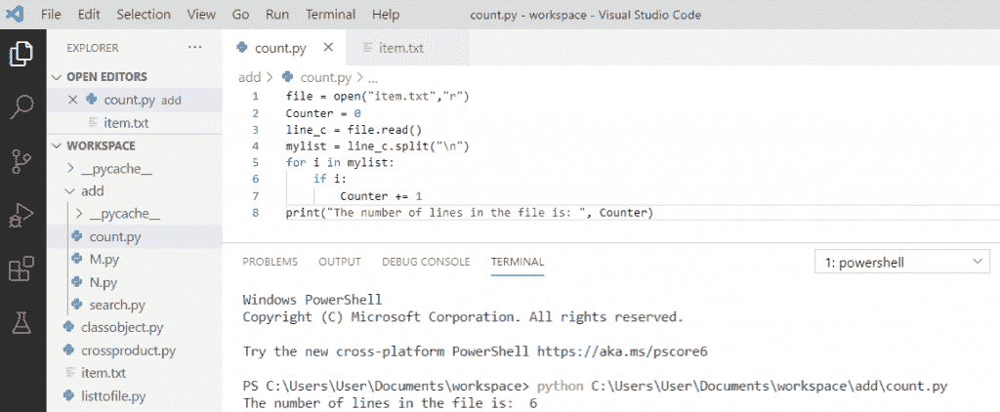

# Python 中读取 excel 文件并写入 Excel

> 原文：<https://pythonguides.com/python-read-excel-file/>

[](https://sharepointsky.teachable.com/p/python-and-machine-learning-training-course)

在本 [Python 教程](https://pythonguides.com/python-download-and-installation/)中，我们将结合实例讨论如何**读取 excel 文件** ( **Python 读取 excel 文件**)以及如何用 Python 写入 Excel 文件。

目录

[](#)

*   [用 Python 读取 Excel 文件](#Read_Excel_File_in_Python "Read Excel File in Python")
*   [写入 excel python](#write_to_excel_python "write to excel python")
*   [Python 计算文件中的行数](#Python_count_lines_in_a_file "Python count lines in a file")

## 用 Python 读取 Excel 文件

为了在 Python 中**读取 excel 文件，我们将使用 **[xlrd 模块](https://xlrd.readthedocs.io/en/latest/)** 从电子表格中检索信息。需要安装的命令是 **xlrd 模块**。xlrd 模块用于从电子表格中提取数据。**

```
import xlrd
location = "C:\\Users\\   \\Documents\\demo.xlsx"
wb = xlrd.open_workbook(location)
sheet = wb.sheet_by_index(0)
print(sheet.cell_value(0, 0))
```

在编写上述代码(用 Python 读取 Excel 文件)后，您将打印这些代码，然后输出将显示为 **" Name "** 。这里，第 0 行和第 0 列的数据是从电子表格中提取的。

可以参考下面的截图**用 Python 读取 Excel 文件**



## 写入 excel python

要在 python 中写入 excel 文件，我们可以使用 **xlsx 模块**，我们可以对电子表格执行多项操作，也可以在 Python 中修改数据。

需要安装的命令是 **xlsxwriter 模块**。

```
import xlsxwriter
outWorkbook = xlsxwriter.Workbook("out.xlsx")
outSheet = outWorkbook.add_worksheet()
Name = ["John"]
Salary = [12000]
outSheet.write("A1", "Names")
outSheet.write("B1", "sal")
outSheet.write(1, 0, Name[0])
outSheet.write(1, 1, Salary[0])
outWorkbook.close()
```

编写上述代码(用 Python 编写 Excel 文件)后，您将打印这些代码，然后输出将显示为 **" Names John sal 12000 "** 。在这里，我们可以使用 xlsxwriter 模块将数据写入电子表格。

可以参考下面截图用 Python 写 Excel 文件。



write to excel python

## Python 计算文件中的行数

*   首先创建一个文本文件并写一些行。
*   然后在读取模式下打开文件，使用 **open(file，mode)** 将文件名作为文件，使用**“r”**作为模式打开文件并读取其内容。
*   创建一个内容列表，当元素遇到“\n”时，它们将被拆分。
*   使用 for 循环并迭代计数器变量。
*   现在，变量计数器与最终结果一起显示。

**举例:**

```
file = open("item.txt", "r")
Counter = 0
line_c = file.read()
my_list = line_c.split("\n")
for i in mylist:
    if i:
        Counter += 1
print("Tne number of lines in the file is: ", Counter)
```


Text file

写完上面的代码(python 计算文件中的行数)，你将打印出 **" Counter "** ，然后输出将显示为**"文件中的行数是** : **6 "** 。在这里，我们可以看到它对文件中的行数进行了计数，并且显示了变量 counter 中的值。

你可以参考下面截图中 python 文件的行数



Python count lines in a file

这就是我们如何在 Python 中**写入现有的 excel 文件。**

您可能会喜欢以下 Python 教程:

*   [Python 中的乘法与例题](https://pythonguides.com/multiply-in-python/)
*   [Python 对于基数为 10 的 int()无效文字](https://pythonguides.com/python-invalid-literal-for-int-with-base-10/)
*   [Python 元组排序列表](https://pythonguides.com/python-sort-list-of-tuples/)
*   [删除 python 中的 Unicode 字符](https://pythonguides.com/remove-unicode-characters-in-python/)
*   [Python 中的注释行](https://pythonguides.com/comment-lines-in-python/)
*   [Python 字典追加示例](https://pythonguides.com/python-dictionary-append/)
*   [在 Python 中检查列表是否为空](https://pythonguides.com/check-if-a-list-is-empty-in-python/)
*   [Python 将列表转换成字符串](https://pythonguides.com/python-convert-list-to-string/)
*   [Python 输入和 raw_input 函数](https://pythonguides.com/python-input-and-raw_input-function/)
*   [Python 文件方法(附有用例子)](https://pythonguides.com/python-file-methods/)
*   [Python 逐行读取文件示例](https://pythonguides.com/python-read-a-file-line-by-line/)

在这个 python 教程中，我们学习了**如何在 Python 中读取 excel 文件**，**如何在 Python 中写入现有文件**，以及 Python 对文件中的行数进行计数。

[Bijay Kumar](https://pythonguides.com/author/fewlines4biju/)

Python 是美国最流行的语言之一。我从事 Python 工作已经有很长时间了，我在与 Tkinter、Pandas、NumPy、Turtle、Django、Matplotlib、Tensorflow、Scipy、Scikit-Learn 等各种库合作方面拥有专业知识。我有与美国、加拿大、英国、澳大利亚、新西兰等国家的各种客户合作的经验。查看我的个人资料。

[enjoysharepoint.com/](https://enjoysharepoint.com/)[](https://www.facebook.com/fewlines4biju "Facebook")[](https://www.linkedin.com/in/fewlines4biju/ "Linkedin")[](https://twitter.com/fewlines4biju "Twitter")