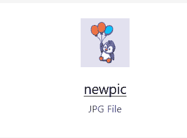
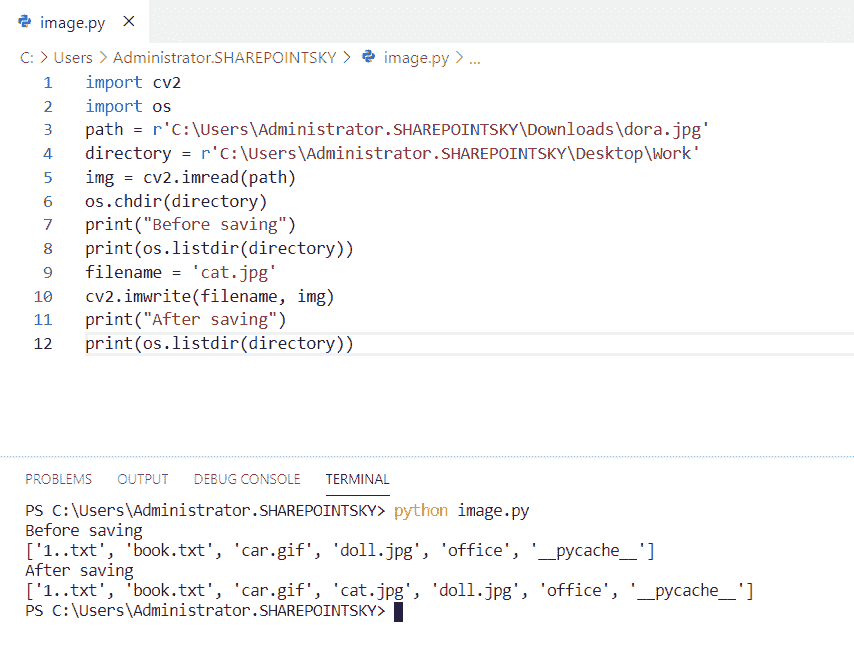
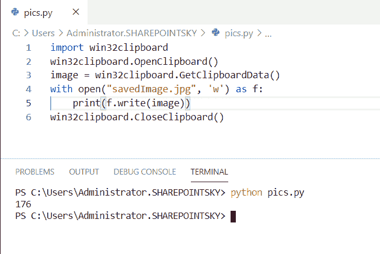
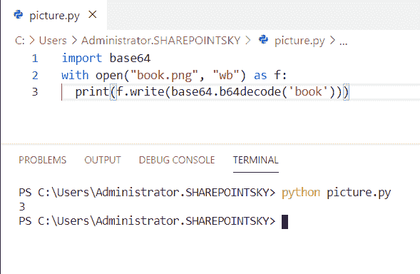
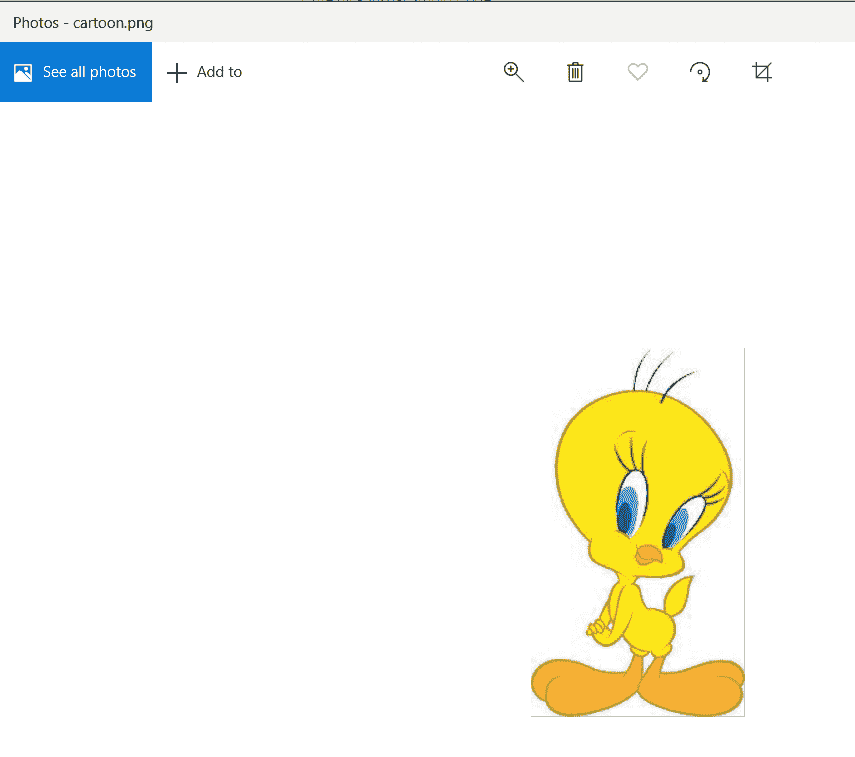

# Python 将图像保存到文件中

> 原文：<https://pythonguides.com/python-save-an-image-to-file/>

[](https://sharepointsky.teachable.com/p/python-and-machine-learning-training-course)

在本 [Python 教程](https://pythonguides.com/python-programming-for-the-absolute-beginner/)中，我们将学习**如何在 python** 中将图像保存到文件中，我们还将涉及以下主题:

*   如何在 python 中保存图像
*   Python 显示图像
*   Python 保存图像 OpenCV2
*   Python 将图像从 URL 保存到文件
*   用 python 从窗口剪贴板中读取 jpg
*   将 base64 格式的字符串转换为图像并保存在 python 文件中
*   Python 将图像文件保存到文件夹中
*   Python 将图像写入文件
*   Python 将图像保存到文件打开 cv

目录

[](#)

*   [如何在 python 中使用枕头保存图像](#How_to_save_an_image_using_a_pillow_in_python "How to save an image using a pillow in python")
*   [Python 显示图像](#Python_show_image "Python show image")
*   [Python 用 OpenCV2 保存文件](#Python_save_the_file_with_OpenCV2 "Python save the file with OpenCV2")
*   [Python 将图像从 URL 保存到文件](#Python_save_an_image_to_file_from_URL "Python save an image to file from URL")
*   [用 python 从窗口剪贴板读取 jpg](#Read_jpg_from_window_clipboard_in_python "Read jpg from window clipboard in python")
    *   [安装 Python Pyperclip 模块](#Install_Python_Pyperclip_module " Install Python Pyperclip module")
*   [将 base64 格式的字符串转换成图像并保存在 python 文件中](#Convert_string_in_base64_to_image_and_save_in_file_python "Convert string in base64 to image and save in file python")
*   [Python 将图像文件保存到一个文件夹中](#Python_save_the_image_file_to_a_folder "Python save the image file to a folder")
*   [Python 将图像写入文件](#Python_write_an_image_to_file "Python write an image to file")
*   [Python 保存图像到文件打开 cv](#Python_save_the_image_to_file_open_cv "Python save the image to file open cv")

## 如何在 python 中使用枕头保存图像

在这里，我们可以看到**如何在 python 中保存图像**。

*   在这个例子中，我从 PIL 导入了一个名为 **Image 的模块，**声明了一个变量picture，并为**Image . open(r ' downloads \ 3 . jpg ')**指定了路径和图像的名称以及扩展名。
*   并声明了另一个变量并赋值**picture . save(" dolls . jpg ")**。在这里，【doll.jpg】是图像的新名称。

示例:

```py
from PIL import Image  
import PIL  
picture = Image.open(r'Downloads\3.jpg')  
picture = picture.save("dolls.jpg") 
```

在下面的截图中，你可以将图像保存为**dolls.jpg**。


How to save an image using a pillow in python

## Python 显示图像

在这里，我们可以看到**如何在 python 中显示图像**。

*   在这个例子中，我从 **PIL** 模块中导入了一个名为 **Image** 的模块并打开该图像。
*   我已经用**image = image . open(' new pic . jpg ')**打开了图片。 **Image.open** 连同图片的名称和扩展名。
*   **image.show()用于**在 python 中显示图像。

示例:

```py
from PIL import Image
image = Image.open('newpic.jpg')
image.show()
```



Python show image

## Python 用 OpenCV2 保存文件

在这里，我们可以看到如何用 python 中的 **opencv2** 保存文件。

*   在这个例子中，我导入了一个名为 **cv2** 和 **os** 的模块，将一个变量作为路径，并分配一个路径，将一个目录作为另一个变量，并分配该目录的路径。
*   **imread** 用于指定读取图像的方式， **os.chdir(目录)**方法用于将当前目录更改为给定路径。
*   保存**cat.jpg**文件后，通过将【dora.jpg】的名字改为【cat.jpg】的名字**并在目录中列出文件名，将路径中的图像**dora.jpg**复制到目录中。**
*   **os.listdir** 用于列出目录，保存图像前后都会列出目录。

示例:

```py
import cv2 
import os 
path = r'C:\Users\Administrator.SHAREPOINTSKY\Downloads\dora.jpg'
directory = r'C:\Users\Administrator.SHAREPOINTSKY\Desktop\Work'
img = cv2.imread(path) 
os.chdir(directory) 
print("Before saving")   
print(os.listdir(directory))   
filename = 'cat.jpg'
cv2.imwrite(filename, img) 
print("After saving")  
print(os.listdir(directory)) 
```

在这里，我们可以将保存前后的目录列表作为输出。您可以参考下面的输出截图:



Python save the file with OpenCV2

## Python 将图像从 URL 保存到文件

在这里，我们可以看到**如何在 python 中从 URL** 保存图像到文件。

*   在这个例子中，我导入了一个名为 **urllib.request** 的模块。 **urllib.request** 模块定义了帮助打开 URL 的函数和类。
*   我已经从 PIL 导入了图片模块，用于**检索文件**的模块的 **urlretrieve** 方法，URL 赋值为**" https://bit . ly/3 oeo hk "**。
*   我们可以通过使用 **URL 缩短工具**来缩短 URL 的长度。
*   **PIL。Image.open("new.png")** 用于打开图像，【new.png】是文件的名称。
*   **image.show()** 用于显示文件中的图像。

示例:

```py
import urllib.request
from PIL import Image  
import PIL
print(urllib.request.urlretrieve("https://bit.ly/3oAeohK"))
image = PIL.Image.open("new.png")
image.show()
```

URL 以图像格式保存，作为下面截图中的输出。


Python save an image to file from URL

## 用 python 从窗口剪贴板读取 jpg

这里可以看到**如何用 python 从窗口剪贴板**读取 jpg。

*   在这个例子中，我导入了一个名为 **win32clipboard** 的模块。**。【OpenClipboard()用于打开剪贴板，防止其他应用程序修改内容。**
*   当应用程序调用 **GetClipboardData()** 函数时，系统执行剪贴板格式之间的隐式数据格式转换，并复制数据。
*   为了读取 jpg 文件，我将文件打开为**“saved image . jpg”**以及扩展名，使用**‘w’**模式写入文件，并使用 f.write 写入文件内容。
*   **CloseClipboard()** 用于关闭剪贴板，以便其他窗口可以访问剪贴板。

### 安装 Python Pyperclip 模块

要安装这个模块，我们必须使用

```py
pip install pyperclip
```

示例:

```py
import win32clipboard
win32clipboard.OpenClipboard()
image = win32clipboard.GetClipboardData()
with open("savedImage.jpg", 'w') as f:
    print(f.write(image))
win32clipboard.CloseClipboard()
```

下面的截图显示了输出。



Read jpg from window clipboard in python

## 将 base64 格式的字符串转换成图像并保存在 python 文件中

在这里，我们可以**如何将 base64 中的字符串转换为图像，并将**保存在文件 python 中。

*   在本例中，我导入了一个名为 base64 的模块。base64 用于解码和编码，也用于将字符串转换为字节格式。
*   为了打开文件，我使用了**和 open("book.png "，" wb ")作为 f** ，为了保存和写入文件，我使用了 print**(f . write(base64 . b64 decode(' book '))。**
*   将字符串解码为 image **base64.b64decode** 。

示例:

```py
import base64
with open("book.png", "wb") as f:
  print(f.write(base64.b64decode('book')))
```

我们可以看到创建的文件作为输出。在下面的截图中。


Convert string in base64 to image and save in file python



Convert string in base64 to image and save in file python

## Python 将图像文件保存到一个文件夹中

在这里，我们可以看到**如何在 python** 中将图像文件保存到文件夹中。

*   在这个例子中，我导入了一个名为 **cv2** 和 **os** 的模块，并将一个变量声明为 image，并为其赋值**image = cv2 . imread(' doll . jpg ')**。**doll.jpg**是文件的名称。
*   **imread** 用于从指定文件中加载图像，并声明文件夹的路径以将图像文件保存到文件夹中。
*   为了将这些路径合并成一条路径，我使用了 **os.path.join** 。

示例:

```py
import cv2
import os
image = cv2.imread('doll.jpg')
path = r'C:\Users\Administrator.SHAREPOINTSKY\Desktop\Newfolder'
(cv2.imwrite(os.path.join(path,'doll.jpg'), image))
```

在下面的截图中，我们可以看到图像文件保存到我们指定的路径。


Python save image file to folder

## Python 将图像写入文件

现在，我们可以看到**如何用 python 写一个图像到文件**

*   在本例中，我从 dolls.jpg 导入了一个名为 **Image 的模块，并打开了要读取的**Image 文件，读取的文件被读取。****
*   为了写图像，我打开了名为**cartoon.png**的文件。为了将 dolls.jpg 图像文件写入名为 cartoon.png 的新文件，我使用了 **file.write()** 。为了关闭这个文件，我使用了**。**

示例:

```py
from PIL import Image
file = open('dolls.jpg','rb')
data = file.read()
file.close()
file = open('cartoon.png','wb')
file.write(data)
file.close() 
```

我们可以看到图像被写入另一个文件作为输出。您可以参考下面的输出截图。



Python write an image to file

## Python 保存图像到文件打开 cv

现在，我们可以看到**如何在 python 中将图像保存到文件打开 cv**

*   在这个例子中，我将模块 **cv2** 导入为 **cv** 和 **sys** ，并将一个变量声明为 image 并赋值为**cv . imread(cv . samples . findfile(" doll . jpg "))**。doll.jpg 是文件的名称。
*   这里，如果条件为无，我将**用于检查图像是否存在。如果图像不存在，它返回**“没有找到图像。”****
*   如果图像存在，它通过使用 **cv.imshow** ()显示图像。
*   **ord()** 接受字符串作为参数，并返回与传递的参数相等的 Unicode。
*   返回字符串 **("s"** )后，使用 **cv.imwrite("doll.jpg "，image)** 显示图像文件。

示例:

```py
import cv2 as cv
import sys
image = cv.imread(cv.samples.findFile("doll.jpg"))
if image is None:
    sys.exit("No image found.")
cv.imshow("showimage", image)
file = cv.waitKey(0)
if file == ord("s"):
    cv.imwrite("doll.jpg", image)
```

下面的截图显示了作为输出的图像文件。


Python save the image to file open cv

您可能会喜欢以下 Python 教程:

*   [如何使用 Python Tkinter 创建日期时间选择器](https://pythonguides.com/create-date-time-picker-using-python-tkinter/)
*   [Python Pygame 教程](https://pythonguides.com/python-pygame-tutorial/)
*   [使用 Python 的机器学习](https://pythonguides.com/machine-learning-using-python/)
*   [如何进入 Python Tkinter 程序的下一页](https://pythonguides.com/go-to-next-page-in-python-tkinter/)
*   [如何使用 Python Tkinter 读取文本文件](https://pythonguides.com/python-tkinter-read-text-file/)
*   [Python 获取目录中的所有文件](https://pythonguides.com/python-get-all-files-in-directory/)
*   [如何使用 Python Tkinter 获取用户输入并存储在变量中](https://pythonguides.com/how-to-take-user-input-and-store-in-variable-using-python-tkinter/)
*   [Python 捕捉多个异常](https://pythonguides.com/python-catch-multiple-exceptions/)
*   [Python 异常处理](https://pythonguides.com/python-exceptions-handling/)

在本教程中，我们学习了如何在 python 中将图像保存到文件中的 ****，并且我们已经涵盖了以下主题:****

*   如何在 python 中保存图像
*   Python 显示图像
*   Python 保存图像 OpenCV2
*   Python 将图像从 URL 保存到文件
*   用 python 从窗口剪贴板中读取 jpg
*   将 base64 格式的字符串转换为图像并保存在 python 文件中
*   Python 将图像文件保存到文件夹中
*   Python 将图像写入文件
*   Python 将图像保存到文件打开 cv

[Bijay Kumar](https://pythonguides.com/author/fewlines4biju/)

Python 是美国最流行的语言之一。我从事 Python 工作已经有很长时间了，我在与 Tkinter、Pandas、NumPy、Turtle、Django、Matplotlib、Tensorflow、Scipy、Scikit-Learn 等各种库合作方面拥有专业知识。我有与美国、加拿大、英国、澳大利亚、新西兰等国家的各种客户合作的经验。查看我的个人资料。

[enjoysharepoint.com/](https://enjoysharepoint.com/)[](https://www.facebook.com/fewlines4biju "Facebook")[](https://www.linkedin.com/in/fewlines4biju/ "Linkedin")[](https://twitter.com/fewlines4biju "Twitter")