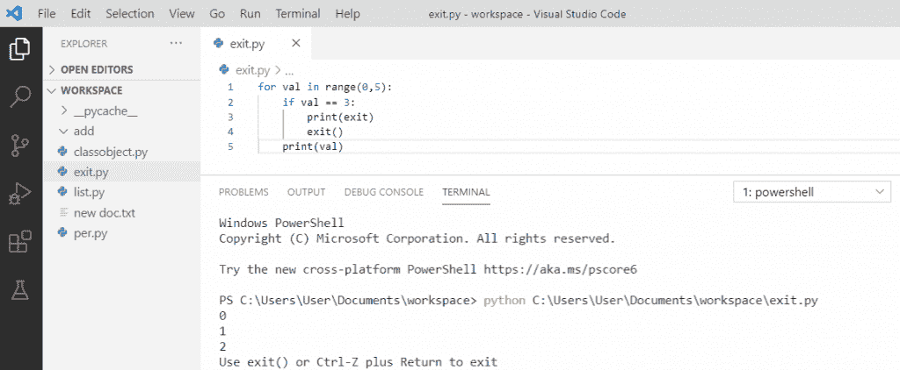
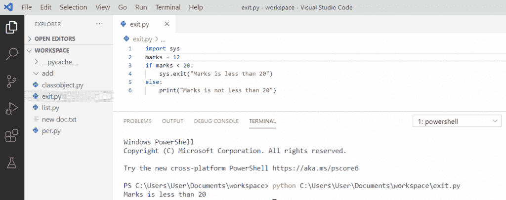
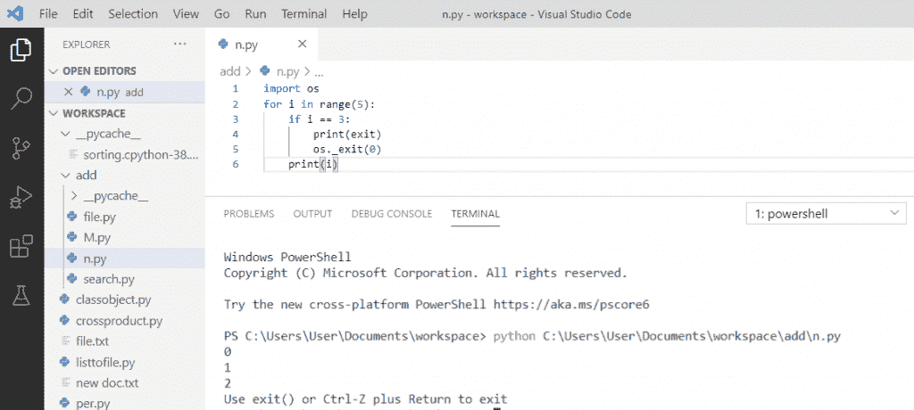
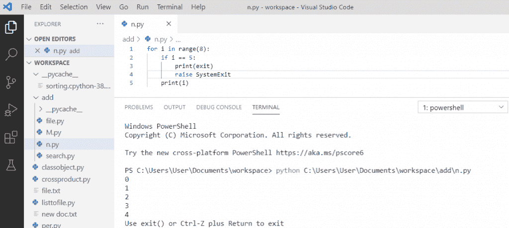
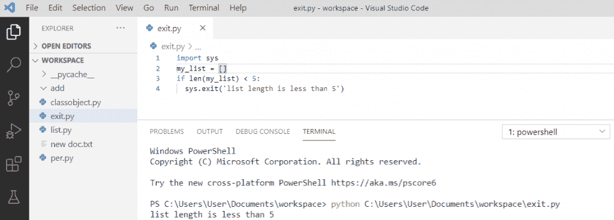

# Python 退出命令(quit()，exit()，sys.exit())

> 原文：<https://pythonguides.com/python-exit-command/>

[](https://sharepointsky.teachable.com/p/python-and-machine-learning-training-course)

在这个 [python 教程中，](https://pythonguides.com/python-hello-world-program/)你将通过几个例子了解到 **Python 退出命令**。这里我们将检查 **:**

*   Python quit()函数
*   Python exit()函数
*   Python sys.exit()函数
*   Python os.exit()函数
*   Python 清理系统退出
*   python 中停止代码执行的程序
*   python 中 exit()和 sys.exit()的区别

目录

[](#)

*   [Python 退出命令](#Python_exit_command "Python exit command")
*   [Python 退出()函数](#Python_quit_function "Python quit() function")
*   [Python exit()函数](#Python_exit_function "Python exit() function")
*   [Python sys.exit()函数](#Python_sysexit_function "Python sys.exit() function")
*   [Python os.exit()函数](#Python_osexit_function "Python os.exit() function")
*   [Python 序列系统退出](#Python_raise_SystemExit "Python raise SystemExit")
*   [python 中停止代码执行的程序](#Program_to_stop_code_execution_in_python "Program to stop code execution in python")
*   [python 中 exit()和 sys.exit()的区别](#Difference_between_exit_and_sysexit_in_python "Difference between exit() and sys.exit() in python")

## Python 退出命令

让我们来看看 python 中的**退出命令，比如 quit()、exit()、sys.exit()命令。**

## Python 退出()函数

在 python 中，我们有一个内置的 **quit()函数**，用于退出 python 程序。当遇到系统中的 **quit()** 函数时，完全终止程序的执行。

它不应该在生产代码中使用，并且这个函数只应该在解释器中使用。

**举例:**

```py
for val in range(0,5):
    if val == 3:
        print(quit)
        quit()
    print(val)
```

写完上面的代码(python quit()函数)，你将打印出 **" val "** ，然后输出将显示为 **" 0 1 2 "** 。这里，如果**“val”**的值变为**“3”**，则程序被强制退出，并打印退出信息。

可以参考下面截图 **python 退出()函数**。


Python quit() function

## Python exit()函数

我们也可以使用 python 中内置的 **exit()函数来退出和走出 python 中的程序。它应该只在解释器中使用，它就像是 quit()** 的**同义词，使 python 更加用户友好**

**举例:**

```py
for val in range(0,5):
    if val == 3:
        print(exit)
        exit()
    print(val)
```

写完上面的代码(python exit()函数)，你将打印出 **" val "** ，然后输出将显示为 **" 0 1 2 "** 。这里，如果**“val”**的值变为**“3”**，那么程序被强制退出，并且它也将打印退出消息。

可以参考下面截图 **python exit()函数**。



Python exit() function

## Python sys.exit()函数

在 python 中， **sys.exit()** 被认为很适合在生产代码中使用，这与 **quit()** 和 **exit()** 不同，因为 sys 模块总是可用的。它还包含了用于退出程序和执行过程的内置函数。 **sys.exit()** 也会引发 SystemExit 异常。

**举例:**

```py
import sys
marks = 12
if marks < 20:
    sys.exit("Marks is less than 20")
else:
    print("Marks is not less than 20")
```

编写上述代码(python sys.exit()函数)后，输出将显示为一个**"标记小于 20 "** 。在这里，如果标记小于 20，那么它将退出程序作为一个异常发生，它将打印系统退出与参数。

可以参考下面截图 **python sys.exit()函数**。



Python sys.exit() function

## Python os.exit()函数

那么首先，我们将**导入** **os** 模块。然后，使用 **os.exit()** 方法**终止具有指定状态的进程**。我们可以在不刷新缓冲区或调用任何清理处理程序的情况下使用这个方法。

**举例:**

```py
import os
for i in range(5):
    if i == 3:
        print(exit)
        os._exit(0)
    print(i)
```

写完上面的代码(python os.exit()函数)，输出会出现一个**“0 1 2”**。这里，它将退出程序，如果**‘I’的值等于 3** ，那么它将打印退出消息。

可以参考下面截图 **python os.exit()函数**。



Python os.exit() function

## Python 序列系统退出

**SystemExit** 是**引发**的异常，当程序运行需要停止时。

**举例:**

```py
for i in range(8):
    if i == 5:
        print(exit)
        raise SystemExit
    print(i)
```

写完上面的代码(python raise SystemExit)，输出会出现**“0 1 2 3 4”**。这里，我们将使用这个异常来引发一个错误。如果**的值‘I’等于 5** ，那么它将退出程序并打印退出信息。

可以参考下面截图 **python raise SystemExit** 。



Python raise SystemExit

## python 中停止代码执行的程序

要在 python 中首先停止代码执行，我们必须导入 **sys** 对象，然后我们可以调用 **exit()** 函数来停止程序运行。这是停止代码执行的最可靠的方法。我们也可以将字符串传递给 **Python exit()方法**。

**举例:**

```py
import sys
my_list = []
if len(my_list) < 5:
  sys.exit('list length is less than 5')
```

写完上面的代码(python 中程序停止代码执行)，输出会出现一个**“列表长度小于 5”**。如果你想阻止它运行，如果某个条件没有得到满足，那么你可以停止执行。这里，**“我的列表”**的长度小于 5，所以停止执行。

可以参考下面截图**程序停止 python** 中的代码执行。



Program to stop code execution in python

## python 中 exit()和 sys.exit()的区别

*   **exit()**——如果我们在代码中使用 **exit()** 并在 shell 中运行它，它会显示一条消息，询问我是否要杀死该程序。exit()被认为不适合在生产代码中使用，因为它依赖于站点模块。
*   sys . exit()–但是在这种情况下 **sys.exit()** 更好，因为它关闭程序并且不询问。在生产代码中使用它被认为是好的，因为 sys 模块总是在那里。

在本 Python 教程中，我们通过示例了解了 **python exit 命令**,也看到了如何使用它:

*   Python quit()函数
*   Python exit()函数
*   Python sys.exit()函数
*   Python os.exit()函数
*   Python 清理系统退出
*   python 中停止代码执行的程序
*   python 中 exit()和 sys.exit()的区别

[Bijay Kumar](https://pythonguides.com/author/fewlines4biju/)

Python 是美国最流行的语言之一。我从事 Python 工作已经有很长时间了，我在与 Tkinter、Pandas、NumPy、Turtle、Django、Matplotlib、Tensorflow、Scipy、Scikit-Learn 等各种库合作方面拥有专业知识。我有与美国、加拿大、英国、澳大利亚、新西兰等国家的各种客户合作的经验。查看我的个人资料。

[enjoysharepoint.com/](https://enjoysharepoint.com/)[](https://www.facebook.com/fewlines4biju "Facebook")[](https://www.linkedin.com/in/fewlines4biju/ "Linkedin")[](https://twitter.com/fewlines4biju "Twitter")