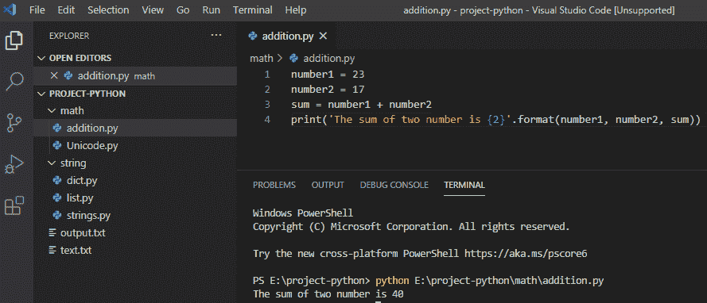
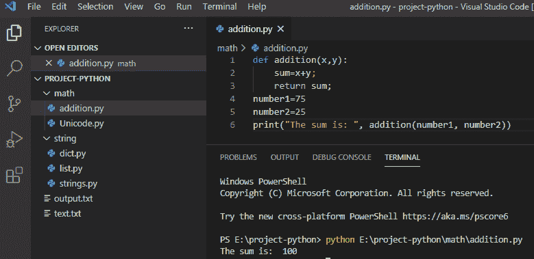
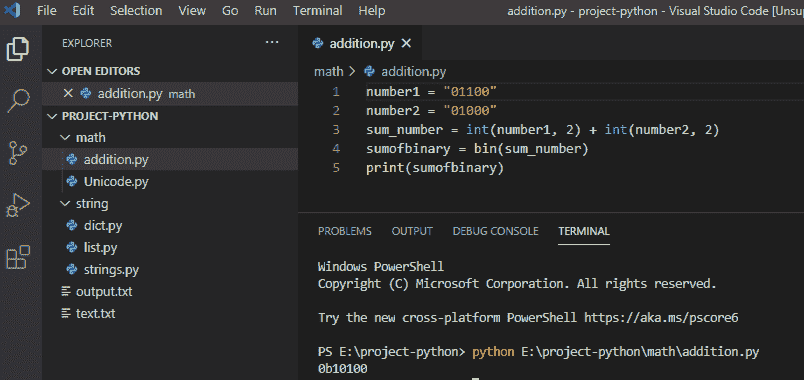
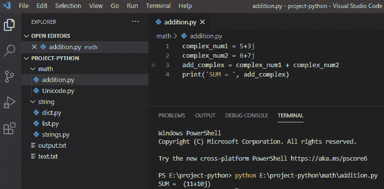
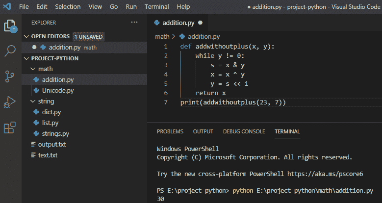

# Python 附加示例

> 原文：<https://pythonguides.com/python-addition/>

[](https://sharepointsky.teachable.com/p/python-and-machine-learning-training-course)

在本 [Python 教程](https://pythonguides.com/python-download-and-installation/)中，我们将结合一些例子讨论关于 **Python 加法**以及如何在 Python 中进行两个数的加法。我们还将检查:

*   用 Python 将两个数相加
*   使用函数在 python 中添加两个数字
*   在 Python 中添加两个二进制数
*   如何用 Python 将两个复数相加
*   不使用+运算符将两个数相加

目录

[](#)

*   [(Python 加法)在 Python 中加两个数](#Python_Addition_Add_two_numbers_in_Python "(Python Addition) Add two numbers in Python")
*   [使用函数](#Add_two_numbers_in_python_using_function "Add two numbers in python using function")在 python 中将两个数相加
*   [在 Python 中添加两个二进制数](#Add_two_binary_numbers_in_Python "Add two binary numbers in Python")
*   [如何在 Python 中添加两个复数](#How_to_add_two_complex_numbers_in_Python "How to add two complex numbers in Python")
*   [不使用+运算符将两个数相加](#Add_two_numbers_without_using_operator "Add two numbers without using + operator")

## (Python 加法)在 Python 中加两个数

**为了在 Python** 中添加两个数字，我们将使用**“+”**操作符来添加存储在变量中的两个数字。

**举例:**

```
number1 = 23 
number2 = 17
sum = number1 + number2
print('The sum of two number is {2}'.format(number1, number2, sum))
```

写完上面的代码后(在 Python 中如何将两个数相加)，你将打印出来，然后输出将显示为**“两个数之和是 40”**。这里，我们有两个数字，它们被加到 sum 变量中。

你可以参考下面的截图，用 python 添加两个数。



How do you add two numbers in Python

这就是我们如何在 python 中将两个数相加。

## 使用函数在 python 中将两个数相加

在 python 中，我们可以使用 **def** 函数**将两个数**相加，并且在函数定义的括号内传递参数，我们可以通过函数名调用函数。

**举例:**

```
def addition(x,y):
sum = x+y;
return sum;
number1=75
number2=25
print("The sum is: ", addition(number1, number2))
```

写完上面的代码后(使用函数在 Python 中添加两个数字)，您将打印的数字将显示为**" sum is**:**100 "**。这里， **def addition()** 是用于加法的函数，并且声明了变量。

你可以参考下面的截图，使用函数在 python 中添加两个数。



Add two numbers in python using the function

这就是我们如何在 python **中使用函数将两个数字相加。**

## 在 Python 中添加两个二进制数

在 python 中，为了将两个二进制数相加，我们内置了函数 **int()** ，它将给定的二进制字符串转换成整数，而 **bin()** 则将整数的和值转换成二进制。

**举例:**

```
number1 = "01100"
number2 = "01000"
sum_number = int(number1, 2) + int(number2, 2)
sumofbinary = bin(sum_number)
print(sumofbinary)
```

写完上面的代码(在 Python 中添加两个二进制数)，你将打印“sumofbinary”，然后输出将显示为 **" 0b10100 "** 。在这里，它将二进制转换成一个整数，它将被相加，并再次将整数和转换成二进制。

用 python 添加两个二进制数可以参考下面的截图。



Add two binary numbers in Python

这就是我们如何在 python 中将两个二进制数相加。

## 如何在 Python 中添加两个复数

在 python 中，复数是实数和虚数的组合，将两个复数相加，我们将使用 **" + "** 运算符将这两个复数相加。

**举例:**

```
complex_num1 = 5+3j
complex_num2 = 6+7j
add_complex = complex_num1 + complex_num2
print('SUM = ', add_complex)
```

写完上面的代码(如何在 Python 中添加两个复数)，你将打印出 **"add_complex"** 然后输出将显示为 **" SUM= (11+10j) "** 。在这里，**T5 只是简单地把两个复数相加。**

可以参考下面的截图，用 Python 添加两个复数。



How to add two complex numbers in Python

这就是我们如何在 Python 中把两个复数相加。

## 不使用+运算符将两个数相加

在 python 中，要在不使用+运算符的情况下将两个数相加，我们可以使用按位运算符将两个数相加。

**举例:**

```
def addwithoutplus(x,y):
while y!=0:
s = x & y
x = x ^ y
y = s << 1
return x
print(addwithoutplus(23, 7))
```

写完上面的代码(如何在不使用+运算符的情况下将两个数相加)，你将打印出 **"addwithoutplus"** 然后输出将显示为 **" 30 "** 。这里，只是简单地将两个数相加，没有使用**“+”**运算符。

你可以参考下面的截图，在不使用+运算符的情况下将两个数相加



Add two numbers without using + operator

这就是我们如何不用+运算符就能**将两个数相加。**

您可能会喜欢以下教程:

*   [Python 中的乘法与例题](https://pythonguides.com/multiply-in-python/)
*   [如何在 Python 中处理 indexerror:字符串索引超出范围](https://pythonguides.com/indexerror-string-index-out-of-range-python/)
*   [解析 Python 时出现意外的 EOF](https://pythonguides.com/unexpected-eof-python/)
*   [Python 对于基数为 10 的 int()无效文字](https://pythonguides.com/python-invalid-literal-for-int-with-base-10/)
*   [Python 元组排序列表](https://pythonguides.com/python-sort-list-of-tuples/)
*   [删除 python 中的 Unicode 字符](https://pythonguides.com/remove-unicode-characters-in-python/)
*   [Python 字典追加示例](https://pythonguides.com/python-dictionary-append/)
*   [在 Python 中检查列表是否为空](https://pythonguides.com/check-if-a-list-is-empty-in-python/)
*   [Python 将列表转换成字符串](https://pythonguides.com/python-convert-list-to-string/)
*   [从字符串 Python 中删除字符](https://pythonguides.com/remove-character-from-string-python/)
*   [获取当前目录 Python](https://pythonguides.com/get-current-directory-python/)
*   [python 中的百分号是什么意思](https://pythonguides.com/percent-sign-mean-in-python/)
*   [Python 数组与示例](https://pythonguides.com/python-array/)

在本教程中，我们学习了如何用 Python 将两个数相加。

*   如何用 Python 将两个数相加
*   使用函数在 python 中添加两个数字
*   在 Python 中添加两个二进制数
*   如何用 Python 将两个复数相加
*   不使用+运算符将两个数相加

[Bijay Kumar](https://pythonguides.com/author/fewlines4biju/)

Python 是美国最流行的语言之一。我从事 Python 工作已经有很长时间了，我在与 Tkinter、Pandas、NumPy、Turtle、Django、Matplotlib、Tensorflow、Scipy、Scikit-Learn 等各种库合作方面拥有专业知识。我有与美国、加拿大、英国、澳大利亚、新西兰等国家的各种客户合作的经验。查看我的个人资料。

[enjoysharepoint.com/](https://enjoysharepoint.com/)[](https://www.facebook.com/fewlines4biju "Facebook")[](https://www.linkedin.com/in/fewlines4biju/ "Linkedin")[](https://twitter.com/fewlines4biju "Twitter")