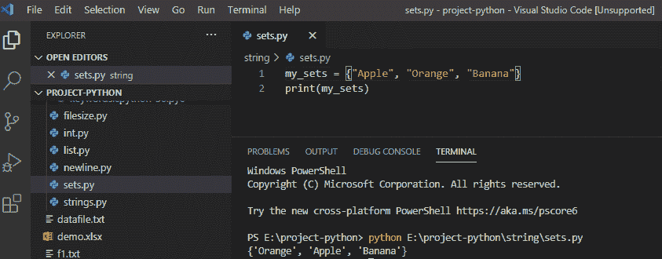
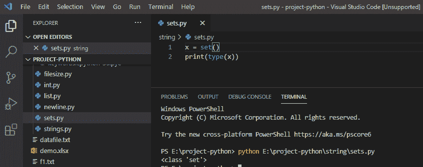
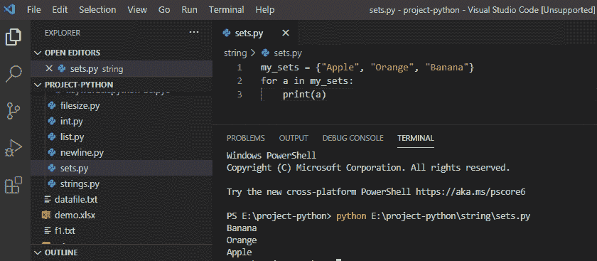
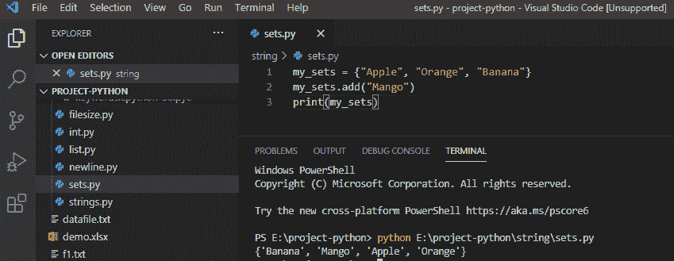
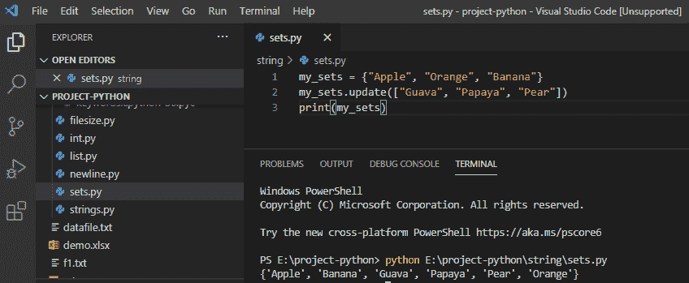
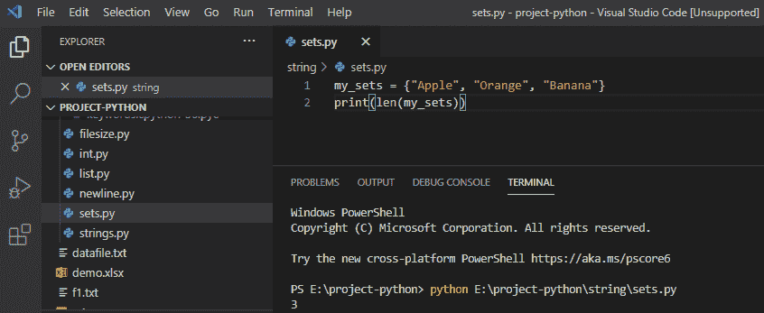
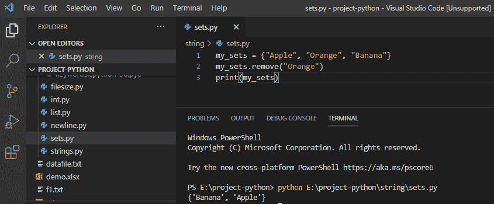
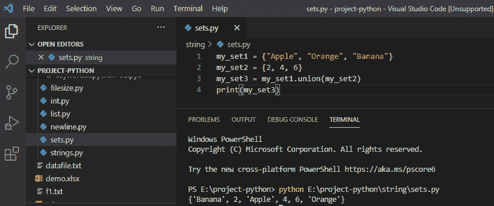

# Python 创建空集

> 原文：<https://pythonguides.com/python-create-empty-set/>

[](https://sharepointsky.teachable.com/p/python-and-machine-learning-training-course)

在本 [Python 教程](https://pythonguides.com/python-programming-for-the-absolute-beginner/)中，我们将讨论如何在 Python 中**创建一个空集，我们将结合实例学习** **Python 中的**集。****

*   什么是 Python 集合
*   如何在 python 中创建空集
*   如何从 Python 集合中访问项目
*   如何向 Python 集添加项目
*   如何在 python 中更新 set
*   用 python 求集合的长度
*   从集合 python 中移除项目
*   Python 连接两个集合

目录

[](#)

*   [Python 集合](#Python_Set "Python Set")
*   [在 Python 中创建一个空集](#Create_an_empty_set_in_Python "Create an empty set in Python")
*   [访问 set python 中的项目](#Access_items_in_set_python "Access items in set python")
*   [向 Python 集合添加项目](#Add_items_to_Python_Set "Add items to Python Set")
*   [更新 python 中的集合](#Update_set_in_python "Update set in python")
*   [python 中集合的长度](#Length_of_the_set_in_python "Length of the set in python")
*   [从集合 python 中移除项目](#Remove_item_from_set_python "Remove item from set python")
*   [Python 加入两个集合](#Python_join_two_set "Python join two set")

## Python 集合

**Python 集合**是一个无序的条目集合，它是无索引的。 **Python 集合**是通过将所有项目放在花括号内创建的。

**举例:**

```py
my_sets = {"Apple", "Orange", "Banana"}
print(my_sets)
```

写完上面的代码(python sets)，你将打印出 **"my_sets"** ，然后输出将显示为 **" { '桔子'，**'苹果'，**'香蕉' } "** 。在这里，我们可以看到集合是无序的，所以它可以是任何随机的顺序。

你可以参考下面的 python 集截图



Python Set

## 在 Python 中创建一个空集

为了在 python 中创建一个空集，我们必须使用不带任何参数的 **set()** 函数，如果我们使用空的花括号“ **{}** ”，那么我们将得到一个空的字典。

**举例:**

```py
x = set()
print(type(x))
```

写完上面的代码(用 python 创建一个空集)，你将打印出 **"type(x)"** ，然后输出将显示为 **" <类' set' > "** 。在这里，我们可以使用 set()函数来获取 python 中的空集。

可以参考下面截图**在 python 中创建空集**



Python create empty set

## 访问 set python 中的项目

在 python 中，**集合项目不能通过引用索引来访问**，因为集合是无序的，项目没有索引。但是您可以通过使用**来循环设置项目。**

**举例:**

```py
my_sets = {"Apple", "Orange", "Banana"}
for a in my_sets:
print(a)
```

写完上面的代码(set python 中的访问项)，你将打印出 **" a "** ，然后输出将显示为**"香蕉橙苹果"**。在这里，通过使用 for 循环，我们可以访问集合中的项目。

可以参考下面 set python 中的截图访问项。



Access items from Python Set

## 向 Python 集合添加项目

为了**在 Python 集合中添加项目**，我们将使用 **add()** 方法在集合中添加任何项目。

**举例:**

```py
my_sets = {"Apple", "Orange", "Banana"}
my_sets.add("Mango")
print(my_sets)
```

写完上面的代码(在 python 中设置添加项目)，你将打印出 **" my_sets "** ，然后输出将显示为 **" { '香蕉'，'芒果'，'**，' T4 '**'，'桔子' } "** 。这里，add()方法将把我的项目“mango”添加到集合中。

你可以参考下面的截图添加物品到 python 集合。



Add items to Python Set

## 更新 python 中的集合

在 python 中，要在集合中添加多个项目，我们将使用 **update()** 方法，然后我们将列表传递给 update，这将添加集合中的所有项目。

**举例:**

```py
my_sets = {"Apple", "Orange", "Banana"}
my_sets.update(["Guava", "Papaya", "Pear"])
print(my_sets)
```

写完上面的代码(用 python 更新 set)，你将打印出 **" my_sets "** ，然后输出将显示为 **" { ****'苹果'，****** **'香蕉'，'番石榴'，'木瓜'，'梨'，'桔子'** **} "** 。这里，update()方法将添加集合中的所有项目。

可以参考下面 python 中的截图更新集。



Update set in python

## python 中集合的长度

在 python 中，我们使用 **len()** 方法来获取项目的长度，它返回集合中存在的项目数。

**举例:**

```py
my_sets = {"Apple", "Orange", "Banana"}
print(len(my_sets))
```

写完上面的代码(python 中 set 的长度)，你将打印出 **" len(my_sets) "** ，然后输出将显示为 **" 3** **"。**这里，len()方法将返回集合中的项目数。

可以参考下面 python 中的 set 的截图长度。



Length of the set in python

## 从集合 python 中移除项目

在 python 中，我们使用 **remove()** 方法从集合中移除任何项目。如果指定的项目不在集合中，那么它将给出一个错误。

**举例:**

```py
my_sets = {"Apple", "Orange", "Banana"}
my_set.remove("Orange")
print(my_set)
```

写完上面的代码后(从 set python 中移除该项)，你将打印出**(my _ sets)**，然后输出将显示为**“{ ' Banana '，' Apple'}** **”。**此处，物品“橙色”从器械包中移除。

您可以参考下面的截图从集合 python 中移除项目。



Remove item from set python

## Python 加入两个集合

在 python 中，要连接两个集合，我们将使用 **union()** 方法，它将返回一个包含两个集合中所有项目的新集合。

**举例:**

```py
my_set1 = {"Apple", "Orange", "Banana"}
my_set2 = {2, 4, 6}
my_set3 = my_set1.union(my_set2)
print(my_set3)
```

写完上面的代码(python 联接两个集合)，你将打印出**(my _ set 3)**然后输出将显示为**“{ '香蕉'，2，'苹果'，4，6，'橙子' }** **”。**这里，union()方法返回一个包含两个集合中所有项目的新集合。

可以参考下面的截图 python 连接两个集合。



Python join two set

您可能会喜欢以下 Python 教程:

*   [Python 关键字与示例](https://pythonguides.com/python-keywords/)
*   [Python While 循环示例](https://pythonguides.com/python-while-loop/)
*   [Python 中的字符串方法及示例](https://pythonguides.com/string-methods-in-python/)
*   [Python 检查变量是否为整数](https://pythonguides.com/python-check-if-the-variable-is-an-integer/)
*   [检查一个数是否是素数 Python](https://pythonguides.com/check-if-a-number-is-a-prime-python/)
*   [Python 将元组转换为列表](https://pythonguides.com/python-convert-tuple-to-list/)
*   [python 中的百分号是什么意思](https://pythonguides.com/percent-sign-mean-in-python/)
*   [Python 中的排序算法](https://pythonguides.com/sorting-algorithms-in-python/)
*   [Python 中的优先级队列](https://pythonguides.com/priority-queue-in-python/)

在这个 Python 教程中，我们学习了什么是 **Python 集合**，如何**在 Python** 中创建一个空集，如何**从 Python 集合**中访问项目，如何**向 Python 集合**中添加项目，如何**在 python** 中更新集合，在 python 中找到集合的**长度，**从集合 python** 中移除项目，并且 **python 加入两个集合**。**

[Bijay Kumar](https://pythonguides.com/author/fewlines4biju/)

Python 是美国最流行的语言之一。我从事 Python 工作已经有很长时间了，我在与 Tkinter、Pandas、NumPy、Turtle、Django、Matplotlib、Tensorflow、Scipy、Scikit-Learn 等各种库合作方面拥有专业知识。我有与美国、加拿大、英国、澳大利亚、新西兰等国家的各种客户合作的经验。查看我的个人资料。

[enjoysharepoint.com/](https://enjoysharepoint.com/)[](https://www.facebook.com/fewlines4biju "Facebook")[](https://www.linkedin.com/in/fewlines4biju/ "Linkedin")[](https://twitter.com/fewlines4biju "Twitter")