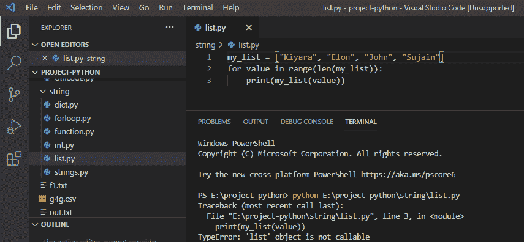
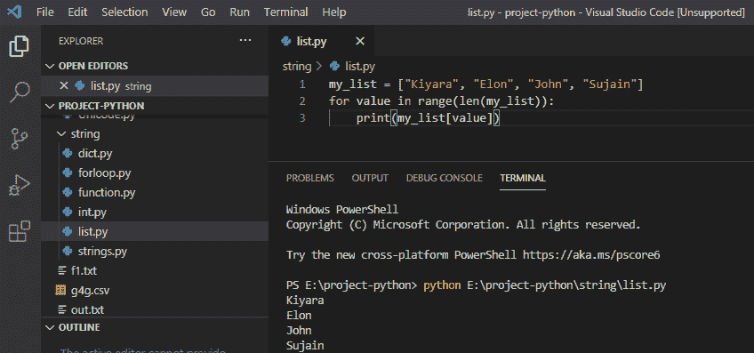
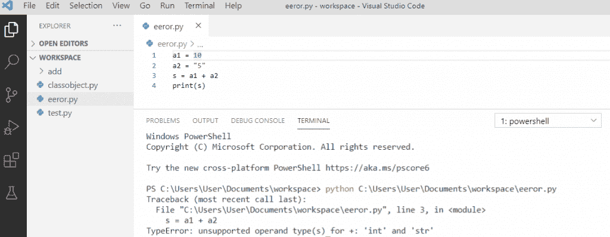
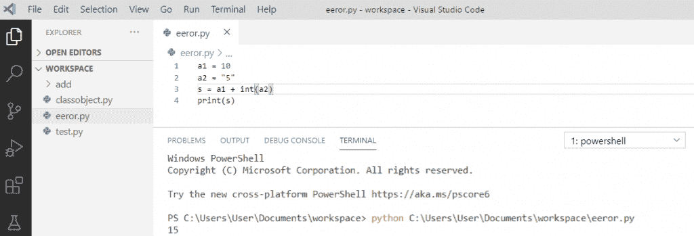
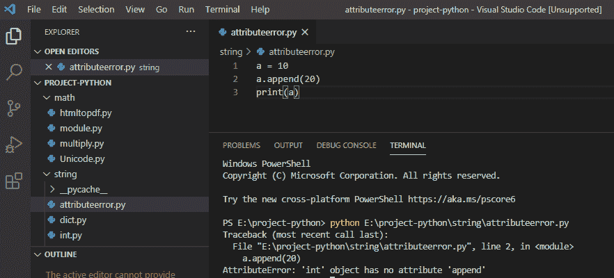
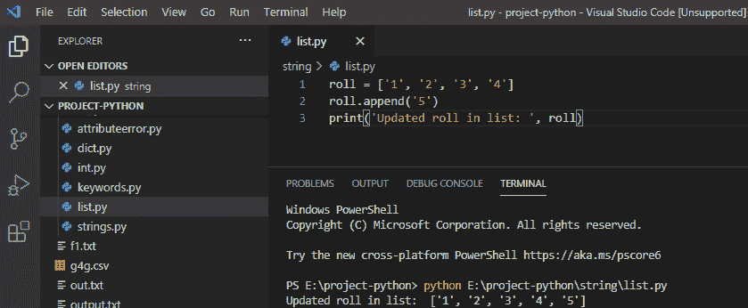
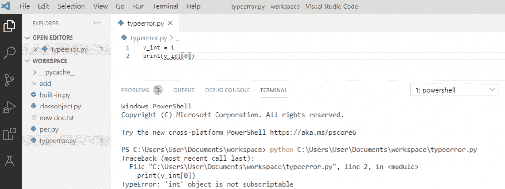

# Python 类型错误:“list”对象不可调用

> 原文：<https://pythonguides.com/python-typeerror-list-object-is-not-callable/>

[](https://sharepointsky.teachable.com/p/python-and-machine-learning-training-course)

在本 [Python 教程](https://pythonguides.com/python-download-and-installation/)中，我们将讨论如何在 Python 中修复**“type error 和 attribute error”**。我们将检查:

*   type error:“list”对象不可调用。
*   TypeError:不支持+:“int”和“str”的操作数类型。
*   Python 对象没有属性
*   TypeError: python int 对象不可订阅

目录

[](#)

*   [类型错误:“列表”对象不可调用](#TypeError_list_object_is_not_callable "TypeError: ‘list’ object is not callable")
*   [类型错误:不支持+:“int”和“str”的操作数类型](#TypeError_unsupported_operand_types_for_int_and_str "TypeError: unsupported operand type(s) for +: ‘int’ and ‘str’")
*   [Python 对象没有属性](#Python_object_has_no_attribute "Python object has no attribute")
*   [类型错误:python int 对象不可订阅](#TypeError_python_int_object_is_not_subscriptable "TypeError: python int object is not subscriptable")

## 类型错误:“列表”对象不可调用

在 python 中，当我们在 print 语句中传递参数时，我们会得到这个错误，代码包含圆括号来打印列表中的每一项，因此我们会得到这个 typeerror。

**举例:**

```
my_list = ["Kiyara", "Elon", "John", "Sujain"]
for value in range(len(my_list)):
print(my_list(value))
```

写完上面的代码后，你将打印出 **"my_list(value)"** 然后错误将显示为"**类型错误:' list '对象不可调用**"。这里，发生这个错误是因为我们使用了圆括号，这对于打印项目是不正确的。

你可以在 python 中看到下面这个类型错误的截图



TypeError: ‘list’ object is not callable

为了解决这个 **python typeerror** 我们必须在打印**“值”**时传递方括号内的参数，因为列表变量就是这样工作的。

**举例:**

```
my_list = ["Kiyara", "Elon", "John", "Sujain"]
for value in range(len(my_list)):
print(my_list[value])
```

写完上面的代码后，你将打印出 **" my_list[value] "** ，然后输出将显示为" **Kiyara Elon John Sujain** "。这里，通过在打印时使用方括号来解决错误。

你可以参考下面的截图如何解决类型错误。



Python error list object is not callable

## 类型错误:不支持+:“int”和“str”的操作数类型

当我们试图将一个整数与字符串相加时，我们得到了不支持的操作数类型+: 'int '和' str' ,反之亦然，因为我们无法将字符串添加到整数中。

**举例:**

```
a1 = 10
a2 = "5"
s = a1 + a2
print(s)
```

写完上述代码后，您将打印出**(s)**，然后错误将显示为 **"** **类型错误:不支持+: 'int '和' str ' "的操作数类型。**在这里，发生这个错误是因为我们试图将整数和字符串相加，所以它返回一个错误。

您可以看到下面的屏幕截图类型错误:python 中+:“int”和“str”的操作数类型不受支持



TypeError: unsupported operand type(s) for +: ‘int’ and ‘str’

为了解决这个 **python typeerror** 我们必须使用 **int()** 方法将字符串值转换为整数，这样我们可以避免这个错误。

**举例:**

```
a1 = 10
a2 = "5"
s = a1 + int(a2
)
print(s)
```

写完上面的代码后，你将打印出**(s)**，然后输出将显示为**“15”。**在这里，错误是通过将 **a2** 的值转换为**整数类型**然后添加两个值来解决的。

您可以参考下面的屏幕截图，了解如何解析+: 'int '和' str '的不支持的操作数类型。



unsupported operand type(s) for +: ‘int’ and ‘str’

## Python 对象没有属性

在 python 中，我们得到这个属性错误是因为无效的属性引用或赋值。

**举例:**

```
a = 10
a.append(20)
print(a)
```

写完上面的代码后，你将打印出 **"a"** ，然后错误将显示为" **AttributeError: 'int '对象没有属性' append'** "。这里，发生此错误是因为进行了无效的属性引用，并且整数类型的变量不支持 append 方法。

你可以看到下面的属性错误截图



Python object has no attribute

为了解决这个 **python attributeerror** 我们必须给出一个**列表类型的变量**来支持**python 中的 **append 方法，**所以给出有效的属性来避免这个错误是很重要的。**

 ****举例:**

```
roll = ['1','2','3','4']
roll.append('5')
print('Updated roll in list: ',roll)
```

写完上面的代码后，您将打印这些代码，然后输出将显示为一个**“更新的 roll in list: ['1 '，' 2 '，' 3 '，' 4 '，' 5']”。**在这里，通过在列表上给出有效的属性引用 append 来解决错误。

你可以参考下面的截图 attributeerror 是如何解决的。



Python object has no attribute

## 类型错误:python int 对象不可订阅

当我们试图使用**整型值**作为数组时，就会出现这个**错误**。我们将整数视为一个可下标的对象。整数不是可下标的对象。像元组、列表等对象在 python 中是可订阅的。

**举例:**

```
v_int = 1
print(v_int[0])
```

*   写完上面的代码，一旦你会打印出**“v _ int[0]”**那么错误就会出现为**“type error:‘int’对象不可订阅”**。
*   在这里，发生此错误是因为函数将变量视为数组，但该变量是一个整数。
*   你可以看到我们已经声明了一个整型变量 **"v_int"** ，在下一行中，我们试图将整型变量 **"v_int[0]"** 的值打印成一个列表。这就产生了误差。

您可以在下面看到 typeerror 的截图:python int 对象不可下标



TypeError: python int object is not subscriptable

为了解决这种类型的**错误‘int’对象在 python 中是不可下标的**，我们需要避免使用整型值作为数组。此外，确保不使用切片或索引来访问整数中的值。

**举例:**

```
v_int = 1
print(v_int)
```

写完上面的代码后，一旦你打印出 **" v_int "** ，那么输出将显示为 **" 1 "** 。这里，通过删除方括号解决了错误。

你可以看到下面的截图:python int 对象是不可订阅的


typeerror: python int object is not subscriptable

您可能会喜欢以下 Python 教程:

*   [Python if else with examples](https://pythonguides.com/python-if-else/)
*   [Python For 循环示例](https://pythonguides.com/python-for-loop/)
*   [Python 读取 excel 文件并在 Python 中写入 Excel](https://pythonguides.com/python-read-excel-file/)
*   [在 Python 中创建一个元组](https://pythonguides.com/create-a-tuple-in-python/)
*   [Python 创建空集](https://pythonguides.com/python-create-empty-set/)
*   [Python 关键字与示例](https://pythonguides.com/python-keywords/)
*   [Python While 循环示例](https://pythonguides.com/python-while-loop/)
*   [Python 中的字符串方法及示例](https://pythonguides.com/string-methods-in-python/)
*   [名称错误:Python 中没有定义名称](https://pythonguides.com/nameerror-name-is-not-defined/)
*   [Python 检查变量是否为整数](https://pythonguides.com/python-check-if-the-variable-is-an-integer/)

这是修复 python 类型的方法错误:“list”对象不可调用，类型错误:不支持+:“int”和“str”的操作数类型，属性错误:对象没有属性和类型错误:python int 对象不可订阅

[Bijay Kumar](https://pythonguides.com/author/fewlines4biju/)

Python 是美国最流行的语言之一。我从事 Python 工作已经有很长时间了，我在与 Tkinter、Pandas、NumPy、Turtle、Django、Matplotlib、Tensorflow、Scipy、Scikit-Learn 等各种库合作方面拥有专业知识。我有与美国、加拿大、英国、澳大利亚、新西兰等国家的各种客户合作的经验。查看我的个人资料。

[enjoysharepoint.com/](https://enjoysharepoint.com/)[](https://www.facebook.com/fewlines4biju "Facebook")[](https://www.linkedin.com/in/fewlines4biju/ "Linkedin")[](https://twitter.com/fewlines4biju "Twitter")**